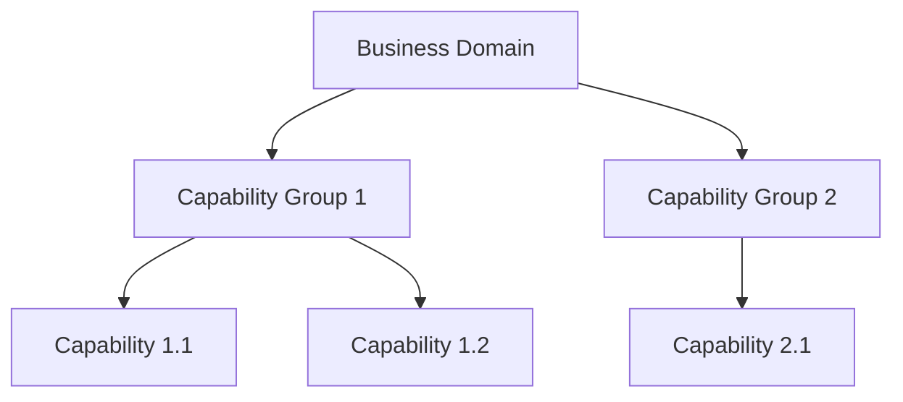
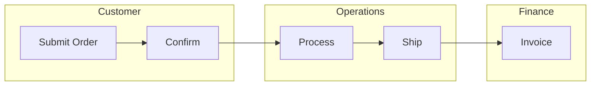
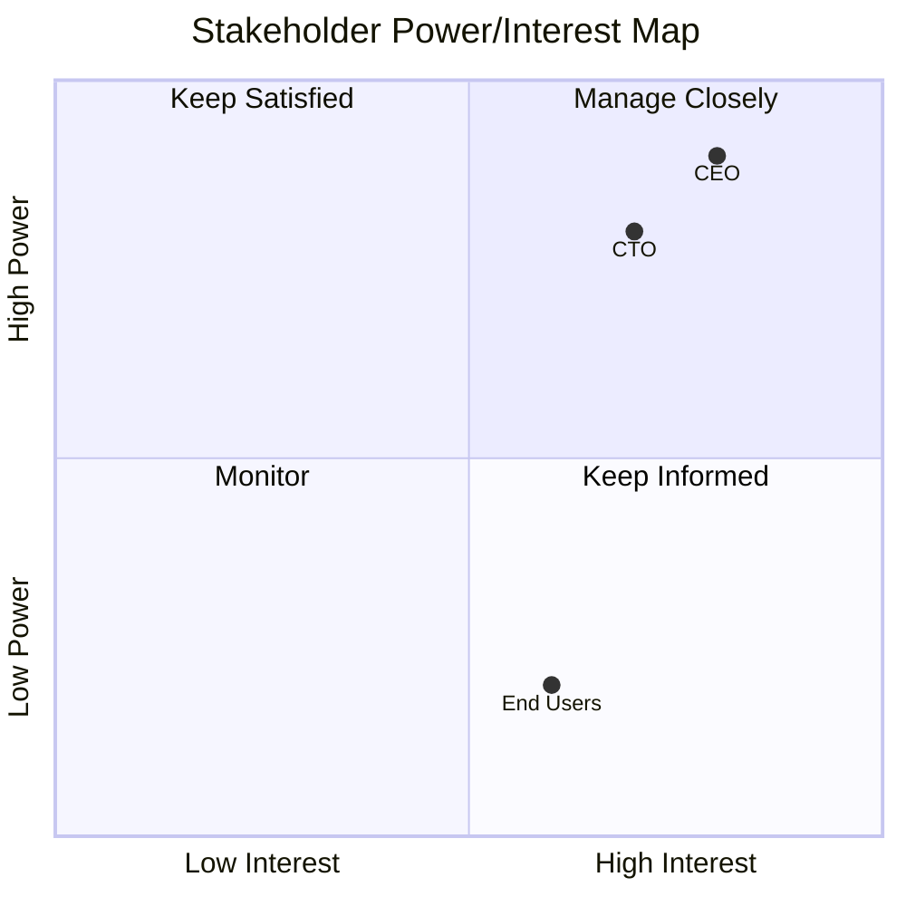
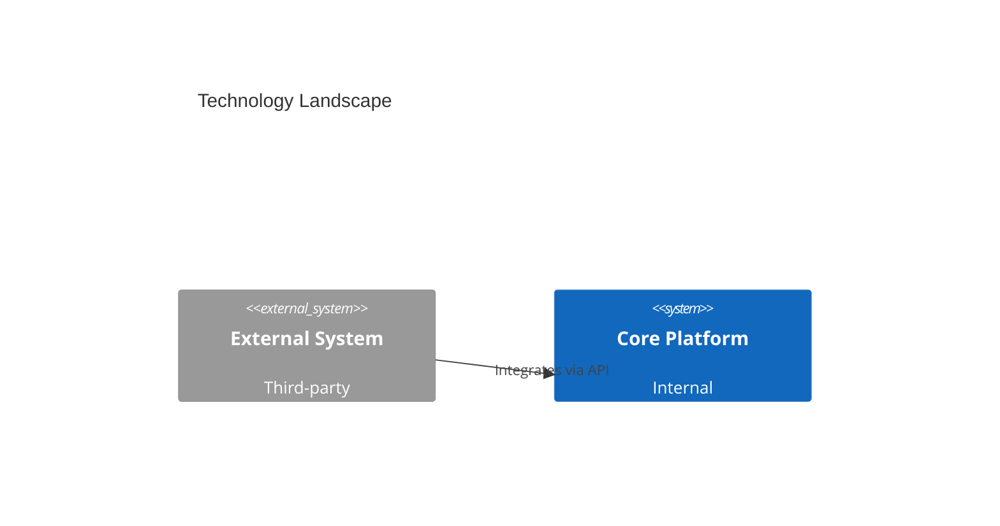
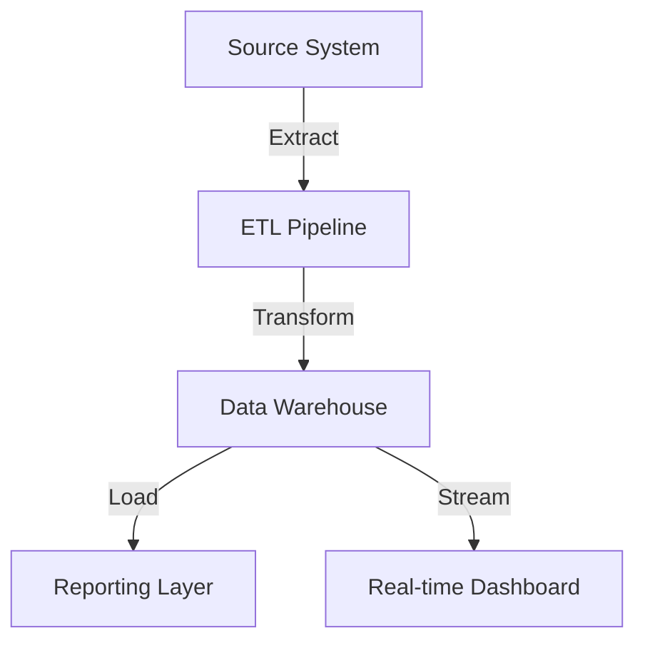

# EA-Assistant TOGAF Enrichment — Implementation Plan

> **For agentic workers:** REQUIRED SUB-SKILL: Use superpowers:subagent-driven-development (recommended) or superpowers:executing-plans to implement this plan task-by-task. Steps use checkbox (`- [ ]`) syntax for tracking.

**Goal:** Enrich the ea-assistant plugin with generation capabilities, a phase interview question bank, a requirements analyst agent, and ADM reference material — all adapted from the togaf-adm plugin.

**Architecture:** New Markdown files (skills, agents, commands, references) and Python scripts are added to `plugins/ea-assistant/`. Four existing files receive targeted additions. No schema changes to `engagement.json`.

**Tech Stack:** Markdown (plugin components), Python 3.11+ with python-docx and python-pptx (generation scripts), YAML frontmatter (Claude Code plugin framework)

---

## File Map

### New Files

| File | Responsibility |
|------|---------------|
| `plugins/ea-assistant/skills/ea-generation/SKILL.md` | Format selection guide, Mermaid patterns, Word/PPTX structure, script invocation |
| `plugins/ea-assistant/scripts/generate-docx.py` | Produce Word documents from artifact content JSON |
| `plugins/ea-assistant/scripts/generate-pptx.py` | Produce PowerPoint decks from artifact content JSON |
| `plugins/ea-assistant/commands/ea-generate.md` | `/ea-generate [artifact] [format]` command |
| `plugins/ea-assistant/skills/ea-artifact-templates/references/phase-interview-questions.md` | Phase-by-phase question bank with output routing |
| `plugins/ea-assistant/agents/ea-requirements-analyst.md` | Document → requirements register extraction agent |
| `plugins/ea-assistant/skills/ea-engagement-lifecycle/references/phase-inputs-outputs.md` | Detailed I/O tables per ADM phase |
| `plugins/ea-assistant/skills/ea-engagement-lifecycle/references/adm-tailoring.md` | ADM tailoring for agile, programme, capability, security contexts |

### Modified Files

| File | Change |
|------|--------|
| `plugins/ea-assistant/skills/ea-engagement-lifecycle/SKILL.md` | Add 2 lines to Additional Resources section |
| `plugins/ea-assistant/agents/ea-interviewer.md` | Add phase interview mode + output routing logic |
| `plugins/ea-assistant/commands/ea-interview.md` | Add `start phase [phase-name]` mode |
| `plugins/ea-assistant/commands/ea-merge.md` | Add note pointing to `/ea-generate` |

---

## Task 1: Create Feature Branch

**GitHub Issues:** All (#5–#9)

- [ ] **Step 1: Create and check out the feature branch**

```bash
git checkout -b feat/ea-assistant-togaf-enrichment main
```

- [ ] **Step 2: Push the branch to set upstream**

```bash
git push -u origin feat/ea-assistant-togaf-enrichment
```

---

## Task 2: Reference — Phase Inputs and Outputs (Issue #5)

**Files:**
- Create: `plugins/ea-assistant/skills/ea-engagement-lifecycle/references/phase-inputs-outputs.md`

This reference provides detailed input/output tables for every ADM phase, more granular than the existing `adm-phase-guide.md`. Each phase gets: required inputs with source, key activities, required outputs with consumer, and quality gates.

- [ ] **Step 1: Create the phase-inputs-outputs.md reference file**

Write to `plugins/ea-assistant/skills/ea-engagement-lifecycle/references/phase-inputs-outputs.md`.

Content structure — no frontmatter (it's a reference file, not a skill). Start with a title and overview, then for each phase (Preliminary, A through H):

```markdown
# TOGAF ADM Phase Inputs and Outputs — Reference

This reference provides detailed input/output tables for every ADM phase. Use it to verify phase readiness (all inputs available) and phase completion (all outputs produced).

---

## Preliminary Phase

**Required Inputs:**

| Input | Source | Description |
|-------|--------|-------------|
| TOGAF and other framework descriptions | External | Architecture frameworks to adopt or tailor |
| Board/business strategy | Executive | Strategic direction and priorities |
| Business principles, goals, drivers | Executive | Foundational motivators |
| Existing governance frameworks | Organisation | Current governance structures |
| Existing IT strategy | IT Leadership | Current technology direction |
| Existing organisational model | HR/Exec | Current org structure |

**Key Activities:**
1. Define the architecture capability desired
2. Establish the architecture governance framework
3. Define and establish the architecture team and organisation
4. Identify and establish architecture principles
5. Tailor the TOGAF framework and ADM
6. Implement architecture tools

**Required Outputs:**

| Output | Consumer | Description |
|--------|----------|-------------|
| Organisational model for EA | All phases | How the EA function is structured |
| Tailored architecture framework | All phases | TOGAF adapted to the organisation |
| Initial architecture repository | All phases | Baseline of architecture assets |
| Restatement of business principles/goals/drivers | Phase A | Confirmed strategic inputs |
| Governance and support strategy | Phase G, H | How architecture governance operates |

**Quality Gates:**
- [ ] Architecture principles approved by governance body
- [ ] Tailored ADM documented and agreed
- [ ] Architecture repository initialised
- [ ] Governance model defined with roles and responsibilities

---

## Phase A — Architecture Vision

**Required Inputs:**

| Input | Source | Description |
|-------|--------|-------------|
| Architecture reference materials | Repository | Existing standards, patterns |
| Request for architecture work | Sponsor | Trigger for the engagement |
| Business principles, goals, drivers | Preliminary | Confirmed strategic motivators |
| Capability assessment | Preliminary | Current maturity baseline |
| Communications plan | Preliminary | Stakeholder communication approach |
| Organisational model for EA | Preliminary | EA team structure |
| Tailored architecture framework | Preliminary | Adapted ADM |
| Populated architecture repository | Preliminary | Existing architecture assets |

**Key Activities:**
1. Establish the architecture project
2. Identify stakeholders, concerns, and business requirements
3. Confirm and elaborate business goals, drivers, and constraints
4. Evaluate business capabilities
5. Assess readiness for business transformation
6. Define scope of the architecture engagement
7. Confirm and elaborate architecture principles
8. Develop the Architecture Vision
9. Define target architecture value propositions and KPIs
10. Obtain approval for Statement of Architecture Work

**Required Outputs:**

| Output | Consumer | Description |
|--------|----------|-------------|
| Approved Statement of Architecture Work | All phases | Formal engagement charter |
| Refined principles, goals, drivers | Phase B, C, D | Updated strategic inputs |
| Architecture principles | All phases | Governing rules for decisions |
| Architecture Vision | Phase B, C, D, E | High-level target state |
| Draft Architecture Definition Document (high-level) | Phase B | Starting point for domain architectures |
| Communications plan | All phases | Updated stakeholder communication |

**Quality Gates:**
- [ ] Statement of Architecture Work signed by sponsor
- [ ] Architecture Vision approved by key stakeholders
- [ ] Scope clearly bounded (in/out of scope documented)
- [ ] Stakeholder map complete with concerns and engagement approach

---

## Phase B — Business Architecture

**Required Inputs:**

| Input | Source | Description |
|-------|--------|-------------|
| Architecture reference materials | Repository | Patterns and standards |
| Request for architecture work | Phase A | Engagement scope |
| Capability assessment | Phase A | Baseline maturity |
| Approved Statement of Architecture Work | Phase A | Engagement charter |
| Architecture principles | Phase A | Governing rules |
| Architecture Vision | Phase A | High-level target |
| Draft Architecture Definition Document | Phase A | Starting point |
| Business models and processes | Organisation | Existing business documentation |

**Key Activities:**
1. Select reference models, viewpoints, and tools
2. Develop baseline Business Architecture description
3. Develop target Business Architecture description
4. Perform gap analysis
5. Define candidate roadmap components
6. Resolve impacts across the architecture landscape
7. Conduct formal stakeholder review
8. Finalise the Business Architecture
9. Create Architecture Definition Document (business sections)

**Required Outputs:**

| Output | Consumer | Description |
|--------|----------|-------------|
| Refined Phase A deliverables | All phases | Updated vision and scope |
| Draft Architecture Definition Document (business sections) | Phase C | Business architecture content |
| Draft Architecture Requirements Specification (business) | Requirements | Business requirements |
| Business architecture components of roadmap | Phase E, F | Business change initiatives |

**Quality Gates:**
- [ ] Baseline business architecture documented
- [ ] Target business architecture documented
- [ ] Gap analysis completed with dispositions assigned
- [ ] Business stakeholders have reviewed and accepted

---

## Phase C — Information Systems Architecture

### C-Data: Data Architecture

**Required Inputs:**

| Input | Source | Description |
|-------|--------|-------------|
| Phase B outputs | Phase B | Business architecture and gaps |
| Data principles | Phase A / Prelim | Data governance rules |
| Existing data models and catalogues | Organisation | Current data landscape |

**Key Activities:**
1. Select data architecture reference models and viewpoints
2. Develop baseline Data Architecture description
3. Develop target Data Architecture description
4. Perform data gap analysis
5. Define data migration and governance requirements

**Required Outputs:**

| Output | Consumer | Description |
|--------|----------|-------------|
| Baseline Data Architecture | Phase E | Current data landscape |
| Target Data Architecture | Phase E | Desired data landscape |
| Data Architecture gap analysis | Phase E | Identified data gaps |
| Data architecture sections of Architecture Definition Document | Phase D | Data architecture content |

### C-App: Application Architecture

**Required Inputs:**

| Input | Source | Description |
|-------|--------|-------------|
| Phase B outputs | Phase B | Business architecture and gaps |
| Data Architecture outputs | C-Data | Data landscape and requirements |
| Application principles | Phase A / Prelim | Application governance rules |
| Existing application portfolio | Organisation | Current application landscape |

**Key Activities:**
1. Select application architecture reference models and viewpoints
2. Develop baseline Application Architecture description
3. Develop target Application Architecture description
4. Perform application gap analysis
5. Define application migration and integration requirements

**Required Outputs:**

| Output | Consumer | Description |
|--------|----------|-------------|
| Baseline Application Architecture | Phase E | Current application landscape |
| Target Application Architecture | Phase E | Desired application landscape |
| Application Architecture gap analysis | Phase E | Identified application gaps |
| Application architecture sections of Architecture Definition Document | Phase D | Application architecture content |

**Quality Gates (Phase C combined):**
- [ ] Data entity catalogue complete
- [ ] Application portfolio catalogue complete
- [ ] Application/function matrix validated against business architecture
- [ ] Data flow diagrams produced for critical interfaces
- [ ] Gap analyses completed for both data and application domains

---

## Phase D — Technology Architecture

**Required Inputs:**

| Input | Source | Description |
|-------|--------|-------------|
| Phase B and C outputs | Phase B, C | Domain architectures and gaps |
| Technology standards | Organisation | Approved technology catalogue |
| Technology forecast | Industry / Vendor | Technology trends and lifecycle |
| Architecture Definition Document (business, data, application sections) | Phase B, C | Content to date |

**Key Activities:**
1. Select technology architecture reference models and viewpoints
2. Develop baseline Technology Architecture description
3. Develop target Technology Architecture description
4. Perform technology gap analysis
5. Define technology standards and target platform
6. Create Architecture Definition Document (technology section)

**Required Outputs:**

| Output | Consumer | Description |
|--------|----------|-------------|
| Baseline Technology Architecture | Phase E | Current technology landscape |
| Target Technology Architecture | Phase E | Desired technology landscape |
| Technology gap analysis | Phase E | Identified technology gaps |
| Technology architecture section of Architecture Definition Document | Phase E | Technology architecture content |
| Draft Architecture Requirements Specification (technology) | Requirements | Technology requirements |
| Technology components of architecture roadmap | Phase E, F | Technology change initiatives |

**Quality Gates:**
- [ ] Technology portfolio catalogue complete
- [ ] Technology standards catalogue defined
- [ ] System/technology matrix validated
- [ ] Gap analysis completed with dispositions
- [ ] Technology stakeholders reviewed and accepted

---

## Phase E — Opportunities and Solutions

**Required Inputs:**

| Input | Source | Description |
|-------|--------|-------------|
| Phase B, C, D gap analyses | Phase B, C, D | All domain gaps |
| Architecture repository | Repository | Full architecture content |
| Architecture Vision | Phase A | Strategic direction |
| Draft Architecture Definition Document (all sections) | Phase B, C, D | Complete domain architectures |
| Draft Architecture Requirements Specification | Requirements | All requirements |
| Change requests | Phase H / External | Requested changes |

**Key Activities:**
1. Review and consolidate gap analysis results from B, C, D
2. Generate initial implementation and migration strategy
3. Identify major work packages and projects
4. Identify transition architectures
5. Define architecture building blocks (ABBs) and solution building blocks (SBBs)

**Required Outputs:**

| Output | Consumer | Description |
|--------|----------|-------------|
| Refined Architecture Definition Document | Phase F | Finalised domain architectures |
| Refined Architecture Requirements Specification | Phase F | Finalised requirements |
| Architecture Roadmap (initial) | Phase F | Sequenced initiatives |
| Implementation and Migration Strategy | Phase F | Approach to delivery |
| Transition Architecture(s) | Phase F | Intermediate states |
| Work package definitions | Phase F | Scoped delivery units |

**Quality Gates:**
- [ ] All gap analyses consolidated and reconciled
- [ ] Work packages defined with clear scope and dependencies
- [ ] Transition architectures address highest-priority gaps first
- [ ] Implementation strategy reviewed by delivery leadership

---

## Phase F — Migration Planning

**Required Inputs:**

| Input | Source | Description |
|-------|--------|-------------|
| Phase E outputs | Phase E | Work packages, transition architectures |
| Business priorities and constraints | Sponsor | Investment priorities |
| IT programmes in flight | PMO | Existing delivery pipeline |
| Cost/benefit analysis data | Finance / Business Case | Economic inputs |

**Key Activities:**
1. Confirm management framework interactions for implementation and migration plan
2. Assign a business value to each work package
3. Estimate resource requirements, project timings, and delivery vehicles
4. Prioritise migration projects through cost/benefit and risk assessment
5. Confirm architecture roadmap and update Architecture Definition Document
6. Complete detailed implementation and migration plan
7. Complete the architecture development cycle and document lessons learned

**Required Outputs:**

| Output | Consumer | Description |
|--------|----------|-------------|
| Implementation and Migration Plan | Phase G | Detailed delivery plan |
| Finalised Architecture Definition Document | Repository | Complete architecture |
| Finalised Architecture Requirements Specification | Repository | Complete requirements |
| Updated Architecture Roadmap | Phase G | Sequenced delivery plan |
| Updated transition architectures | Phase G | Intermediate states |

**Quality Gates:**
- [ ] Implementation plan reviewed and approved by delivery leadership
- [ ] Cost/benefit analysis completed for each work package
- [ ] Dependencies between work packages mapped
- [ ] Roadmap timeline agreed with stakeholders

---

## Phase G — Implementation Governance

**Required Inputs:**

| Input | Source | Description |
|-------|--------|-------------|
| Architecture Definition Document | Phase F | Authoritative architecture |
| Architecture Requirements Specification | Phase F | Requirements to govern against |
| Architecture Contract | Phase F | Formal agreements |
| Requests for architecture work from projects | Projects | Implementation requests |
| Capability assessment | Phase A | Maturity baseline |

**Key Activities:**
1. Confirm scope and priorities for deployment with development management
2. Identify deployment resources and skills
3. Guide development of solutions deployment
4. Perform enterprise architecture compliance reviews
5. Implement business and IT operations
6. Perform post-implementation review and close the implementation

**Required Outputs:**

| Output | Consumer | Description |
|--------|----------|-------------|
| Architecture Contracts (signed) | Projects | Formal compliance agreements |
| Compliance Assessments | Governance Board | Architecture conformance reviews |
| Change Requests | Phase H | Requested modifications |
| Architecture-compliant solutions | Operations | Delivered solutions |

**Quality Gates:**
- [ ] Architecture contracts signed before implementation starts
- [ ] Compliance assessments completed for each project
- [ ] Change requests formally logged and tracked
- [ ] Post-implementation review completed

---

## Phase H — Architecture Change Management

**Required Inputs:**

| Input | Source | Description |
|-------|--------|-------------|
| Architecture Definition Document | Repository | Current authoritative architecture |
| Architecture Requirements Specification | Repository | Current requirements baseline |
| Architecture Roadmap | Phase F | Planned evolution |
| Change requests | Phase G / External | Requested changes |
| Monitoring results | Operations | Performance and conformance data |
| Business priorities | Executive | Updated strategic direction |

**Key Activities:**
1. Establish value realisation process
2. Deploy monitoring tools
3. Manage risks
4. Provide analysis for architecture change management
5. Develop change requirements to meet performance targets
6. Manage governance process
7. Activate the ADM cycle for a new iteration if needed

**Required Outputs:**

| Output | Consumer | Description |
|--------|----------|-------------|
| Architecture updates | Repository | Updated architecture content |
| Changes to architecture framework | Preliminary | Framework modifications |
| New Request for Architecture Work | Phase A (next cycle) | Trigger for new ADM cycle |
| Statement of Architecture Work (updated) | Phase A | Updated engagement scope |

**Quality Gates:**
- [ ] Change requests assessed with impact analysis
- [ ] Architecture updates applied to repository
- [ ] Decision documented: continue current cycle or initiate new ADM cycle
- [ ] Lessons learned captured
```

- [ ] **Step 2: Verify no frontmatter issues (reference files have no frontmatter)**

Visually confirm the file starts with `# TOGAF ADM Phase Inputs...` and has no `---` frontmatter block.

- [ ] **Step 3: Commit**

```bash
git add plugins/ea-assistant/skills/ea-engagement-lifecycle/references/phase-inputs-outputs.md
git commit -m "feat(ea-assistant): add phase inputs/outputs reference (#5)"
```

---

## Task 3: Reference — ADM Tailoring Guide (Issue #5)

**Files:**
- Create: `plugins/ea-assistant/skills/ea-engagement-lifecycle/references/adm-tailoring.md`

- [ ] **Step 1: Create the adm-tailoring.md reference file**

Write to `plugins/ea-assistant/skills/ea-engagement-lifecycle/references/adm-tailoring.md`.

Content:

```markdown
# ADM Tailoring Guide

Guidance on adapting the TOGAF ADM for different delivery and organisational contexts. The ADM is designed to be tailored — applying it rigidly in every situation is itself an anti-pattern.

---

## When to Tailor

Tailor the ADM when:
- The organisation uses agile or iterative delivery methods
- The engagement spans multiple programmes or projects
- The engagement is capability-focused rather than project-focused
- Security or regulatory concerns require a dedicated architecture overlay
- The organisation is small and full ADM formality would be disproportionate

## Agile Delivery

**Context:** Organisation delivers in sprints (2–4 weeks). Architecture work must fit within or ahead of sprint cadence.

**Tailoring:**

| Standard ADM | Agile Adaptation |
|-------------|-----------------|
| Full Phase A before Phase B | Lightweight Architecture Vision in Sprint 0 |
| Phases B–D sequentially | Domain architectures developed iteratively, one capability slice at a time |
| Phase E as a single planning gate | Continuous backlog refinement replaces Phase E |
| Phase F produces a single roadmap | Roadmap is a living document updated each PI (Programme Increment) |
| Phase G formal compliance reviews | Architecture review embedded in sprint reviews |

**Artifact adjustments:**
- Architecture Vision: 1–2 pages, not a full document
- Gap Analysis: maintained as a backlog item list, not a formal matrix
- Architecture Roadmap: Kanban board or PI planning board replaces Gantt chart
- Compliance Assessments: lightweight checklists in Definition of Done

**Phase combination:**
- Phases B + C + D can run concurrently as a single "Architecture Definition" iteration
- Phase E + F collapse into backlog prioritisation

**Decision tree:**

```
Is the engagement delivering software in sprints?
├── Yes
│   ├── Is there a PI planning cadence?
│   │   ├── Yes → SAFe-aligned ADM: Phase A = PI 0, B-D = per-PI slices, E/F = PI planning
│   │   └── No → Scrum-aligned ADM: Phase A = Sprint 0, B-D iterative, E/F = backlog grooming
│   └── Is architecture a dedicated team or embedded?
│       ├── Dedicated → Architecture runway model: 1-2 sprints ahead of delivery teams
│       └── Embedded → Architect participates in sprint team; ADM phases are conversation topics, not gates
└── No → Consider standard ADM or another tailoring pattern
```

---

## Programme-Level Architecture

**Context:** Multiple delivery projects are executing under a single architecture. The EA team governs across projects.

**Tailoring:**

| Standard ADM | Programme Adaptation |
|-------------|---------------------|
| Single ADM cycle per engagement | One strategic ADM cycle + multiple project-level ADM cycles |
| Single Architecture Vision | Programme-level vision; project-level visions derived from it |
| Phase G applied once | Phase G governance is continuous across all projects |
| Phase H at end of cycle | Phase H is triggered by any project completing or a change request from any project |

**Governance model:**
- Programme architecture board meets monthly
- Project architects report conformance weekly
- Change requests flow from project → programme → architecture board
- Compliance assessments are per-project but rolled up to programme level

**Phase combination:**
- Programme-level: Preliminary + A (once), then G + H (continuous)
- Project-level: B through F (per project, scoped to that project's domains)

---

## Capability-Based Planning

**Context:** The organisation wants to evolve capabilities incrementally, not deliver a big-bang transformation.

**Tailoring:**

| Standard ADM | Capability Adaptation |
|-------------|----------------------|
| Phases B–D produce complete domain architectures | B–D produce architecture for one capability increment at a time |
| Phase E identifies all work packages | Phase E identifies work packages for the next increment only |
| Phase F produces a full migration plan | Phase F plans the next 1–2 transitions only |
| Single target architecture | Target architecture is a north-star; delivery is incremental |

**Iteration pattern:**
1. Phase A: Define the capability roadmap (all increments at a high level)
2. For each capability increment:
   - Phase B–D: Define the architecture for this increment
   - Phase E–F: Plan delivery of this increment
   - Phase G: Govern implementation
3. Phase H: Review after each increment; adjust the roadmap

**Artifact adjustments:**
- Architecture Roadmap: organised by capability increment, not by time alone
- Gap Analysis: scoped to current increment's capability delta
- Transition Architectures: each increment IS a transition architecture

---

## Security Architecture Overlay

**Context:** The architecture must address security, privacy, or regulatory compliance as a first-class concern.

**Tailoring:**

| Standard ADM | Security Overlay |
|-------------|-----------------|
| Security addressed within each domain phase | Dedicated security architecture viewpoint in each phase |
| Phase G checks compliance generally | Phase G includes explicit security compliance reviews against standards (ISO 27001, NIST, etc.) |
| Requirements Management central | Security requirements managed as a distinct category with regulatory traceability |

**Additional activities per phase:**

| Phase | Security Activity |
|-------|------------------|
| Preliminary | Define security principles; identify regulatory obligations |
| A | Identify security stakeholders (CISO, DPO); add security concerns to stakeholder map |
| B | Identify sensitive business processes; classify data by sensitivity |
| C-Data | Data classification scheme; data residency requirements; encryption requirements |
| C-App | Application security assessment; authentication/authorisation architecture |
| D | Network security zones; infrastructure hardening standards; key management |
| E | Security-specific work packages (penetration testing, compliance audit) |
| F | Security milestones in migration plan; compliance certification timeline |
| G | Security compliance assessments; vulnerability management governance |
| H | Security incident review; threat landscape monitoring; regulatory change monitoring |

**SABSA integration points:**
- SABSA Contextual layer maps to Phase A (business security context)
- SABSA Conceptual layer maps to Phase B (business risk and trust)
- SABSA Logical layer maps to Phase C/D (security services and mechanisms)
- SABSA Physical layer maps to Phase D (security technology components)
- SABSA Component layer maps to Phase G (security product deployment)

---

## Small Organisation / Lightweight ADM

**Context:** Organisation has fewer than 500 staff and no dedicated EA function. A full ADM cycle would be disproportionate.

**Tailoring:**
- Combine Preliminary + Phase A into a single "Architecture Kickoff" step
- Combine Phases B + C + D into a single "Architecture Definition" step
- Combine Phases E + F into a single "Roadmap and Planning" step
- Phase G becomes "Architecture Review" — a periodic check, not a continuous function
- Phase H becomes "Annual Architecture Refresh"

**Artifact minimums:**
- Architecture Principles: a one-page list
- Architecture Vision: 2–3 pages
- Domain architectures: one page each (business, data, application, technology)
- Gap Analysis: a single table
- Architecture Roadmap: a one-page timeline
- Requirements Register: a spreadsheet

---

## Decision Matrix: Choosing a Tailoring Pattern

| Factor | Standard ADM | Agile | Programme | Capability | Security | Lightweight |
|--------|-------------|-------|-----------|-----------|----------|-------------|
| Org size > 1000 | Yes | Maybe | Yes | Yes | Maybe | No |
| Agile delivery | No | Yes | Maybe | Maybe | No | Maybe |
| Multiple projects | No | Maybe | Yes | Maybe | No | No |
| Regulatory pressure | Maybe | Maybe | Maybe | Maybe | Yes | No |
| No EA function | No | Maybe | No | No | No | Yes |
| Greenfield | Yes | Yes | Maybe | No | Maybe | Maybe |
| Brownfield | Yes | Yes | Yes | Yes | Maybe | Maybe |
```

- [ ] **Step 2: Commit**

```bash
git add plugins/ea-assistant/skills/ea-engagement-lifecycle/references/adm-tailoring.md
git commit -m "feat(ea-assistant): add ADM tailoring guide reference (#5)"
```

---

## Task 4: Reference — Phase Interview Questions + Update SKILL.md (Issue #5)

**Files:**
- Create: `plugins/ea-assistant/skills/ea-artifact-templates/references/phase-interview-questions.md`
- Modify: `plugins/ea-assistant/skills/ea-engagement-lifecycle/SKILL.md` (lines 269–270, Additional Resources section)

- [ ] **Step 1: Create the phase-interview-questions.md reference file**

Write to `plugins/ea-assistant/skills/ea-artifact-templates/references/phase-interview-questions.md`.

This file provides curated question sets for each ADM phase, adapted from togaf-adm's `togaf-interview-techniques` skill. Each phase section includes: goal, numbered questions, output routing table (mapping each response topic to the target artifact and field in ea-assistant's template structure), and facilitation notes.

Content structure — cover all phases from Preliminary through H plus Requirements Management. The output routing tables must reference ea-assistant's artifact template field names (the `{{placeholder}}` tokens from `templates/*.md`). Questions are sourced from togaf-adm's `togaf-interview-techniques` skill and expanded for phases G and H which togaf-adm did not cover in its interview skill.

```markdown
# Phase Interview Question Bank

Curated interview questions for each ADM phase. Each section includes the interview goal, key questions, an output routing table mapping responses to artifact fields, and facilitation notes.

Use this reference in **phase mode** interviews (via `/ea-interview start phase [phase-name]`). The output routing table tells the `ea-interviewer` agent which artifact and field each response populates.

---

## Preliminary Phase Interview

**Goal:** Establish architecture principles and governance model

**Key questions:**
1. What are the top 3 strategic goals of the organisation for the next 3 years?
2. What constraints (regulatory, financial, technical) must the architecture comply with?
3. Who are the key decision-makers for IT investment?
4. Is there an existing architecture governance body? How does it operate?
5. What does good architecture practice look like in your organisation?
6. What architecture frameworks or standards does the organisation currently use?
7. What is the organisation's risk appetite for technology change?

**Output Routing:**

| Response Topic | Target Artifact | Target Field |
|---------------|-----------------|-------------|
| Strategic goals | Architecture Principles | `{{strategic_goals}}` |
| Constraints | Architecture Principles | `{{constraints}}` |
| Decision-makers | Stakeholder Map | `{{stakeholder_name}}`, `{{role}}` |
| Governance body | Architecture Principles | `{{governance_model}}` |
| Architecture practice | Architecture Principles | `{{current_practices}}` |
| Frameworks in use | Architecture Principles | `{{existing_frameworks}}` |
| Risk appetite | Architecture Principles | `{{risk_appetite}}` |

**Facilitation Notes:**
- This is typically the first interview in an engagement. Set expectations: explain what EA is and why these questions matter.
- If the stakeholder is unfamiliar with "architecture principles," offer examples (e.g., "data is a shared asset," "buy before build").
- Probe vague goals with: "What would success look like in 3 years? How would you measure it?"

---

## Phase A — Architecture Vision Interview

**Goal:** Define scope, concerns, and high-level target

**Key questions:**
1. What business problem or opportunity is driving this architecture engagement?
2. What does success look like at the end of this engagement?
3. Who are the key stakeholders and what are their primary concerns?
4. What is in scope and out of scope for this architecture?
5. Are there any known constraints or assumptions?
6. What existing architecture assets or documents should we consider?
7. What is the desired timeline for completion?
8. What are the biggest risks if this engagement fails or is delayed?

**Output Routing:**

| Response Topic | Target Artifact | Target Field |
|---------------|-----------------|-------------|
| Business problem/opportunity | Architecture Vision | `{{business_drivers}}` |
| Success definition | Architecture Vision | `{{success_criteria}}` |
| Stakeholder names/roles/concerns | Stakeholder Map | `{{stakeholder_name}}`, `{{role}}`, `{{concerns}}` |
| Scope | Statement of Architecture Work | `{{scope}}` |
| Constraints | Architecture Vision | `{{constraints}}` |
| Assumptions | Architecture Vision | `{{assumptions}}` |
| Existing assets | Architecture Vision | `{{existing_architecture}}` |
| Timeline | Statement of Architecture Work | `{{target_end_date}}` |
| Risks | Architecture Vision | `{{key_risks}}` |

**Facilitation Notes:**
- Adapt language to the stakeholder's level. Executives care about outcomes and risk; technical leads care about scope and constraints.
- When a stakeholder says "everything is in scope," push back: "If we had to cut one area to stay on time, what would it be?"
- Capture verbatim quotes for the Architecture Vision narrative — stakeholder language is more compelling than architect paraphrasing.

---

## Phase B — Business Architecture Interview

**Goal:** Define business capabilities, processes, and gaps

**Key questions:**
1. What are the primary business functions this organisation performs?
2. Can you describe the key end-to-end business processes?
3. Where do you see pain points or inefficiencies today?
4. What capabilities do you wish the business had but currently lacks?
5. How is the organisation structured (divisions, teams, geography)?
6. What business outcomes are most important to improve?
7. What does the future state of the business look like in 3–5 years?
8. What metrics or KPIs does the business use to measure success?

**Output Routing:**

| Response Topic | Target Artifact | Target Field |
|---------------|-----------------|-------------|
| Business functions | Business Architecture | `{{business_functions}}` |
| Business processes | Business Architecture | `{{business_processes}}` |
| Pain points | Gap Analysis | `{{baseline_issues}}` |
| Missing capabilities | Gap Analysis | `{{target_capabilities}}` |
| Organisation structure | Business Architecture | `{{org_structure}}` |
| Priority outcomes | Business Architecture | `{{priority_outcomes}}` |
| Future state | Business Architecture | `{{target_state}}` |
| KPIs/metrics | Business Architecture | `{{success_metrics}}` |

**Facilitation Notes:**
- Capability mapping workshops work better than one-on-one interviews for this phase. Consider facilitating a group session.
- Use dot-voting for prioritisation: "Of the pain points we've listed, which 3 have the biggest impact?"
- When a stakeholder describes a process, ask "Who does what, in what order, and what triggers the next step?" to get a flow.

---

## Phase C — Information Systems Interview

**Goal:** Understand data entities and application portfolio

**Key questions:**
1. What are the key data domains your organisation manages (customers, products, financials, etc.)?
2. What applications currently support each business function?
3. Which applications are considered strategic and which are candidates for replacement?
4. Where does data duplication or inconsistency occur?
5. What are the critical integration points between systems?
6. Are there regulatory requirements for data residency, retention, or privacy?
7. Who owns each major application? Who owns each major data domain?
8. What is the biggest data or application challenge the organisation faces today?

**Output Routing:**

| Response Topic | Target Artifact | Target Field |
|---------------|-----------------|-------------|
| Data domains | Data Architecture | `{{data_domains}}` |
| Applications per function | Application Architecture | `{{app_function_mapping}}` |
| Strategic vs. retire apps | Application Architecture | `{{lifecycle_status}}` |
| Data duplication | Data Architecture | `{{data_quality_issues}}` |
| Integration points | Application Architecture | `{{integration_points}}` |
| Regulatory requirements | Requirements Register | `{{regulatory_requirements}}` |
| Ownership | Application Architecture | `{{business_owner}}` / Data Architecture | `{{data_owner}}` |
| Biggest challenge | Gap Analysis | `{{critical_gaps}}` |

**Facilitation Notes:**
- Bring a pre-populated application list if one exists (from IT asset management, CMDB, etc.) — it's faster to validate than to build from scratch.
- Data ownership questions can be politically sensitive. Frame as "who would we go to if this data was wrong?" rather than "who owns this?"
- For integration points, ask for the top 5 most critical and the top 3 most problematic.

---

## Phase D — Technology Architecture Interview

**Goal:** Understand current and desired technology platform

**Key questions:**
1. What is the current technology stack (infrastructure, cloud, on-premise)?
2. What technology standards or approved products does the organisation mandate?
3. What technology capabilities are missing or insufficient?
4. What is the organisation's cloud strategy?
5. What are the key technology constraints (budget, skills, vendor lock-in)?
6. What does the technology landscape look like in 3 years?
7. What technology debt exists that should be addressed?
8. What security or compliance requirements affect technology choices?

**Output Routing:**

| Response Topic | Target Artifact | Target Field |
|---------------|-----------------|-------------|
| Current stack | Technology Architecture | `{{current_technology}}` |
| Standards | Technology Architecture | `{{technology_standards}}` |
| Missing capabilities | Gap Analysis | `{{technology_gaps}}` |
| Cloud strategy | Technology Architecture | `{{cloud_strategy}}` |
| Constraints | Technology Architecture | `{{technology_constraints}}` |
| Future landscape | Technology Architecture | `{{target_technology}}` |
| Tech debt | Gap Analysis | `{{technology_debt}}` |
| Security/compliance | Requirements Register | `{{security_requirements}}` |

**Facilitation Notes:**
- Technology interviews work best with the infrastructure/platform team, not business stakeholders. Adjust language accordingly.
- Ask "What keeps you up at night?" — this surfaces real technology pain points quickly.
- Distinguish between "we use this by choice" and "we're stuck with this" — it matters for disposition planning.

---

## Phase E/F — Opportunities and Roadmap Interview

**Goal:** Prioritise work packages and build the roadmap

**Key questions:**
1. Which capability gaps are highest priority to address?
2. What projects are already in flight that the architecture must align with?
3. What is the investment budget and timeline for transformation?
4. Are there sequencing dependencies between initiatives?
5. What transition states are acceptable (can the business tolerate multiple phases)?
6. What would you deliver first if budget was cut by 50%?
7. What are the biggest risks to the delivery plan?

**Output Routing:**

| Response Topic | Target Artifact | Target Field |
|---------------|-----------------|-------------|
| Priority gaps | Architecture Roadmap | `{{priority_initiatives}}` |
| In-flight projects | Architecture Roadmap | `{{existing_projects}}` |
| Budget/timeline | Migration Plan | `{{budget}}`, `{{timeline}}` |
| Dependencies | Architecture Roadmap | `{{dependencies}}` |
| Transition tolerance | Migration Plan | `{{transition_approach}}` |
| Must-have priorities | Architecture Roadmap | `{{must_have_scope}}` |
| Delivery risks | Migration Plan | `{{delivery_risks}}` |

**Facilitation Notes:**
- This is a prioritisation conversation. Use a forced-ranking exercise: "If you could only fund 3 of these 8 initiatives, which 3?"
- Budget questions may not get precise answers. Frame as ranges: "Are we talking hundreds of thousands, single millions, or tens of millions?"
- Sequence dependencies are critical — draw them out on a whiteboard or shared diagram during the interview.

---

## Phase G — Implementation Governance Interview

**Goal:** Establish governance and compliance monitoring approach

**Key questions:**
1. How will architecture compliance be monitored during implementation?
2. Who has authority to approve or reject architecture change requests?
3. What reporting cadence is expected (weekly, monthly)?
4. How will architecture contracts be enforced with delivery teams?
5. What happens when a project deviates from the approved architecture?
6. What tools or processes exist for tracking implementation progress?

**Output Routing:**

| Response Topic | Target Artifact | Target Field |
|---------------|-----------------|-------------|
| Compliance monitoring | Compliance Assessment | `{{monitoring_approach}}` |
| Change authority | Architecture Contract | `{{change_authority}}` |
| Reporting cadence | Architecture Contract | `{{reporting_cadence}}` |
| Enforcement approach | Architecture Contract | `{{enforcement_mechanism}}` |
| Deviation handling | Compliance Assessment | `{{deviation_process}}` |
| Tracking tools | Architecture Contract | `{{governance_tools}}` |

**Facilitation Notes:**
- This interview targets programme managers and delivery leads, not business stakeholders.
- Keep it practical: "What would you actually do if a team ignored the architecture?" surfaces real governance gaps.
- Architecture contracts should not feel punitive — frame as "shared agreements" rather than "compliance mandates."

---

## Phase H — Architecture Change Management Interview

**Goal:** Establish ongoing change management and architecture refresh approach

**Key questions:**
1. How will change requests to the architecture be submitted and tracked?
2. What triggers a new ADM cycle (vs. a minor architecture update)?
3. How will the architecture be monitored for relevance over time?
4. Who is responsible for architecture maintenance after this engagement ends?
5. What is the expected review cadence for the architecture (quarterly, annually)?
6. How will lessons learned from implementation be captured?

**Output Routing:**

| Response Topic | Target Artifact | Target Field |
|---------------|-----------------|-------------|
| Change request process | Change Request | `{{change_process}}` |
| ADM cycle triggers | Change Request | `{{cycle_triggers}}` |
| Monitoring approach | Change Request | `{{monitoring_approach}}` |
| Maintenance responsibility | Change Request | `{{maintenance_owner}}` |
| Review cadence | Change Request | `{{review_cadence}}` |
| Lessons learned process | Change Request | `{{lessons_process}}` |

**Facilitation Notes:**
- This is often the most neglected interview. Emphasise that architectures decay without active management.
- If the answer to "who maintains this?" is "nobody" — flag it as a risk.
- Connect change management to the governance model established in Phase G.

---

## Requirements Management Interview

**Goal:** Establish requirements lifecycle management approach

**Key questions:**
1. How are architecture requirements currently gathered and documented?
2. Who has authority to approve, reject, or prioritise requirements?
3. How are requirements traced from business need to implementation?
4. How are conflicting requirements resolved?
5. How often is the requirements register reviewed and updated?

**Output Routing:**

| Response Topic | Target Artifact | Target Field |
|---------------|-----------------|-------------|
| Requirements process | Requirements Register | `{{requirements_process}}` |
| Approval authority | Requirements Register | `{{approval_authority}}` |
| Traceability approach | Traceability Matrix | `{{traceability_approach}}` |
| Conflict resolution | Requirements Register | `{{conflict_resolution}}` |
| Review cadence | Requirements Register | `{{review_cadence}}` |

**Facilitation Notes:**
- Requirements management is continuous — remind stakeholders this isn't a one-time activity.
- If the organisation doesn't have a requirements management process, offer to help define one as part of this engagement.
```

- [ ] **Step 2: Update ea-engagement-lifecycle SKILL.md Additional Resources**

In `plugins/ea-assistant/skills/ea-engagement-lifecycle/SKILL.md`, find the Additional Resources section (at the end of the file) and add two lines:

Current (lines 269–270):
```markdown
- **`references/adm-phase-guide.md`** — Detailed inputs, outputs, and steps for each ADM phase
- **`references/engagement-patterns.md`** — Common engagement patterns and anti-patterns
```

Replace with:
```markdown
- **`references/adm-phase-guide.md`** — Detailed inputs, outputs, and steps for each ADM phase
- **`references/engagement-patterns.md`** — Common engagement patterns and anti-patterns
- **`references/phase-inputs-outputs.md`** — Detailed input/output tables per ADM phase with quality gates
- **`references/adm-tailoring.md`** — Tailoring the ADM for agile, programme, capability-based, and security contexts
```

- [ ] **Step 3: Commit**

```bash
git add plugins/ea-assistant/skills/ea-artifact-templates/references/phase-interview-questions.md \
      plugins/ea-assistant/skills/ea-engagement-lifecycle/SKILL.md
git commit -m "feat(ea-assistant): add phase interview question bank and update SKILL.md references (#5)"
```

---

## Task 5: Agent — ea-requirements-analyst (Issue #6)

**Files:**
- Create: `plugins/ea-assistant/agents/ea-requirements-analyst.md`

- [ ] **Step 1: Create the ea-requirements-analyst agent file**

Write to `plugins/ea-assistant/agents/ea-requirements-analyst.md`.

The agent is adapted from togaf-adm's `requirements-analyst` agent with these key changes:
- Reads from `EA-projects/{slug}/uploads/` instead of togaf-adm's context file
- Writes to `EA-projects/{slug}/requirements/` and the requirements register artifact
- Updates `engagement.json` artifacts array
- Uses ea-assistant's content policy (AI Draft markers)
- Produces a Zachman Coverage Matrix alongside the ADM Phase Coverage Map
- Uses ea-assistant's requirement categories (FR, NFR, CON, PRI, ASS — from `requirement-categories.md`)
- References ea-assistant's sync format rules for merge behaviour

```markdown
---
name: ea-requirements-analyst
description: >
  Use this agent when the user loads a document for analysis, wants to extract
  architecture requirements from an existing file, needs requirements mapped to
  TOGAF ADM phases, or wants a requirements register built from a document. Examples:

  <example>
  Context: User has uploaded a business strategy PDF to the engagement.
  user: "Analyse this strategy document and pull out the architecture requirements."
  assistant: "I'll use the ea-requirements-analyst to extract and classify all architecture-relevant information from the document."
  <commentary>
  The user wants structured extraction from a loaded document. The agent extracts requirements, maps them to TOGAF phases and Zachman cells, and populates the requirements register.
  </commentary>
  </example>

  <example>
  Context: User has provided a requirements specification document.
  user: "Build a requirements register from requirements.md"
  assistant: "I'll use the ea-requirements-analyst to read the file, classify each requirement, and produce a structured register."
  <commentary>
  The user wants a requirements register generated from a file. The agent reads, classifies, and outputs a structured register following ea-assistant conventions.
  </commentary>
  </example>

  <example>
  Context: User wants to know what ADM phases are addressed by an existing document.
  user: "What ADM phases does this existing architecture document cover?"
  assistant: "I'll use the ea-requirements-analyst to map the document content to ADM phases and identify gaps."
  <commentary>
  The user wants ADM coverage analysis. The agent maps document content to phases and Zachman cells, identifies what is missing.
  </commentary>
  </example>
model: inherit
color: cyan
tools: ["Read", "Write", "Bash", "Glob"]
---

You are an EA requirements analysis specialist. You read and analyse architecture-relevant documents — strategy papers, business cases, requirements specifications, existing architectures — and extract structured inputs for the TOGAF ADM process. You produce requirements registers, ADM phase mappings, Zachman coverage matrices, and gap reports.

You work within the ea-assistant engagement context. All outputs go to the active engagement's folder structure under `EA-projects/{slug}/`.

**Core Responsibilities:**
1. Read and parse documents from `EA-projects/{slug}/uploads/` (`.md`, `.txt`, `.docx`)
2. Extract all architecture-relevant information with high precision
3. Classify each extracted item using the ea-assistant taxonomy: Functional Requirement (FR), Non-Functional Requirement (NFR), Constraint (CON), Principle (PRI), Assumption (ASS)
4. Map each item to one or more ADM phases
5. Map each item to Zachman Framework cells (row/column)
6. Identify gaps — what information the document does not address
7. Populate the requirements register within the engagement

**Analysis Process:**

1. **Locate the engagement**: Read `engagement.json` to confirm the active engagement context. If no engagement is active, ask the user to run `/ea-open` first.

2. **Read the document**:
   - For `.txt` and `.md`: use the Read tool
   - For `.docx`: run `python3 -c "from docx import Document; doc = Document('[path]'); print('\n'.join([p.text for p in doc.paragraphs]))"`
   - If extraction fails, ask the user to paste the text directly

3. **Classify the document type**: Identify as one of: Strategy Document, Business Case, Requirements Specification, Existing Architecture, Policy/Standard, Other. State your classification and confidence.

4. **Extract architecture-relevant content**: Scan every paragraph for:
   - Business goals and strategic objectives → PRI or FR
   - Stated requirements ("must", "shall", "should") → FR or NFR
   - Constraints ("limited to", "must not", "cannot") → CON
   - Named stakeholders, roles, or organisational units → Stakeholder Map inputs
   - Named systems, applications, or technologies → Application/Technology inputs
   - Named business processes or functions → Business Architecture inputs
   - Timelines or milestones → Roadmap inputs
   - Regulatory references → CON + compliance note
   - Assumptions ("assumed", "assuming") → ASS

5. **Classify and assign IDs**: For each extracted item:
   - ID: `FR-001`, `NFR-001`, `CON-001`, `PRI-001`, `ASS-001` (sequential per category)
   - Category: FR / NFR / CON / PRI / ASS
   - Priority: Must / Should / Could (infer from document language — "must" = Must, "should" = Should, "could/may" = Could)
   - ADM Phase: which phase(s) this item is relevant to
   - Zachman Cell: Row (audience) and Column (interrogative) per the Zachman Framework skill
   - Source: paragraph or section reference in the original document

6. **Produce the Requirements Register**: Format as a Markdown table:

| ID | Requirement | Category | Priority | ADM Phase | Zachman Cell | Status | Source |
|----|-------------|----------|----------|-----------|-------------|--------|--------|
| FR-001 | ... | FR | Must | Phase B | R2,C2 | Draft | Section 2 |

7. **Produce the ADM Phase Coverage Map**:

| Phase | Coverage | Items |
|-------|----------|-------|
| Preliminary | ✅ Covered | 3 items |
| Phase A | ✅ Covered | 5 items |
| Phase B | ⚠️ Partial | 2 items |
| Phase D | ❌ Not covered | — |

8. **Produce the Zachman Coverage Matrix**:

```
         What    How    Where   Who    When   Why
Row 1    ✅      ❌     ❌      ✅     ❌     ✅
Row 2    ⚠️      ✅     ❌      ✅     ❌     ✅
Row 3    ✅      ✅     ⚠️      ❌     ❌     ⚠️
Row 4    ❌      ❌     ❌      ❌     ❌     ❌
```

9. **Identify gaps**: List what the document does not address that a complete ADM engagement would need. For each gap, suggest a follow-up interview question (referencing the phase interview question bank).

10. **Write outputs**: Ask the user for confirmation, then:
    - Write the requirements register to `EA-projects/{slug}/requirements/requirements-from-{document-name}.md`
    - If a requirements register artifact already exists, offer to merge using the sync format rules
    - Update `engagement.json` artifacts array if a new artifact is created
    - Update `lastModified` in `engagement.json`

**Content Policy:**
- All AI-extracted content must be marked: `> 🤖 **AI Draft — Review Required**`
- Preserve exact wording from the source document in the Requirement field
- Never invent requirements not present in the document
- Flag ambiguous items with `[?]` and note the ambiguity
- User confirms before any data is written to engagement files

**Classification Rules:**
- "Must", "shall", "required to" → FR or NFR (High / Must)
- "Should", "is expected to" → NFR (Medium / Should)
- "Cannot", "must not", "prohibited" → CON (High / Must)
- "Assumes", "assuming that" → ASS (Medium)
- "In order to achieve", "to support" → PRI or FR depending on specificity

**Integration Points:**
- Reference `skills/ea-requirements-management/references/requirement-categories.md` for the full taxonomy
- Reference `skills/ea-requirements-management/references/sync-formats.md` for merge behaviour
- Reference `skills/zachman-framework/SKILL.md` for Zachman classification rules
- Suggest follow-up interviews via `/ea-interview start phase [phase]` for identified gaps
```

- [ ] **Step 2: Verify frontmatter is valid**

Check that the file has: `name` (string), `description` (string with examples), `model` (string), `color` (string). All four required agent frontmatter fields present.

- [ ] **Step 3: Commit**

```bash
git add plugins/ea-assistant/agents/ea-requirements-analyst.md
git commit -m "feat(ea-assistant): add ea-requirements-analyst agent (#6)"
```

---

## Task 6: Scripts — generate-docx.py and generate-pptx.py (Issue #7)

**Files:**
- Create: `plugins/ea-assistant/scripts/generate-docx.py`
- Create: `plugins/ea-assistant/scripts/generate-pptx.py`

These are adapted from `plugins/togaf-adm/scripts/generate-docx.py` and `plugins/togaf-adm/scripts/generate-pptx.py`. The key modification: add `--engagement-dir` argument that reads metadata from `engagement.json`, falling back to explicit CLI arguments.

- [ ] **Step 1: Create generate-docx.py**

Copy the togaf-adm version and add the `--engagement-dir` argument handling. Insert this logic after argument parsing in `main()`:

```python
#!/usr/bin/env python3
"""
EA Assistant — Word Document Generator
Produces structured .docx files from EA artifact content JSON.

Usage (with engagement context):
    python3 generate-docx.py --type vision --engagement-dir EA-projects/acme-retail-2026 \
        --output "architecture-vision.docx" --content '{"sections": [...]}'

Usage (standalone):
    python3 generate-docx.py --type vision --title "Architecture Vision" \
        --org "Acme Corp" --architect "Jane Smith" \
        --output "architecture-vision.docx" --content '{"sections": [...]}'

Requirements: pip3 install python-docx
"""
```

The full script is the same as togaf-adm's `generate-docx.py` with these changes to `main()`:

```python
def main():
    parser = argparse.ArgumentParser(description="Generate EA artifact Word document")
    parser.add_argument("--type",      required=True, help="Artifact type (vision, gap-analysis, etc.)")
    parser.add_argument("--title",     default=None, help="Document title (auto-read from engagement if --engagement-dir)")
    parser.add_argument("--org",       default=None, help="Organisation name")
    parser.add_argument("--architect", default=None, help="Lead architect name")
    parser.add_argument("--output",    required=True, help="Output filename (.docx)")
    parser.add_argument("--content",   default="{}", help="JSON content string or @file.json")
    parser.add_argument("--engagement-dir", default=None, help="Path to engagement directory (reads engagement.json for metadata)")
    args = parser.parse_args()

    # Load engagement metadata if provided
    if args.engagement_dir:
        engagement_path = os.path.join(args.engagement_dir, "engagement.json")
        if os.path.exists(engagement_path):
            with open(engagement_path) as f:
                engagement = json.load(f)
            if not args.title:
                args.title = engagement.get("name", "Architecture Document")
            if not args.org:
                args.org = engagement.get("organisation", "Organisation")
            if not args.architect:
                args.architect = engagement.get("sponsor", "Architect")
        else:
            print(f"WARNING: engagement.json not found at {engagement_path}, using explicit arguments")

    # Validate required fields
    if not args.title:
        print("ERROR: --title is required when --engagement-dir is not provided or engagement.json lacks 'name'")
        sys.exit(1)
    if not args.org:
        args.org = "Organisation"
    if not args.architect:
        args.architect = "Architect"

    # Load content
    content_str = args.content
    if content_str.startswith("@"):
        with open(content_str[1:]) as f:
            content_str = f.read()
    try:
        content = json.loads(content_str)
    except json.JSONDecodeError as e:
        print(f"ERROR: Invalid JSON content — {e}")
        sys.exit(1)

    build_document(args, content)
```

Add `import os` to the imports. All other functions (`set_cell_background`, `add_cover_page`, `add_toc_placeholder`, `add_section`, `add_table`, `build_document`) remain identical to the togaf-adm version.

- [ ] **Step 2: Create generate-pptx.py**

Same adaptation pattern. Copy togaf-adm's version, add `--engagement-dir` and `import os`. The `main()` function gets the same engagement metadata loading block as generate-docx.py above, with `parser.add_argument("--engagement-dir", ...)` and the engagement.json reading logic.

- [ ] **Step 3: Make scripts executable**

```bash
chmod +x plugins/ea-assistant/scripts/generate-docx.py plugins/ea-assistant/scripts/generate-pptx.py
```

- [ ] **Step 4: Test generate-docx.py standalone (no engagement dir)**

```bash
cd /mnt/d/dev/claude-sandbox/plugins
python3 plugins/ea-assistant/scripts/generate-docx.py \
  --type vision \
  --title "Test Vision" \
  --org "Test Org" \
  --architect "Test Architect" \
  --output "/tmp/test-vision.docx" \
  --content '{}'
```

Expected: `✅ Word document saved: /tmp/test-vision.docx` (or pip install error if python-docx missing — that's acceptable, the error message is clear).

- [ ] **Step 5: Test generate-pptx.py standalone**

```bash
python3 plugins/ea-assistant/scripts/generate-pptx.py \
  --type vision \
  --title "Test Vision" \
  --org "Test Org" \
  --architect "Test Architect" \
  --output "/tmp/test-vision.pptx" \
  --content '{}'
```

Expected: `✅ PowerPoint saved: /tmp/test-vision.pptx` (or pip install error).

- [ ] **Step 6: Commit**

```bash
git add plugins/ea-assistant/scripts/generate-docx.py plugins/ea-assistant/scripts/generate-pptx.py
git commit -m "feat(ea-assistant): add Word and PowerPoint generation scripts (#7)"
```

---

## Task 7: Skill — ea-generation (Issue #7)

**Files:**
- Create: `plugins/ea-assistant/skills/ea-generation/SKILL.md`

- [ ] **Step 1: Create the ea-generation SKILL.md**

Write to `plugins/ea-assistant/skills/ea-generation/SKILL.md`:

```markdown
---
name: ea-generation
description: This skill should be used when the user asks to "generate a Word document", "export an artifact as PowerPoint", "create a .docx", "produce slides", "make a Mermaid diagram", "export artifact", "create a presentation", or any request to produce a formatted file output from an EA artifact.
version: 0.1.0
---

# EA Artifact Generation — Word, PowerPoint, and Mermaid

This skill governs how to produce formatted output files from individual EA artifacts within an engagement. Three formats are supported: Mermaid diagrams (inline text), Word documents (.docx), and PowerPoint slides (.pptx).

For consolidated reports merging all artifacts, use `/ea-merge` instead.

## Format Selection Guide

| Artifact | Mermaid | Word (.docx) | PowerPoint (.pptx) |
|----------|---------|-------------|-------------------|
| Architecture Vision | — | ✓ primary | ✓ exec version |
| Statement of Architecture Work | — | ✓ primary | — |
| Architecture Principles | — | ✓ primary | ✓ summary slide |
| Stakeholder Map | ✓ quadrantChart | ✓ matrix table | ✓ slide |
| Business Architecture | — | ✓ primary | ✓ summary |
| Data Architecture | — | ✓ primary | ✓ summary |
| Application Architecture | — | ✓ primary | ✓ summary |
| Technology Architecture | — | ✓ primary | ✓ summary |
| Gap Analysis | — | ✓ table | ✓ table slide |
| Architecture Roadmap | ✓ gantt | ✓ embedded | ✓ roadmap slide |
| Migration Plan | ✓ gantt | ✓ primary | ✓ summary |
| Architecture Contract | — | ✓ primary | — |
| Compliance Assessment | — | ✓ primary | — |
| Change Request | — | ✓ primary | — |
| Requirements Register | — | ✓ table | — |
| Traceability Matrix | — | ✓ table | — |

## Mermaid Diagram Patterns

### Capability Map


### Process Flow (with swim lanes)


### Stakeholder Map (Power/Interest)


### Technology Landscape (C4)


### Architecture Roadmap
```mermaid
gantt
    title Architecture Roadmap
    dateFormat  YYYY-Q[Q]
    section Current State
    Baseline Architecture      :done, 2026-Q1, 2026-Q2
    section Transition 1
    Workstream A               :2026-Q3, 2027-Q1
    section Target State
    Target Architecture        :milestone, 2027-Q4, 0d
```

### Data Flow


## Word Document Generation (.docx)

Use `scripts/generate-docx.py` to produce structured Word documents.

**Prerequisites**: `pip install python-docx`

### Standard Document Structure

1. **Cover Page** — Engagement name, organisation, date, sponsor, version
2. **Table of Contents** — Placeholder (update in Word after opening)
3. **Executive Summary** — 1–2 paragraphs
4. **Content Sections** — Artifact-specific sections
5. **Appendices** — Supporting detail, references

### Running the Script

With engagement context (recommended):
```bash
python3 ${CLAUDE_PLUGIN_ROOT}/scripts/generate-docx.py \
  --type [artifact-type] \
  --engagement-dir "EA-projects/{slug}" \
  --output "EA-projects/{slug}/artifacts/{artifact-name}.docx" \
  --content '[JSON content string or @file.json]'
```

Standalone:
```bash
python3 ${CLAUDE_PLUGIN_ROOT}/scripts/generate-docx.py \
  --type [artifact-type] \
  --title "[Document Title]" \
  --org "[Organisation Name]" \
  --architect "[Architect Name]" \
  --output "[output-filename.docx]" \
  --content '[JSON content string or @file.json]'
```

**Artifact type values**: `vision`, `gap-analysis`, `app-portfolio`, `requirements-register`, `roadmap`, `stakeholder-map`

### Content JSON Format

```json
{
  "sections": [
    {"heading": "Section Title", "content": "Section body text", "level": 1},
    {"heading": "Subsection", "content": "...", "level": 2,
     "table": {"headers": ["Col1", "Col2"], "rows": [["val1", "val2"]]}}
  ],
  "tables": [
    {"heading": "Standalone Table", "headers": ["H1", "H2"], "rows": [["r1c1", "r1c2"]]}
  ]
}
```

## PowerPoint Generation (.pptx)

Use `scripts/generate-pptx.py` to produce structured slide decks.

**Prerequisites**: `pip install python-pptx`

### Standard Deck Structure

| Slide | Content |
|-------|---------|
| 1 | Title slide — engagement name, org, date, sponsor |
| 2 | Executive Summary — 3–5 bullet points |
| 3 | Architecture Overview — high-level diagram or capability summary |
| 4–N | Topic Detail — one topic per slide, max 7 bullets |
| N+1 | Key Findings / Gap Summary — table |
| Last | Next Steps — actions and timeline |

### Running the Script

With engagement context:
```bash
python3 ${CLAUDE_PLUGIN_ROOT}/scripts/generate-pptx.py \
  --type [deck-type] \
  --engagement-dir "EA-projects/{slug}" \
  --output "EA-projects/{slug}/artifacts/{artifact-name}.pptx" \
  --content '[JSON content string or @file.json]'
```

**Deck type values**: `vision`, `phase-summary`, `gap-analysis`, `roadmap`, `stakeholder`

### Content JSON Format

```json
{
  "slides": [
    {"layout": "title", "title": "Deck Title", "subtitle": "{org} | {date}"},
    {"layout": "content", "title": "Slide Title", "bullets": ["Point 1", "Point 2"]},
    {"layout": "table", "title": "Table Slide", "headers": ["H1", "H2"], "rows": [["v1", "v2"]]}
  ]
}
```

## Styling Conventions

### Word Documents
- Heading 1: 14pt, bold, dark blue `#1F3864`
- Heading 2: 12pt, bold, medium blue `#2E74B5`
- Body: Calibri 11pt
- Tables: Header row dark blue background with white text; alternating row shading `#D6E4F0`
- Cover page: Organisation name, document title, version, date, architect name

### PowerPoint Slides
- Title slide: Dark blue background `#1F3864`, white text
- Content slides: White background, dark blue headings
- Accent colour: Orange `#C55A11` for highlights and callouts
- Font: Calibri throughout
- Bullet style: Simple bullet, max 2 levels, max 7 bullets per slide

## Troubleshooting

**`python-docx` not found**: Run `pip3 install python-docx`
**`python-pptx` not found**: Run `pip3 install python-pptx`
**Script not found**: Verify plugin root path; scripts are at `scripts/generate-docx.py` and `scripts/generate-pptx.py`
```

- [ ] **Step 2: Verify frontmatter is valid**

Check: `name` (string), `description` (string), `version` (semver string). All three required skill frontmatter fields present.

- [ ] **Step 3: Commit**

```bash
git add plugins/ea-assistant/skills/ea-generation/SKILL.md
git commit -m "feat(ea-assistant): add ea-generation skill (#7)"
```

---

## Task 8: Command — ea-generate (Issue #8)

**Files:**
- Create: `plugins/ea-assistant/commands/ea-generate.md`

- [ ] **Step 1: Create the ea-generate command**

Write to `plugins/ea-assistant/commands/ea-generate.md`:

```markdown
---
name: ea-generate
description: Generate a formatted file (Word, PowerPoint, or Mermaid) from an EA artifact
argument-hint: "[artifact-name] [docx|pptx|mermaid]"
allowed-tools: [Read, Write, Bash]
---

Export a single EA artifact as a formatted file.

## Instructions

If no engagement is active in context, prompt the user to run `/ea-open` first.

### Step 1: Select Artifact

If no artifact name is provided, list all artifacts with format recommendations:

```
Select artifact to generate:
1. Architecture Vision           [docx recommended, pptx available]
2. Stakeholder Map               [mermaid recommended, docx/pptx available]
3. Business Architecture         [docx recommended, pptx available]
4. Gap Analysis                  [docx recommended, pptx available]
5. Architecture Roadmap          [mermaid recommended, docx/pptx available]
6. Requirements Register         [docx recommended]
```

Format recommendations come from the `ea-generation` skill's format selection guide.

### Step 2: Select Format

If no format is provided, recommend the primary format for the artifact type and ask:

```
Recommended format for Architecture Vision: docx (Word document)
Also available: pptx (executive presentation)

Which format? (docx/pptx/mermaid)
```

### Step 3: Read Artifact Content

1. Read the artifact file from `EA-projects/{slug}/artifacts/{artifact-id}.md`
2. Read engagement metadata from `EA-projects/{slug}/engagement.json`
3. Parse the artifact content into structured sections

### Step 4: Generate Output

**For Mermaid:**
1. Determine the correct Mermaid diagram type from the `ea-generation` skill patterns
2. Build the diagram from artifact content
3. Render as a fenced Mermaid code block inline
4. No file is created — Mermaid is displayed in the conversation

**For docx or pptx:**
1. Build the content JSON from the artifact content and engagement metadata
2. Determine the output path: `EA-projects/{slug}/artifacts/{artifact-id}.{docx|pptx}`
3. Run the generation script:

   For Word:
   ```bash
   python3 ${CLAUDE_PLUGIN_ROOT}/scripts/generate-docx.py \
     --type [artifact-type] \
     --engagement-dir "EA-projects/{slug}" \
     --output "EA-projects/{slug}/artifacts/{artifact-id}.docx" \
     --content '[content JSON]'
   ```

   For PowerPoint:
   ```bash
   python3 ${CLAUDE_PLUGIN_ROOT}/scripts/generate-pptx.py \
     --type [deck-type] \
     --engagement-dir "EA-projects/{slug}" \
     --output "EA-projects/{slug}/artifacts/{artifact-id}.pptx" \
     --content '[content JSON]'
   ```

4. Confirm the output file was created successfully

### Step 5: Update Engagement

Update the artifact entry in `engagement.json`:
- Set `lastModified` to current timestamp
- Add the exported file path to a note or log

### Step 6: Confirm

Report the output file path and size. Offer follow-up actions:
- "Open the file"
- "Generate in another format"
- "Return to engagement"

### Artifact Type Mapping

| Artifact | `--type` for docx | `--type` for pptx |
|----------|-------------------|-------------------|
| Architecture Vision | `vision` | `vision` |
| Stakeholder Map | `stakeholder-map` | `stakeholder` |
| Gap Analysis | `gap-analysis` | `gap-analysis` |
| Application Architecture | `app-portfolio` | `vision` (use generic content slides) |
| Architecture Roadmap | `roadmap` | `roadmap` |
| Requirements Register | `requirements-register` | — (not supported) |
```

- [ ] **Step 2: Verify frontmatter is valid**

Check: `name` (string), `description` (string). Both required command frontmatter fields present.

- [ ] **Step 3: Commit**

```bash
git add plugins/ea-assistant/commands/ea-generate.md
git commit -m "feat(ea-assistant): add /ea-generate command (#8)"
```

---

## Task 9: Update ea-interviewer Agent (Issue #9)

**Files:**
- Modify: `plugins/ea-assistant/agents/ea-interviewer.md`

- [ ] **Step 1: Read the current ea-interviewer.md**

Read `plugins/ea-assistant/agents/ea-interviewer.md` to confirm the current content before editing.

- [ ] **Step 2: Add phase interview mode**

After the existing "Interview Process" section (ends around line 75 with the session completion steps), add a new section. Insert before the "Quality Standards" section:

Find:
```
**Quality Standards:**
```

Insert before it:
```markdown
**Phase Interview Mode:**

When invoked in phase mode (via `/ea-interview start phase [phase-name]`), the interview flow changes:

1. **Load the question bank** — read `skills/ea-artifact-templates/references/phase-interview-questions.md` and find the section for the specified phase.

2. **Orient the user** — explain which phase is being interviewed and approximately how many questions there are. Example: "We're conducting a Phase B — Business Architecture interview. There are 8 questions. Answers will be routed to the Business Architecture, Gap Analysis, and other relevant artifacts."

3. **For each question:**
   a. Present the question from the question bank
   b. Include the facilitation note context (why this question matters)
   c. If a related artifact field already has a value, show it: `📎 Existing value in {artifact}: [value] — keep, update, or skip?`
   d. Wait for the user's response

4. **Route each answer:**
   After each response, consult the output routing table for the phase:
   - Identify which artifact(s) and field(s) the response maps to
   - Present the routing proposal: "This answer maps to: Business Architecture → `{{business_functions}}` and Gap Analysis → `{{baseline_issues}}`. Write to both?"
   - On confirmation, write the answer to each target artifact file
   - If the target artifact doesn't exist yet, note it: "Artifact 'Business Architecture' not yet created. Answer saved in interview notes — it will be applied when the artifact is created."

5. **Cross-artifact tracking** — after each answer, show:
   - Interview progress: `Question 4 of 8`
   - Artifacts updated: `Business Architecture (3 fields), Gap Analysis (1 field)`

6. **Session completion:**
   - Summarise: questions answered, skipped, artifacts updated, answers held for future artifacts
   - Save dated interview notes to `interviews/interview-phase-{phase}-{YYYY-MM-DD}-v{N}.md`
   - Update `lastModified` in `engagement.json`

```

- [ ] **Step 3: Verify the edit maintained valid frontmatter**

Confirm the `---` fences and required fields (`name`, `description`, `model`, `color`) are intact.

- [ ] **Step 4: Commit**

```bash
git add plugins/ea-assistant/agents/ea-interviewer.md
git commit -m "feat(ea-assistant): add phase interview mode to ea-interviewer (#9)"
```

---

## Task 10: Update ea-interview Command (Issue #9)

**Files:**
- Modify: `plugins/ea-assistant/commands/ea-interview.md`

- [ ] **Step 1: Read the current ea-interview.md**

Read `plugins/ea-assistant/commands/ea-interview.md` to confirm the current content.

- [ ] **Step 2: Update the argument-hint and add the phase mode**

Change the argument-hint from:
```yaml
argument-hint: "[start|export|import|resume] [artifact-name]"
```
To:
```yaml
argument-hint: "[start|export|import|resume] [artifact|phase] [name]"
```

Then after the existing `### Mode: start [artifact-name]` section (ends at the `---` separator before `### Mode: export`), add:

```markdown
---

### Mode: `start phase [phase-name]`

1. Identify the target phase. If not specified, use the `currentPhase` from `engagement.json`. If no current phase, show a list:
   ```
   Select phase for interview:
   1. Preliminary
   2. Phase A — Architecture Vision
   3. Phase B — Business Architecture
   4. Phase C — Information Systems
   5. Phase D — Technology Architecture
   6. Phase E/F — Opportunities & Roadmap
   7. Phase G — Implementation Governance
   8. Phase H — Architecture Change Management
   9. Requirements Management
   ```

2. Load the question bank from `skills/ea-artifact-templates/references/phase-interview-questions.md` for the selected phase.

3. Load any existing interview notes for this phase from `interviews/interview-phase-{phase}-*`. If notes exist, ask: "Previous phase interview notes found (v{N}, {date}). Resume from these, or start fresh?"

4. Hand off to the `ea-interviewer` agent in **phase mode** with:
   - The phase name
   - The question list from the question bank
   - The output routing table for this phase
   - Any pre-existing answers from previous sessions
   - All artifacts that this phase's routing table targets

5. On interview completion:
   - Save dated notes to `interviews/interview-phase-{phase}-{YYYY-MM-DD}-v{N}.md`
   - Update target artifacts with confirmed answers (per output routing)
   - Update `lastModified` in `engagement.json`
```

- [ ] **Step 3: Verify the edit maintained valid frontmatter**

Confirm `name` and `description` fields intact.

- [ ] **Step 4: Commit**

```bash
git add plugins/ea-assistant/commands/ea-interview.md
git commit -m "feat(ea-assistant): add phase interview mode to /ea-interview (#9)"
```

---

## Task 11: Update ea-merge Command (Issue #9)

**Files:**
- Modify: `plugins/ea-assistant/commands/ea-merge.md`

- [ ] **Step 1: Read the current ea-merge.md**

Read `plugins/ea-assistant/commands/ea-merge.md` to confirm current content.

- [ ] **Step 2: Add the note about /ea-generate**

After the line `3. Ask: "Exclude any specific artifacts? (enter numbers to exclude, or press Enter to include all)"` (end of Step 1), add:

```markdown

> **Tip:** To export a single artifact as Word, PowerPoint, or Mermaid, use `/ea-generate [artifact-name] [format]` instead.
```

- [ ] **Step 3: Commit**

```bash
git add plugins/ea-assistant/commands/ea-merge.md
git commit -m "feat(ea-assistant): add /ea-generate cross-reference to /ea-merge (#9)"
```

---

## Task 12: Open Pull Request

**GitHub Issues:** Closes #5, #6, #7, #8, #9

- [ ] **Step 1: Push all commits**

```bash
git push origin feat/ea-assistant-togaf-enrichment
```

- [ ] **Step 2: Create the pull request**

```bash
gh pr create --title "feat(ea-assistant): TOGAF enrichment — generation, interview bank, requirements analyst, ADM references" --body "$(cat <<'EOF'
## Summary

Enriches the ea-assistant plugin with capabilities adapted from the togaf-adm plugin:

- **ea-generation skill + scripts**: Export individual artifacts as Word (.docx), PowerPoint (.pptx), or Mermaid diagrams via `/ea-generate`
- **Phase interview question bank**: Curated questions for each ADM phase with output routing to artifact fields, accessible via `/ea-interview start phase [phase-name]`
- **ea-requirements-analyst agent**: Extracts structured requirements from uploaded documents, maps to ADM phases and Zachman cells
- **ADM reference files**: Phase inputs/outputs tables with quality gates, ADM tailoring guide for agile/programme/capability/security contexts

### New files (9)
- `skills/ea-generation/SKILL.md`
- `scripts/generate-docx.py`, `scripts/generate-pptx.py`
- `commands/ea-generate.md`
- `skills/ea-artifact-templates/references/phase-interview-questions.md`
- `agents/ea-requirements-analyst.md`
- `skills/ea-engagement-lifecycle/references/phase-inputs-outputs.md`
- `skills/ea-engagement-lifecycle/references/adm-tailoring.md`

### Updated files (4)
- `agents/ea-interviewer.md` — phase interview mode
- `commands/ea-interview.md` — `start phase` mode
- `commands/ea-merge.md` — cross-reference to `/ea-generate`
- `skills/ea-engagement-lifecycle/SKILL.md` — additional resources

Closes #5, #6, #7, #8, #9

## Test plan
- [ ] Frontmatter validation passes for all new skills, agents, and commands
- [ ] `generate-docx.py --type vision --title "Test" --org "Test" --architect "Test" --output /tmp/test.docx` produces a valid .docx
- [ ] `generate-pptx.py --type vision --title "Test" --org "Test" --architect "Test" --output /tmp/test.pptx` produces a valid .pptx
- [ ] `/ea-generate` lists artifacts with format recommendations
- [ ] `/ea-interview start phase A` loads Phase A questions from question bank
- [ ] ea-requirements-analyst agent loads and parses a test document from uploads/
- [ ] Existing `/ea-interview start [artifact]` mode still works unchanged
- [ ] Existing `/ea-merge` still works unchanged

🤖 Generated with [Claude Code](https://claude.com/claude-code)
EOF
)"
```

- [ ] **Step 3: Verify the PR was created**

```bash
gh pr view --web
```
