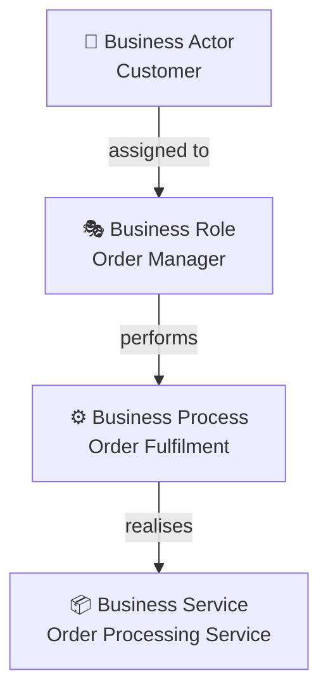
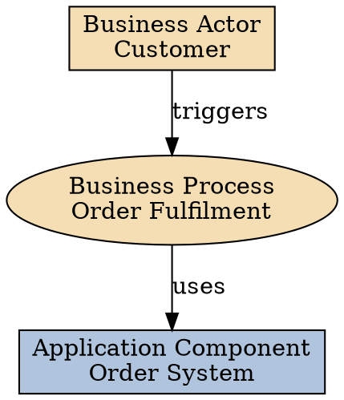

# ArchiMate Notation

ArchiMate 3.x is the standard notation for Enterprise Architecture modelling. It organises elements into **layers**, **aspects**, and **relationships**.

## Layer Overview

| Layer | Concerns | Colour (convention) |
|---|---|---|
| Strategy | Goals, capabilities, resources | Yellow |
| Motivation | Drivers, assessments, principles, goals, requirements | Light yellow |
| Business | Business processes, actors, roles, objects | Yellow/Tan |
| Application | Application components, services, interfaces | Blue |
| Technology | Infrastructure, networks, devices, system software | Green |
| Physical | Physical elements, facilities, equipment | Dark green |
| Implementation & Migration | Work packages, events, plateaus, gaps | Orange |

## Core Element Types

### Motivation Layer
- **Driver** — internal or external condition motivating change
- **Assessment** — result of an analysis (SWOT, risk)
- **Goal** — high-level statement of intent
- **Outcome** — desired end result
- **Principle** — normative property of architecture
- **Requirement** — need to be met
- **Constraint** — restriction on the architecture

### Strategy Layer
- **Capability** — ability to achieve outcomes
- **Course of Action** — approach to achieve goals
- **Resource** — asset in support of strategies
- **Value Stream** — sequence of activities delivering value

### Business Layer
- **Business Actor** — entity capable of performing behaviour
- **Business Role** — responsibility assigned to an actor
- **Business Process** — sequence of behaviours producing a result
- **Business Function** — collection of behaviour based on a criterion
- **Business Service** — explicitly defined exposed business behaviour
- **Business Object** — passive concept with significance in the business
- **Contract** — formal or informal agreement
- **Product** — coherent collection of services and products

### Application Layer
- **Application Component** — modular unit of application functionality
- **Application Interface** — point of access for application services
- **Application Service** — explicitly defined exposed application behaviour
- **Application Function** — automated behaviour of an application
- **Data Object** — passive element processed by applications

### Technology Layer
- **Node** — computational resource
- **Device** — physical IT resource
- **System Software** — software operating the environment
- **Technology Service** — explicitly defined exposed technology behaviour
- **Artifact** — physical piece of data used or produced by a system
- **Network** — communication medium
- **Path** — link between nodes

## Core Relationships

| Relationship | Meaning | Notation |
|---|---|---|
| Association | Unspecified relationship | Plain line |
| Composition | Whole-part, lifecycle dependency | Filled diamond |
| Aggregation | Whole-part, no lifecycle dependency | Open diamond |
| Assignment | Links units of behaviour to active elements | Circle with line |
| Realisation | Higher-level concept realised by lower | Dashed line + open arrow |
| Serving | Element provides services to another | Open arrowhead |
| Access | Element accesses a passive element | Dashed open arrowhead |
| Influence | Element affects another | Dashed line + open arrowhead |
| Triggering | Causal relationship between behaviours | Filled arrowhead |
| Flow | Transfer of information, goods, etc. | Dashed filled arrowhead |

## Diagram Types

| Viewpoint | Purpose | Primary Layers |
|---|---|---|
| Organisation | Actors, roles, responsibilities | Business |
| Business Process | End-to-end process flows | Business |
| Application Cooperation | Application interactions | Application |
| Application Usage | Business processes using applications | Business + Application |
| Technology | Infrastructure and technology | Technology |
| Layered | Cross-layer view | All |
| Capability Map | Strategic capabilities | Strategy + Business |
| Motivation | Goals, drivers, requirements | Motivation |
| Roadmap / Migration | Transition states | Implementation |

## Diagram Formats

### Mermaid (preferred for inline diagrams)

ArchiMate concepts map to Mermaid graph nodes. Use a legend comment at the top:

Use node shapes and emoji prefixes to indicate element types when native ArchiMate shapes are unavailable.

### Graphviz (.dot)

### Draw.io (.drawio)

For Draw.io diagrams, describe the elements and relationships clearly. The `ea-diagram` agent will generate the XML. Reference `references/drawio-archimate-shapes.md` for shape library setup instructions.

## Guidance for AI-Generated Diagrams

When generating ArchiMate diagrams:
1. Identify the viewpoint and primary audience first
2. Limit diagrams to one viewpoint — do not mix concerns
3. Use only elements appropriate to the diagram's layers
4. Mark AI-generated diagrams with a comment: `%% 🤖 AI Draft — Review Required`
5. Keep diagrams focused — 7±2 elements per diagram is optimal

## Additional Resources

- **`references/element-catalogue.md`** — Complete element type reference with notation symbols
- **`references/viewpoint-guide.md`** — Detailed guidance for each ArchiMate viewpoint
- **`references/drawio-archimate-shapes.md`** — Draw.io shape library setup for ArchiMate
