# Diagram Catalogue

Standard diagrams for each EA artifact type. Used by:
- `ea-interviewer` — to prompt for diagrams during and after Q&A sessions
- `ea-brainstorm.md` — to suggest visual capture at close of brainstorm
- `ea-grill.md` — to run Step 8 diagram coverage check
- `ea-diagram` agent — as the reference for standard naming and viewpoints

---

## How to Use This Catalogue

1. **During interview** — at the end of each phase session, present the relevant section and ask: "Which of these diagrams would you like to create now?"
2. **During brainstorm** — at close of session, surface the phase-relevant entries and offer to launch `/ea-diagram`
3. **During grill (Step 8)** — read the artifact's `diagrams:[]` frontmatter and inline refs, compare against the expected diagrams listed here, and report the coverage result
4. **During diagram creation** — use the Mermaid starters below as the initial skeleton; mark all AI-generated content with `%% 🤖 AI Draft — Review Required`

---

## Naming Convention

`{artifact-id}-{diagram-type}.{ext}`

| Ext | Format | When to Use |
|---|---|---|
| `.mmd` | Mermaid source | Primary authoring format; commit to `diagrams/` |
| `.png` / `.svg` | Rendered output | Embedded in exports via `/ea-generate`; regenerated from `.mmd` |
| `.drawio` | Draw.io XML | Complex free-form diagrams or when stakeholders edit in Draw.io |

---

## Preliminary Phase

### Context Diagram
**Artifact:** Engagement Charter  
**Viewpoint:** ArchiMate — Organisation viewpoint  
**Purpose:** Shows the engagement boundary, affected organisations, and key external relationships.

**Filename:** `engagement-charter-context.mmd`

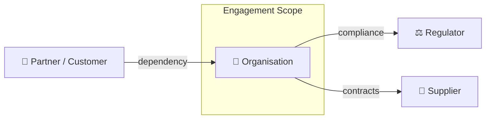

---

### Organisation Chart
**Artifact:** Engagement Charter  
**Viewpoint:** ArchiMate — Organisation viewpoint  
**Purpose:** Shows the organisational structure and units in scope.

**Filename:** `engagement-charter-org-chart.mmd`

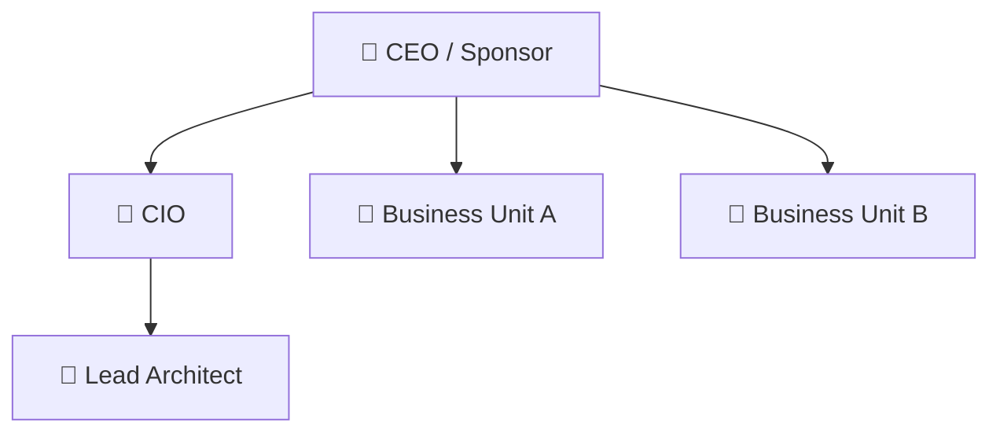

---

## Phase A — Architecture Vision

### Motivation Map
**Artifact:** Architecture Vision  
**Viewpoint:** ArchiMate — Motivation viewpoint  
**Purpose:** Shows the full DRV → Goal → Strategy chain. Communicates *why* the engagement exists and *how* the organisation intends to respond.

**Filename:** `architecture-vision-motivation-map.mmd`

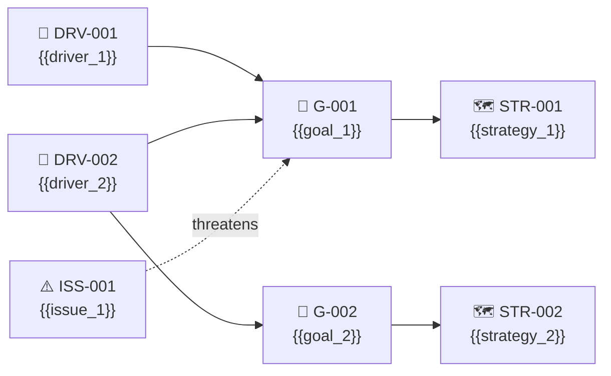

---

### Stakeholder Power/Interest Grid
**Artifact:** Architecture Vision / Stakeholder Map  
**Viewpoint:** Custom — Stakeholder analysis  
**Purpose:** Positions stakeholders by influence and interest to guide engagement strategy.

**Filename:** `architecture-vision-stakeholder-grid.mmd`

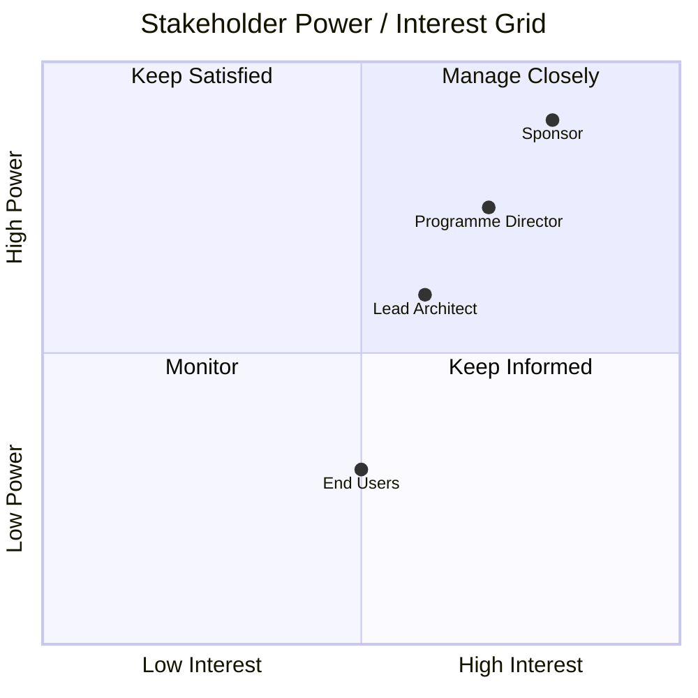

---

## Phase B — Business Architecture

### Capability Map
**Artifact:** Business Architecture  
**Viewpoint:** ArchiMate — Capability viewpoint  
**Purpose:** Hierarchical map of business capabilities with maturity heat-map colouring.

**Filename:** `business-architecture-capability-map.mmd`

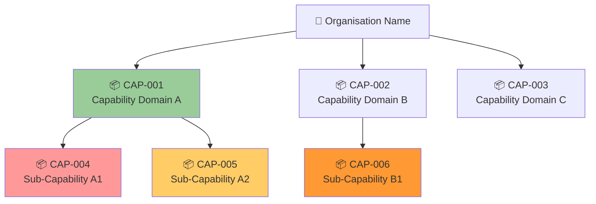

> Colour guide: 🔴 `#ff9999` = Absent &nbsp; 🟠 `#ff9933` = Immature &nbsp; 🟡 `#ffcc66` = Developing &nbsp; 🟢 `#99cc99` = Mature

---

### Business Process Flow
**Artifact:** Business Architecture  
**Viewpoint:** ArchiMate — Business Process viewpoint  
**Purpose:** End-to-end swimlane for a key business process.

**Filename:** `business-architecture-process-flow.mmd`

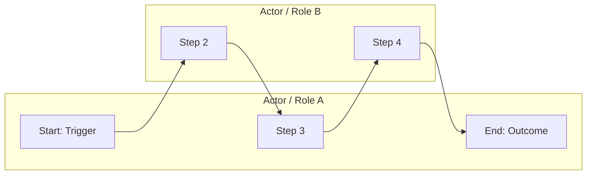

---

### Organisation Map
**Artifact:** Business Architecture  
**Viewpoint:** ArchiMate — Organisation viewpoint  
**Purpose:** Structural view of teams and roles relevant to the architecture scope.

**Filename:** `business-architecture-org-map.mmd`

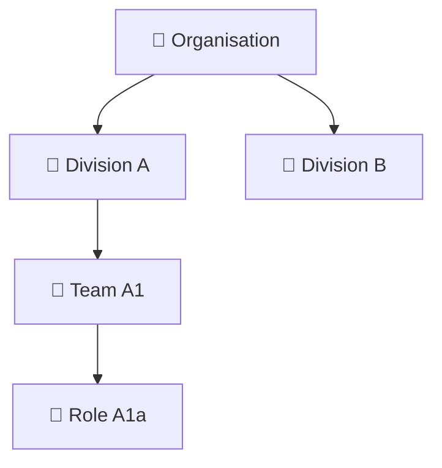

---

## Phase C — Data Architecture

### Conceptual Data Model
**Artifact:** Data Architecture §2  
**Viewpoint:** ArchiMate / ER — Semantic layer  
**Purpose:** Business-readable view of major subject areas and their relationships. No technical attributes.

**Filename:** `data-architecture-conceptual-data-model.mmd`

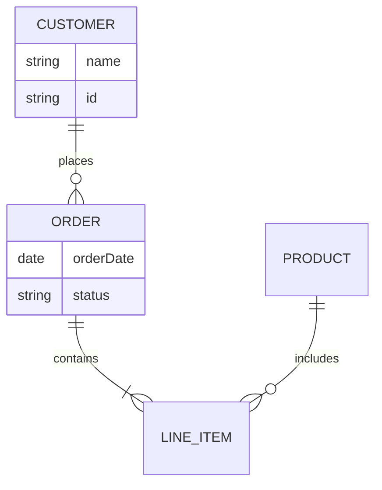

---

### Data Flow Diagram
**Artifact:** Data Architecture §5  
**Viewpoint:** Custom — Information flow  
**Purpose:** Shows how data moves between systems, highlighting cross-boundary flows and transformation points.

**Filename:** `data-architecture-data-flow.mmd`

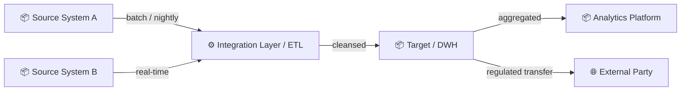

---

## Phase C — Application Architecture

### Application Cooperation View
**Artifact:** Application Architecture  
**Viewpoint:** ArchiMate — Application Cooperation viewpoint  
**Purpose:** Shows how applications interact — the integration topology.

**Filename:** `application-architecture-cooperation.mmd`

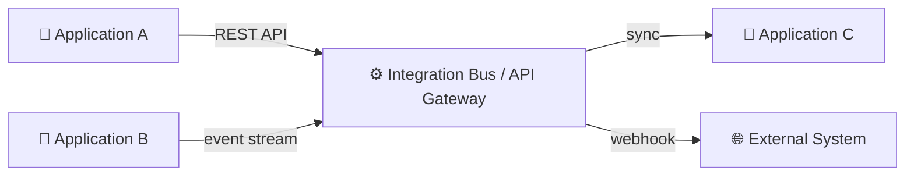

---

### Application Component Map
**Artifact:** Application Architecture  
**Viewpoint:** ArchiMate — Application Structure viewpoint  
**Purpose:** Decomposition of key applications into components and their dependencies.

**Filename:** `application-architecture-component-map.mmd`

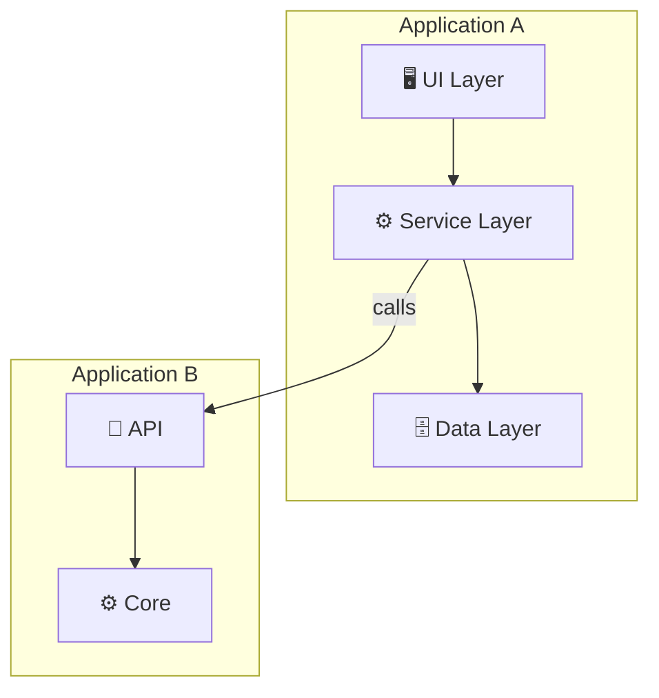

---

## Phase D — Technology Architecture

### Technology Stack View
**Artifact:** Technology Architecture  
**Viewpoint:** ArchiMate — Technology viewpoint  
**Purpose:** Layered view of the technology stack from infrastructure through to application.

**Filename:** `technology-architecture-stack.mmd`

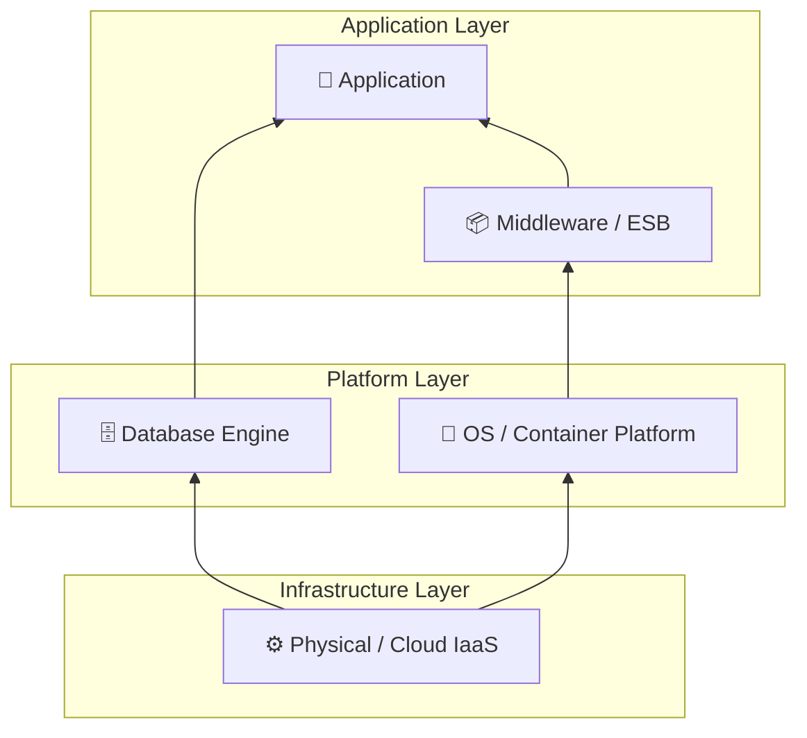

---

### Infrastructure Topology
**Artifact:** Technology Architecture  
**Viewpoint:** ArchiMate — Physical Infrastructure / Deployment viewpoint  
**Purpose:** Shows network zones, nodes, and deployment of key components. Highlights security boundaries and failure domains.

**Filename:** `technology-architecture-topology.mmd`

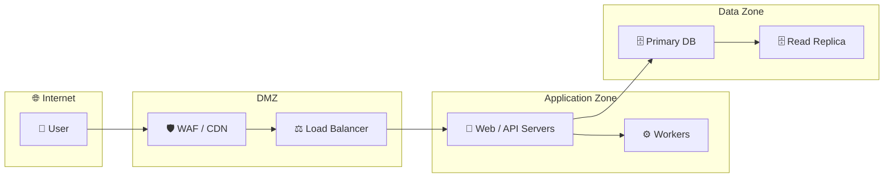

---

## Phase E — Opportunities & Solutions

### Gap Heat Map
**Artifact:** Gap Analysis  
**Viewpoint:** Custom — Capability/priority analysis  
**Purpose:** Visual prioritisation of gaps by strategic impact and closure effort.

**Filename:** `gap-analysis-heat-map.mmd`

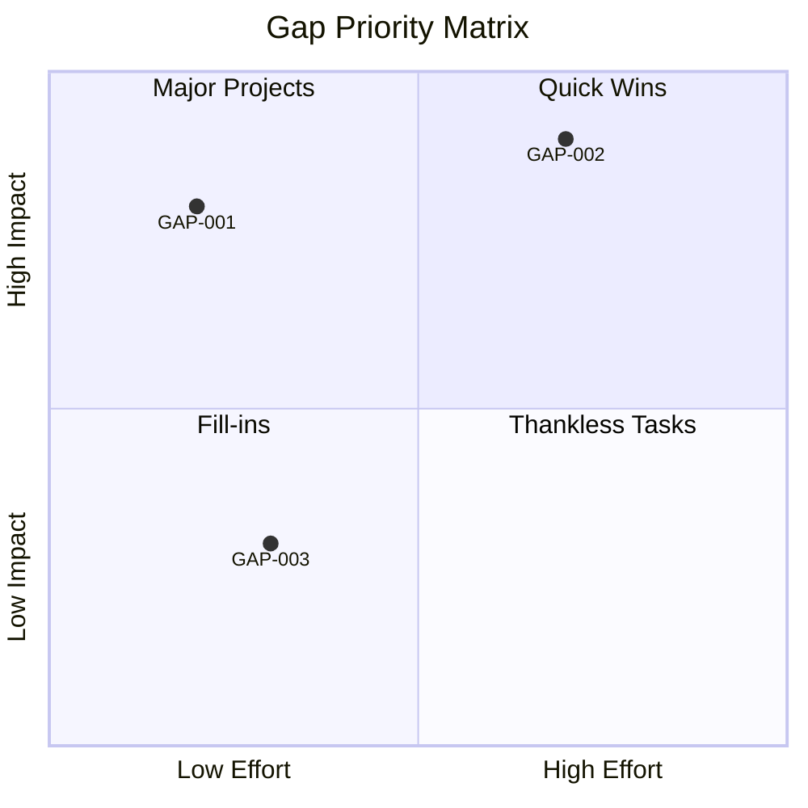

---

### Architecture Roadmap (Gantt)
**Artifact:** Architecture Roadmap  
**Viewpoint:** Custom — Timeline / delivery  
**Purpose:** Delivery timeline showing work packages sequenced into waves.

**Filename:** `architecture-roadmap-gantt.mmd`

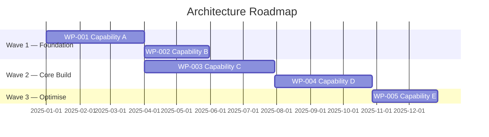

---

## Phase F — Migration Planning

### Migration Wave Diagram
**Artifact:** Migration Plan  
**Viewpoint:** Custom — Transition sequence  
**Purpose:** Shows what moves in each wave and the transition state at each checkpoint.

**Filename:** `migration-plan-waves.mmd`

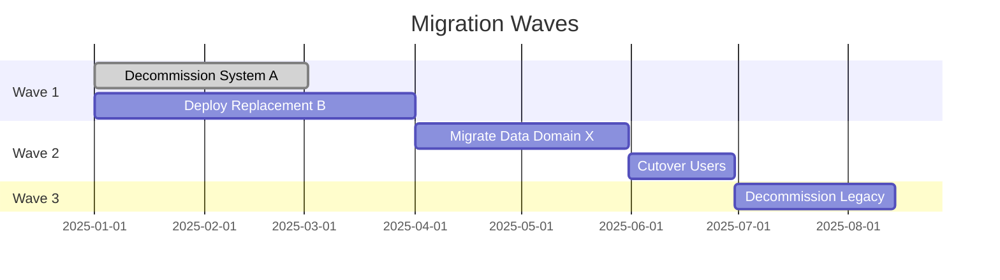

---

## Cross-Cutting Artifacts

### Risk Heat Map
**Artifact:** Risk Register  
**Viewpoint:** Custom — Risk analysis  
**Purpose:** Positions risks by likelihood and impact.

**Filename:** `risk-register-heat-map.mmd`

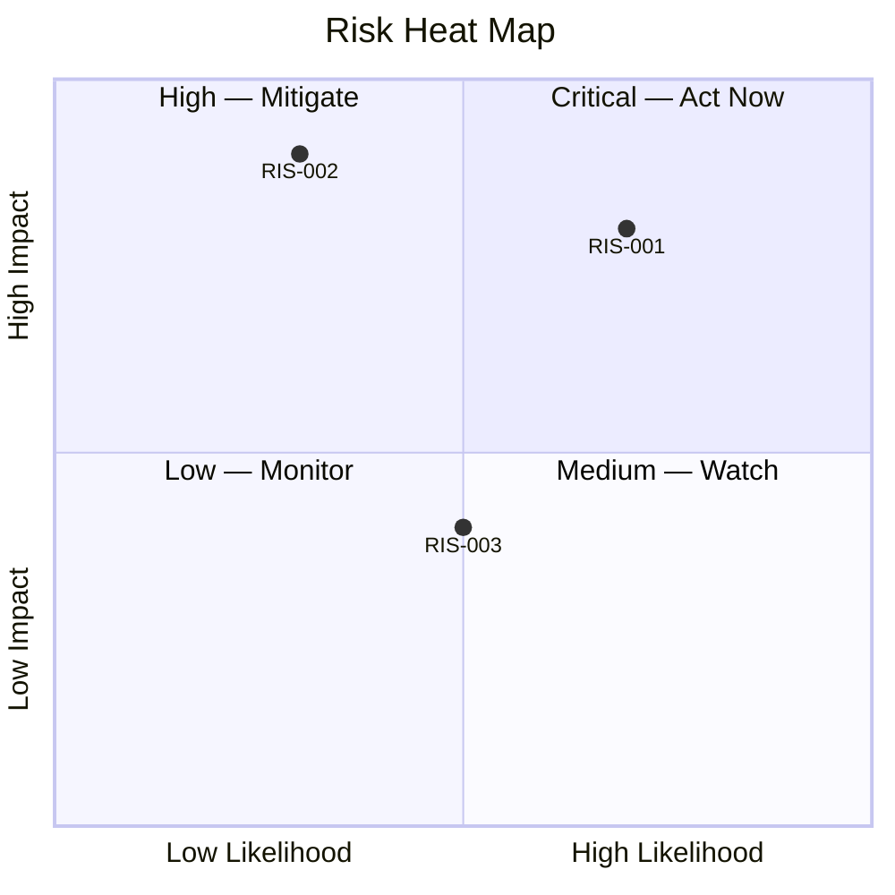

---

### Requirements Traceability Chain
**Artifact:** Requirements Register  
**Viewpoint:** Custom — Motivation traceability  
**Purpose:** Shows how requirements trace from drivers through goals, objectives, and strategies.

**Filename:** `requirements-register-traceability.mmd`

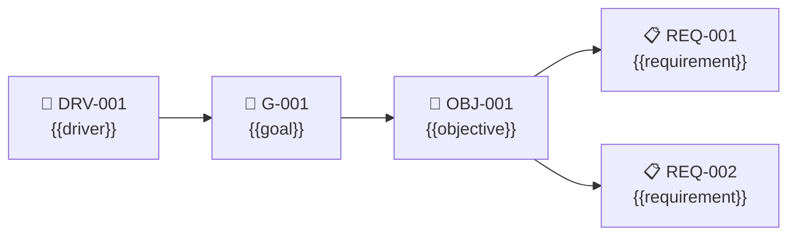

---

## Coverage Table (Quick Reference)

| Artifact | Expected Diagrams | Filenames |
|---|---|---|
| Engagement Charter | Context Diagram, Org Chart | `engagement-charter-context.mmd`, `engagement-charter-org-chart.mmd` |
| Architecture Vision | Motivation Map, Stakeholder Grid | `architecture-vision-motivation-map.mmd`, `architecture-vision-stakeholder-grid.mmd` |
| Business Architecture | Capability Map, Process Flow, Org Map | `business-architecture-capability-map.mmd`, `business-architecture-process-flow.mmd`, `business-architecture-org-map.mmd` |
| Data Architecture | Conceptual Data Model, Data Flow | `data-architecture-conceptual-data-model.mmd`, `data-architecture-data-flow.mmd` |
| Application Architecture | Application Cooperation, Component Map | `application-architecture-cooperation.mmd`, `application-architecture-component-map.mmd` |
| Technology Architecture | Technology Stack, Infrastructure Topology | `technology-architecture-stack.mmd`, `technology-architecture-topology.mmd` |
| Gap Analysis | Gap Heat Map | `gap-analysis-heat-map.mmd` |
| Architecture Roadmap | Gantt Roadmap | `architecture-roadmap-gantt.mmd` |
| Migration Plan | Wave Diagram | `migration-plan-waves.mmd` |
| Risk Register | Risk Heat Map | `risk-register-heat-map.mmd` |
| Requirements Register | Traceability Chain | `requirements-register-traceability.mmd` |
