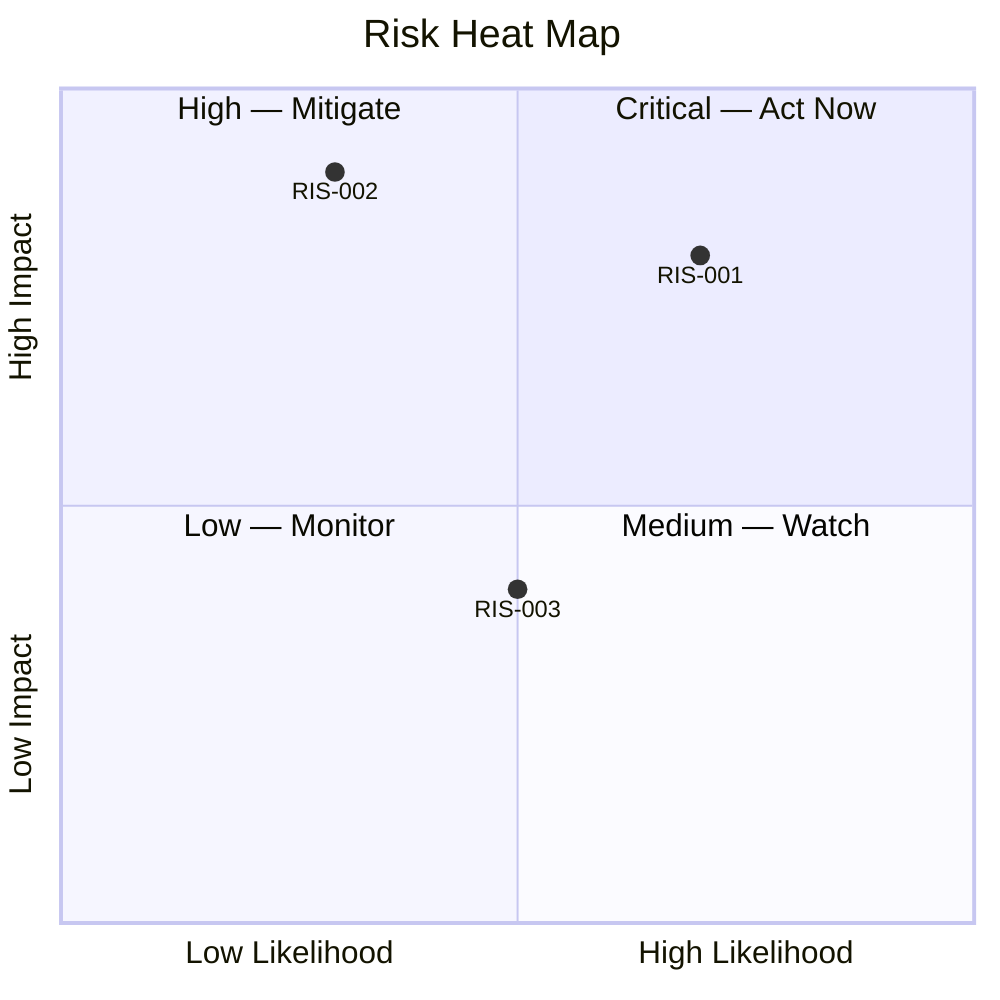
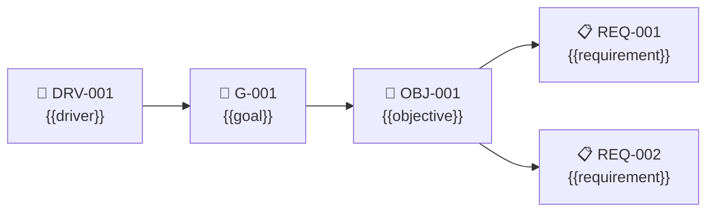

# Cross-Cutting Artifacts

### Risk Heat Map
**Artifact:** Risk Register  
**Viewpoint:** Custom — Risk analysis  
**Purpose:** Positions risks by likelihood and impact.

**Filename:** `risk-register-heat-map.mmd`

---

### Requirements Traceability Chain
**Artifact:** Requirements Register  
**Viewpoint:** Custom — Motivation traceability  
**Purpose:** Shows how requirements trace from drivers through goals, objectives, and strategies.

**Filename:** `requirements-register-traceability.mmd`

---
