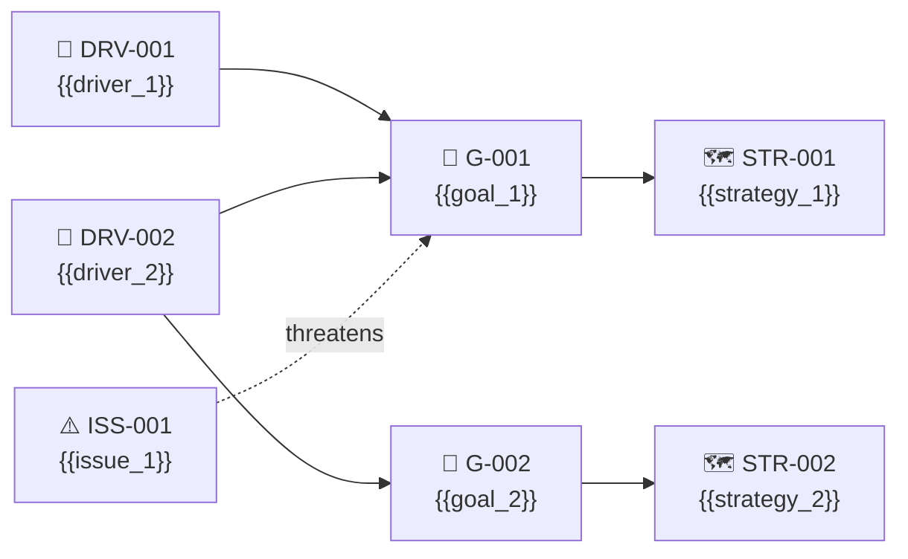
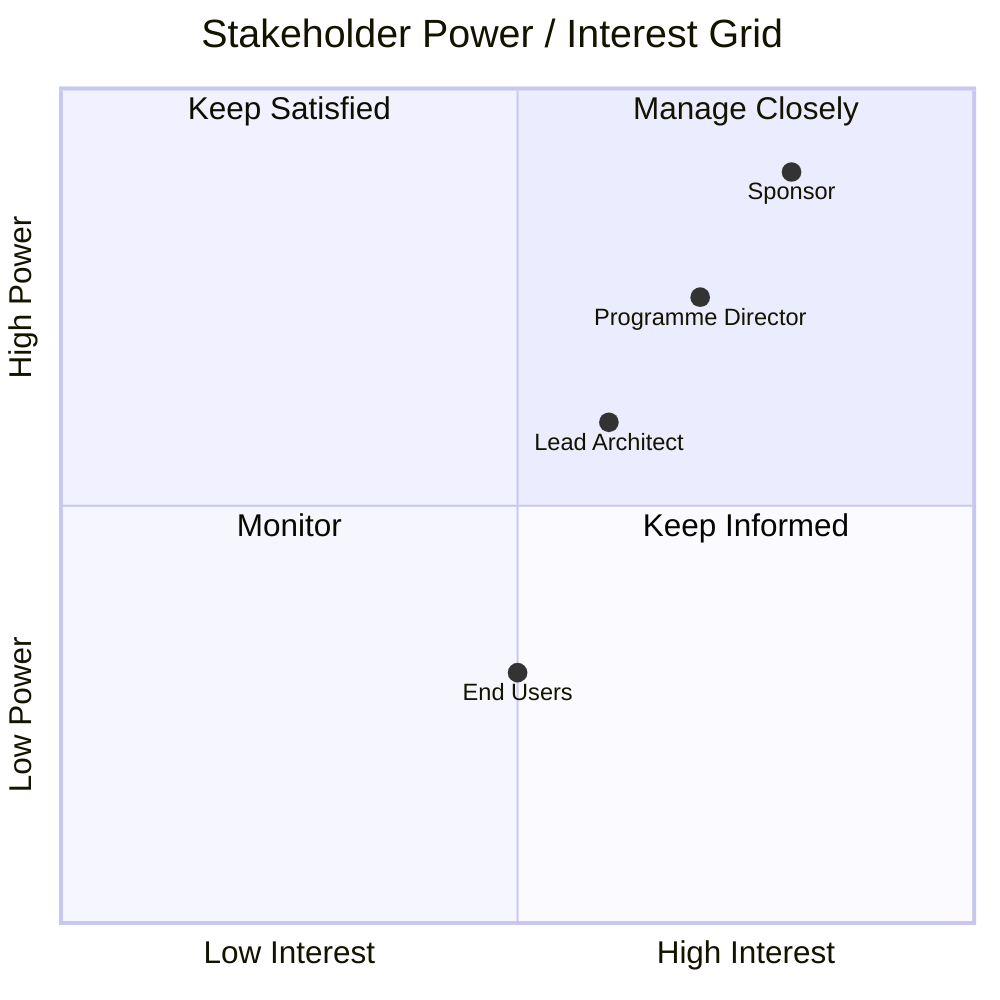

# Phase A — Architecture Vision

### Motivation Map
**Artifact:** Architecture Vision  
**Viewpoint:** ArchiMate — Motivation viewpoint  
**Purpose:** Shows the full DRV → Goal → Strategy chain. Communicates *why* the engagement exists and *how* the organisation intends to respond.

**Filename:** `architecture-vision-motivation-map.mmd`

---

### Stakeholder Power/Interest Grid
**Artifact:** Architecture Vision / Stakeholder Map  
**Viewpoint:** Custom — Stakeholder analysis  
**Purpose:** Positions stakeholders by influence and interest to guide engagement strategy.

**Filename:** `architecture-vision-stakeholder-grid.mmd`

---
