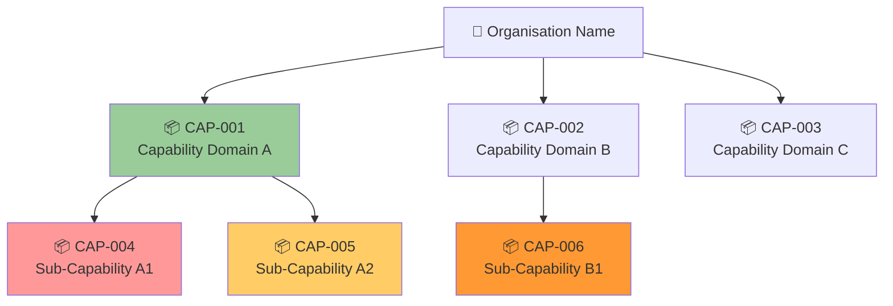
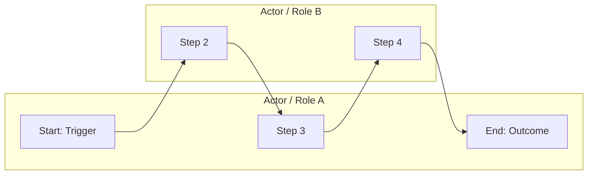
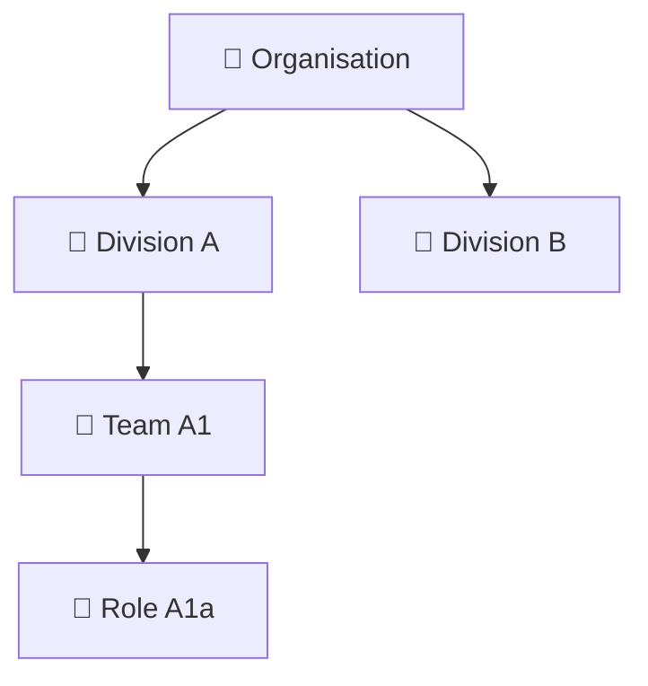

# Phase B — Business Architecture

### Capability Map
**Artifact:** Business Architecture  
**Viewpoint:** ArchiMate — Capability viewpoint  
**Purpose:** Hierarchical map of business capabilities with maturity heat-map colouring.

**Filename:** `business-architecture-capability-map.mmd`

> Colour guide: 🔴 `#ff9999` = Absent &nbsp; 🟠 `#ff9933` = Immature &nbsp; 🟡 `#ffcc66` = Developing &nbsp; 🟢 `#99cc99` = Mature

---

### Business Process Flow
**Artifact:** Business Architecture  
**Viewpoint:** ArchiMate — Business Process viewpoint  
**Purpose:** End-to-end swimlane for a key business process.

**Filename:** `business-architecture-process-flow.mmd`

---

### Organisation Map
**Artifact:** Business Architecture  
**Viewpoint:** ArchiMate — Organisation viewpoint  
**Purpose:** Structural view of teams and roles relevant to the architecture scope.

**Filename:** `business-architecture-org-map.mmd`

---
