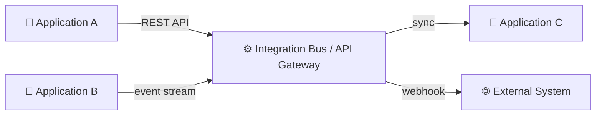
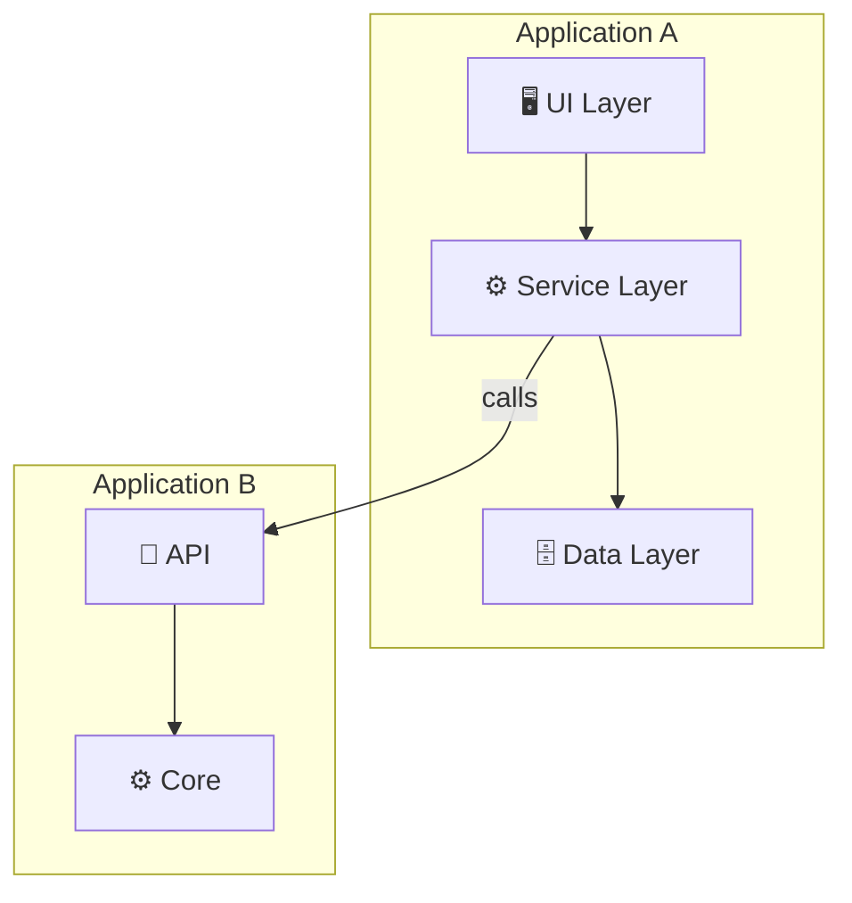

# Phase C — Application Architecture

### Application Cooperation View
**Artifact:** Application Architecture  
**Viewpoint:** ArchiMate — Application Cooperation viewpoint  
**Purpose:** Shows how applications interact — the integration topology.

**Filename:** `application-architecture-cooperation.mmd`

---

### Application Component Map
**Artifact:** Application Architecture  
**Viewpoint:** ArchiMate — Application Structure viewpoint  
**Purpose:** Decomposition of key applications into components and their dependencies.

**Filename:** `application-architecture-component-map.mmd`

---
