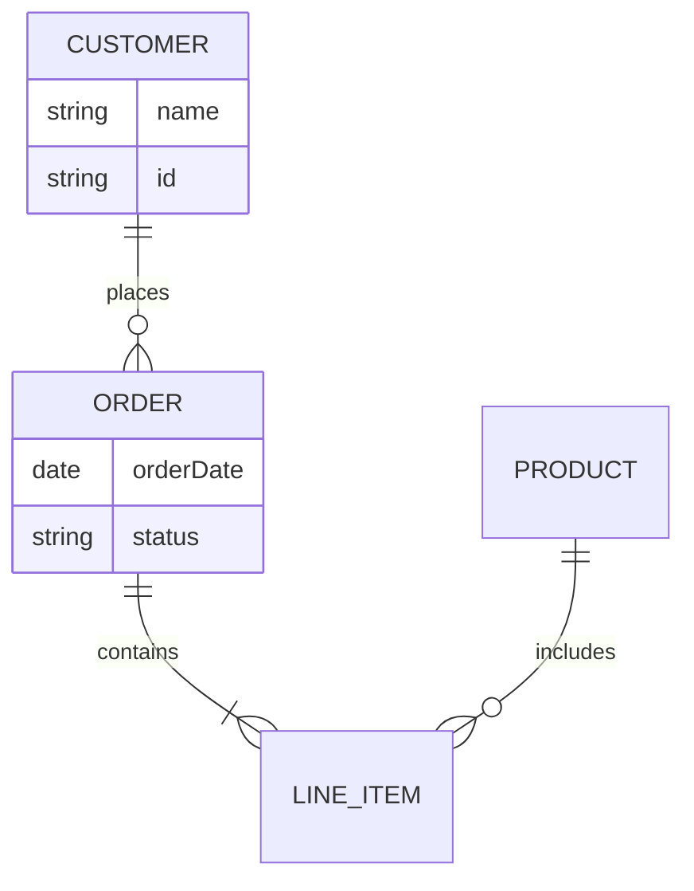
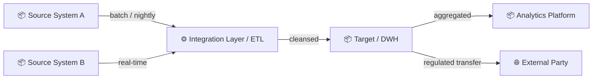

# Phase C — Data Architecture

### Conceptual Data Model
**Artifact:** Data Architecture §2  
**Viewpoint:** ArchiMate / ER — Semantic layer  
**Purpose:** Business-readable view of major subject areas and their relationships. No technical attributes.

**Filename:** `data-architecture-conceptual-data-model.mmd`

---

### Data Flow Diagram
**Artifact:** Data Architecture §5  
**Viewpoint:** Custom — Information flow  
**Purpose:** Shows how data moves between systems, highlighting cross-boundary flows and transformation points.

**Filename:** `data-architecture-data-flow.mmd`

---
