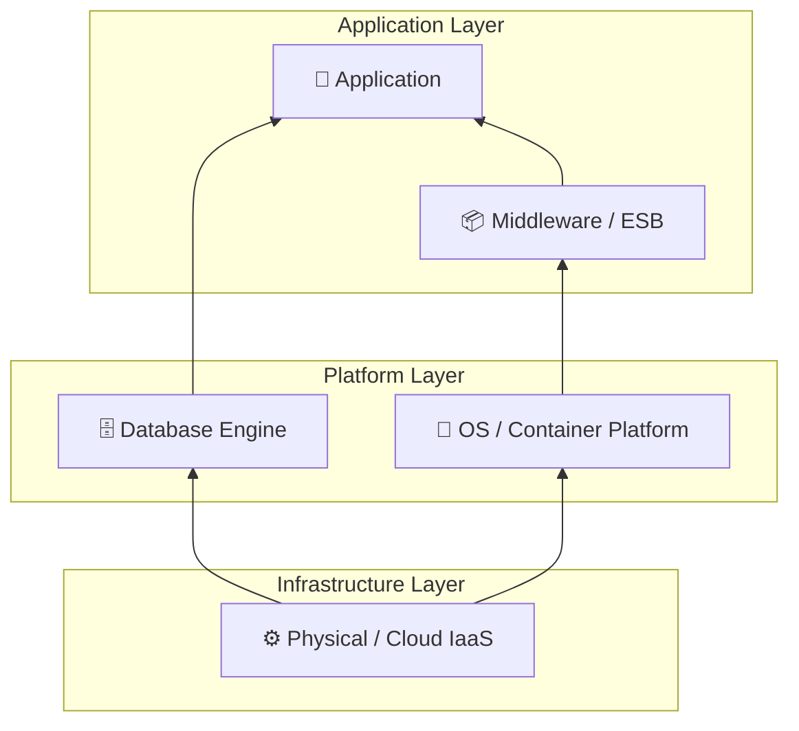
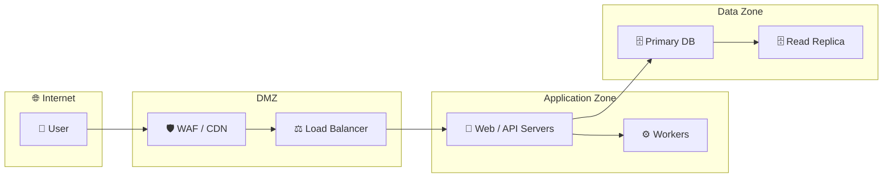

# Phase D — Technology Architecture

### Technology Stack View
**Artifact:** Technology Architecture  
**Viewpoint:** ArchiMate — Technology viewpoint  
**Purpose:** Layered view of the technology stack from infrastructure through to application.

**Filename:** `technology-architecture-stack.mmd`

---

### Infrastructure Topology
**Artifact:** Technology Architecture  
**Viewpoint:** ArchiMate — Physical Infrastructure / Deployment viewpoint  
**Purpose:** Shows network zones, nodes, and deployment of key components. Highlights security boundaries and failure domains.

**Filename:** `technology-architecture-topology.mmd`

---
