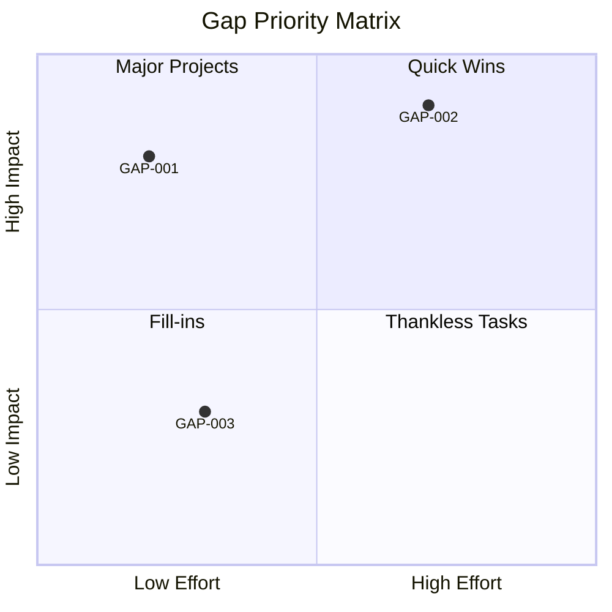
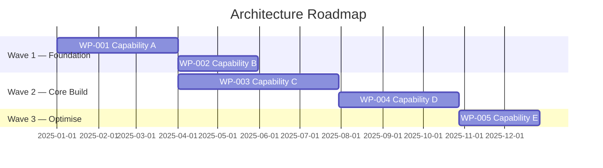

# Phase E — Opportunities & Solutions

### Gap Heat Map
**Artifact:** Gap Analysis  
**Viewpoint:** Custom — Capability/priority analysis  
**Purpose:** Visual prioritisation of gaps by strategic impact and closure effort.

**Filename:** `gap-analysis-heat-map.mmd`

---

### Architecture Roadmap (Gantt)
**Artifact:** Architecture Roadmap  
**Viewpoint:** Custom — Timeline / delivery  
**Purpose:** Delivery timeline showing work packages sequenced into waves.

**Filename:** `architecture-roadmap-gantt.mmd`

---
