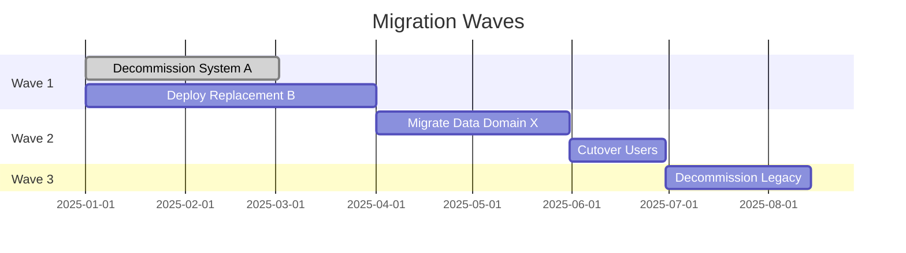

# Phase F — Migration Planning

### Migration Wave Diagram
**Artifact:** Migration Plan  
**Viewpoint:** Custom — Transition sequence  
**Purpose:** Shows what moves in each wave and the transition state at each checkpoint.

**Filename:** `migration-plan-waves.mmd`

---
