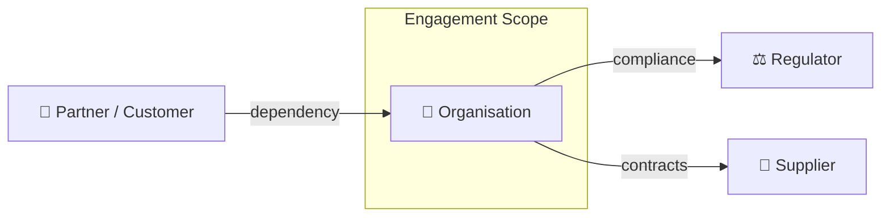
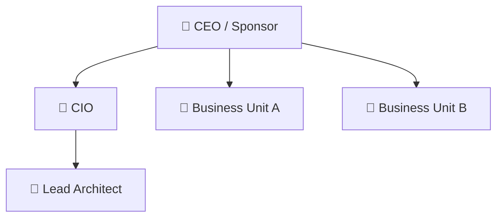

# Preliminary Phase

### Context Diagram
**Artifact:** Engagement Charter  
**Viewpoint:** ArchiMate — Organisation viewpoint  
**Purpose:** Shows the engagement boundary, affected organisations, and key external relationships.

**Filename:** `engagement-charter-context.mmd`

---

### Organisation Chart
**Artifact:** Engagement Charter  
**Viewpoint:** ArchiMate — Organisation viewpoint  
**Purpose:** Shows the organisational structure and units in scope.

**Filename:** `engagement-charter-org-chart.mmd`

---
