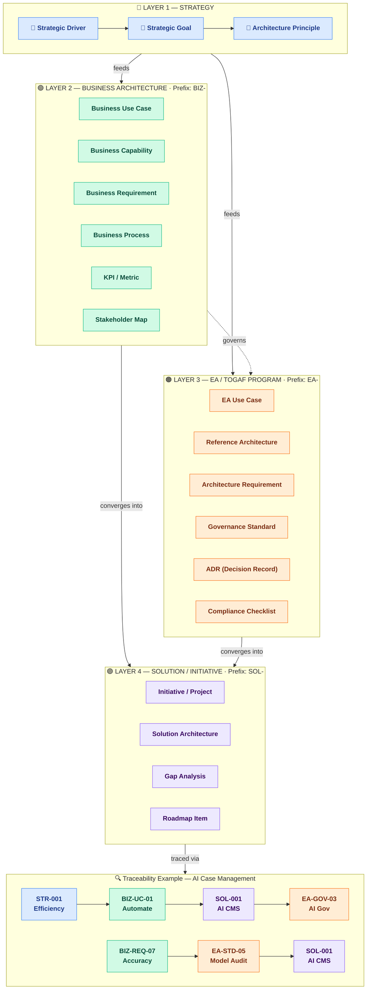

# EA Concepts Reference

## How to Use This Reference

This file is the canonical source for EA concepts that are frequently confused during interviews and artifact creation: **Vision**, **Mission**, **Principle**, **Goal**, **Objective**, **Strategy**, **Plan**, **Risk**, **Issue**, **Problem**, **Opportunity**, **Capability Model**, **Value Stream**, **Business Process**, **Use Case**, **Operating Model**, and **Metrics**. When the `ea-interviewer` agent detects concept confusion it cites this file. All commands and skills that capture direction, decisions, or risks should use these definitions — do not redefine them inline.

> 📎 Source: `references/ea-concepts-source.pdf` — *Enterprise Architecture Strategic Context: Terms, Concepts, and Relationship Models*. The definitions, relationships, and model diagrams in this file are grounded in that document.

---

## Motivation Framework

The engagement's strategic context is captured as a complete, linked chain from executive intent to practical execution:

```
Vision ──inspires──► Mission ──contextualizes──► Business Drivers (DRV)
                                                          │
                                                       drives
                                                          ▼
Issues (ISS) ──threatens──► Goals (G) ◄──achieves── Strategies (STR)
    │                           │
   causes                 operationalizes
    ▼                           ▼
Problems (PRB) ──blocks──► Objectives (OBJ)
                                │
                             informs
                                ▼
                        Capability Model          ◄── Capability Gap (prevents Goals)
                       (What the org does)
                                │
                           exercises
                                ▼
                         Value Streams
                    (End-to-end value delivery)
                                │
                            composed of
                                ▼
                         Business Processes
                                │
                         enables / consumed by
                                ▼
                          Use Cases
                    (Actor goals supported)
                                │
                           generates
                                ▼
                     Requirements Register
                    (traces to ALL layers above)
                                │
                           realised by
                                ▼
                  Architecture Building Blocks (ABB)
                    (Logical, vendor-neutral components)
                                │
                          implemented by
                                ▼
                  Solution Building Blocks (SBB)
                    (Concrete products and technologies)
                                │
                          delivered via
                                ▼
                       User Stories (STY)
                    (Actor-centred delivery items)
                                │
                          broken into
                                ▼
                            Tasks
                    (Atomic implementation steps)
```

Key relationships:
- **Vision** inspires Mission; **Mission** contextualizes Business Drivers
- **Business Drivers** drive Goals; **Issues** threaten Goals; **Strategies** achieve Goals
- **Goals** are operationalized through Objectives; **Problems** block Objectives
- **Objectives and Strategies** inform the Capability Model — what the org must be able to do
- **Capability Model** exercises **Value Streams** — end-to-end chains that deliver stakeholder value
- **Value Streams** are composed of **Business Processes** — structured activity flows with defined actors and steps
- **Use Cases** consume **Business Processes** to achieve actor goals and generate **Requirements**
- **Capability Model** shapes the **Operating Model** — how capabilities, processes, and value streams are organized and delivered
- **Operating Model** performance is measured through Metrics
- **Metrics** close the feedback loop: they validate success or surface new Issues, Problems, and Capability Maturity gaps
- **Capability Gaps** (missing or immature capabilities) prevent Goals from being achieved — they are identified through the Capability Model and feed into the Gap Analysis
- **Requirements Register** is the formal bridge from the strategic layer to execution; every requirement traces back to a Driver, Goal, Objective, Issue, Problem, Capability, Value Stream, Process, Use Case, Operating Model element, or Metric
- **Architecture Building Blocks (ABBs)** realise Requirements as logical, vendor-neutral components; ABBs are implemented by **Solution Building Blocks (SBBs)** — concrete products and technologies
- **User Stories** translate SBBs into actor-centred delivery items that teams implement as **Tasks**

---

## Two Layers of Intent: Business Change vs EA Enablement

A common source of confusion in TOGAF engagements is the overlap between **what the business wants to achieve** (business architecture) and **how the EA function enables and governs that change** (EA/TOGAF program architecture). Both layers use the same vocabulary — Goal, Use Case, Requirement, Strategy — but they describe entirely different subjects. This section provides the anchor distinction, naming conventions, and a quick test to prevent miscategorization.

### The Core Distinction

| Layer | Subject | Question it answers |
|---|---|---|
| **Business Architecture** | Business capabilities and operations | *What does the business want to do?* |
| **EA / TOGAF Program** | Architecture capability and governance | *How do we structure, govern, and standardize change so it is done well?* |

> **Blunt framing:** Business architecture = **change** (what we want to transform). EA / TOGAF = **control** (how we ensure it is done right).

### Structural Model

Think in four layers. EA sits **across** the stack, not inside the business layer.

```
Layer 1 — Strategy
  Goals, Drivers

Layer 2 — Business Architecture
  Capabilities, Value Streams, Business Processes,
  Business Use Cases, Business Requirements

Layer 3 — Solution / Initiative
  Projects, Epics, Implementations

Layer 4 — EA / TOGAF (cross-cutting)
  Architecture Principles, Standards, Reference Architectures,
  EA Capability Use Cases, Architecture Requirements,
  Governance Processes, Architecture Decisions
```

- **Business artifacts** describe the organisation's desired future state and operational design.
- **EA artifacts** describe the rules, standards, and governance mechanisms that ensure solution initiatives conform to architecture direction.
- The two layers are **linked, not competing:** a Business Goal drives a solution initiative, which is then **governed by** an EA Use Case or Architecture Requirement.

### Visual Model

The diagram below shows the three domains (Business Architecture, Solution / Initiative, EA / TOGAF) and how they relate. Solid arrows show flow within a domain; dotted arrows show cross-cutting governance and enablement relationships.

![[Pasted image 20260508120316.png]]

Here's the Mermaid version.




### Naming Conventions

Use explicit prefixes to remove ambiguity. Both layers should still use the unified ID scheme (G-NNN, UC-NNN, REQ-NNN, etc.) — the prefix is for human readability in artifact titles and tables.

| Layer | Artifact | Naming pattern | Example |
|---|---|---|---|
| Business | Use Case | `Business Use Case: {actor goal}` | Business Use Case: Automate Case Management |
| Business | Requirement | `Business Requirement: {outcome}` | Business Requirement: Reduce handling time by 40% |
| Business | Goal | `Business Goal: {desired state}` | Business Goal: Automate case management with AI |
| EA / TOGAF | Use Case | `EA Capability Use Case: {capability}` | EA Capability Use Case: Govern AI Solutions |
| EA / TOGAF | Requirement | `Architecture Requirement: {rule}` | Architecture Requirement: All AI models must pass bias audit |
| EA / TOGAF | Goal | `EA Goal: {capability outcome}` | EA Goal: Establish AI architecture governance |

### Quick Test: "Would this still exist without the EA team?"

When an item feels ambiguous, apply this test:

- **If the item would still exist if the EA team were disbanded** → it is **Business Architecture**
  - Example: *Automating case management with AI* — the business still needs this.
- **If the item would disappear if the EA team were disbanded** → it is **EA / TOGAF**
  - Example: *Defining an AI governance process* — this is an EA capability, not a business operation.

### Example: AI in Case Management — Cleanly Separated

**Business Layer (running the business)**
- **Goal:** Automate case management with AI
- **Use Cases:**
  - Auto-triage cases
  - AI-assisted decisioning
  - Document classification
- **Requirements:**
  - Accuracy thresholds
  - Compliance constraints
  - Integration with CRM
- **Drivers:**
  - Reduce processing time
  - Improve service quality

**EA / TOGAF Layer (enabling controlled delivery)**
- **Use Case:** Define governance process for AI projects
- **Requirements:**
  - Model validation standards
  - Risk classification framework
  - Approval workflows
- **Outputs:**
  - Architecture principles
  - Reference architectures
  - Governance checkpoints

**Relationship map:**
```
Business Goal: Automate case management with AI
  ↓
Solution initiative: AI solution implementation
  ↓
Governed by → EA Capability Use Case: Govern AI Solutions
```

### When to Surface This Distinction

- During **Phase A interviews** when stakeholders describe "goals" that are actually about governance, standards, or EA team capabilities.
- During **Phase B Business Architecture** when business use cases are drafted — flag any whose subject is "governance," "standards," or "review" as likely EA-layer items.
- During **/ea-direction --quality** scans when a direction item's subject is ambiguous.
- During **/ea-grill** reviews when an artifact mixes business and EA intent without explicit labeling.

### Mapping Relationships Between the Two Layers

Do not keep the two layers separate in your head — connect them structurally:

| Business Layer | Relationship | EA / TOGAF Layer |
|---|---|---|
| Business Goal | drives | Solution initiative |
| Solution initiative | governed by | EA Capability Use Case |
| EA Governance | enforces | Architecture Requirements |
| Architecture Requirements | constrain | Solution design |
| Architecture Decisions | guide | Solution implementation |

---

## Quick Reference Table

| Concept | Core Question | One-Line Marker | TOGAF Artifact Home | ArchiMate Element |
|---|---|---|---|---|
| **Vision** | *What do we aspire to become?* | Long-term aspirational destination — the North Star; all Drivers and Strategies must align | Architecture Vision §1; Stakeholder Map | — |
| **Mission** | *Why do we exist today?* | Fundamental purpose and scope of activity — bounds which Drivers are relevant | Architecture Vision §1; Stakeholder Map | — |
| **Business Driver** | *Why do we need to change now?* | External or internal force making the engagement necessary — must be evidenced and traceable to at least one Goal | Architecture Vision §2; Engagement Charter §6.2 | — |
| **Principle** | *What must always be true?* | Normative rule — applies to every future decision in its domain | Architecture Principles Catalogue (Prelim) | Principle (Motivation) |
| **Goal** | *Where do we want to be?* | Desired future state — qualitative, no deadline required | Architecture Vision §3; domain artifacts | Goal (Motivation) |
| **Objective** | *How far, and by when?* | Measurable, time-bound result — must have a measure, target, and deadline | Architecture Vision §4; domain artifacts | Outcome (Motivation) |
| **Strategy** | *How will we get there?* | Chosen course of action — not an outcome, not a sequence | Architecture Vision; domain artifacts | Course of Action (Motivation) |
| **Plan** | *What will we do, in what order, by when?* | Sequenced execution — who, what, when | Architecture Roadmap (Phase E); Migration Plan (Phase F) | Implementation Event sequences (Impl. & Migration) |
| **Risk** | *What could go wrong?* | Uncertain future event with potential negative effect on objectives | Architecture Vision; Statement of Architecture Work; Migration Plan | Risk (Motivation, Strategy layer) |
| **Issue** | *What systemic concern is threatening a goal?* | Broad barrier or pattern of dysfunction — no single fix; threatens a Goal | Architecture Vision §5 (Phase A) | — |
| **Problem** | *What specific symptom is blocking an objective?* | Observable, measurable, and fixable — blocks an Objective | Architecture Vision §6 (Phase A) | — |
| **Capability Model** | *What must the organisation be able to do?* | Stable, hierarchical map of capabilities (people + process + info + tools) — independent of org structure or current systems | Business Architecture (Phase B); Capability Map | Resource (Active Structure) |
| **Capability Gap** | *Which capabilities are missing or immature?* | Delta between required and current capability — prevents goals; feeds Gap Analysis | Gap Analysis (Phase B/C/D) | — |
| **Operating Model** | *How does the organisation function to deliver value?* | Describes how process, information, technology, and governance are organized and coordinated | Business Architecture (Phase B); Technology Architecture (Phase D) | — |
| **Value Stream** | *What end-to-end result does the stakeholder receive?* | End-to-end chain of activities delivering value from trigger to outcome — composed of processes, exercises capabilities | Business Architecture (Phase B); Value Stream Map | Value Stream (Strategy) |
| **Business Process** | *How is value delivered step by step?* | Structured set of activities with defined actors, inputs, outputs, and decision points — component of a value stream | Business Architecture (Phase B); Process Flow | Business Process (Business) |
| **Use Case** | *What does the actor need to accomplish?* | Discrete goal pursued by a specific actor — consumes processes, generates requirements | Business Architecture (Phase B); Use Case Catalog | — |
| **Metrics** | *How do we know we are succeeding?* | Specific, quantifiable measures — leading (predictive) or lagging (outcome); validate strategies or surface new Issues and Problems | Architecture Vision §7; domain artifacts | — |

---

## Concept Definitions

---

### Vision

**What it IS:**
A Vision is a forward-looking, aspirational description of what the organisation intends to become or achieve in the long term — typically a 3–5 year horizon. It serves as the "North Star": all Business Drivers, Goals, and Strategies must align with the Vision to ensure cohesive transformation. The Vision answers *"What are we becoming?"* — not what the organisation does today, but what it is striving towards.

**Distinguishing markers:**
- Aspirational and inspirational — not a plan or a set of tasks
- Long-horizon (3–5 years) — not a near-term target
- Describes an end state, not a method
- Provides the alignment test for all strategic choices made during the engagement

**What it is NOT:**
- Not a **Mission** — a Vision describes the future destination; a Mission describes today's purpose
- Not a **Goal** — a Vision is the overarching aspiration; Goals are the specific desired outcomes that contribute to realising it
- Not a **Strategy** — a Vision says *where*; a Strategy says *how*
- Not a **Principle** — a Vision is a directional statement, not a governance rule

**Common confusions:**
- "Become the leading digital insurer in Southeast Asia by 2030" — this is a **Vision** ✓ (aspirational, long-term, end-state)
- "Deliver outstanding customer service" — this could be a **Mission** (present-day purpose) or a **Goal** (desired state), not a Vision unless it describes a multi-year transformation
- "Adopt cloud-first architecture" — this is a **Strategy** (a chosen approach), not a Vision

**TOGAF placement:** Architecture Vision §1 Executive Summary; Stakeholder Map (as organisational context). Captured during Phase A as the strategic frame for the entire engagement. All Business Drivers should be validated against the Vision — Drivers that do not contribute to the Vision should be flagged.

**Practitioner Notes:**
- Treat the Vision as a **negotiation tool**, not a static deliverable. Build multiple candidate visions and force trade-off discussions early.
- Frame the vision as a **story**: "From [current state] to [desired state] via [key choices]." Stories create emotional buy-in.
- **Maturity marker (L1→L5):** L1 = single static vision; L3 = vision co-created with business; L5 = vision continuously updated based on implementation feedback
- Quantify the **strategic tension** (current vs desired state gap) to drive urgency
- Periodically reassess whether the vision is solving the *right* problem — if market conditions shift, the vision may need updating

---

### Mission

**What it IS:**
A Mission is a concise statement defining the organisation's fundamental purpose, its core activities, and the primary stakeholders it serves. It answers *"Why do we exist today?"* — not where the organisation is going, but what it is for right now. The Mission provides the boundary for all Business Drivers and Goals: Drivers and Goals that fall outside the Mission may indicate scope creep or a need to update the Mission itself.

**Distinguishing markers:**
- Present-tense, enduring — describes current purpose, not future aspiration
- Names what the organisation does, for whom, and why
- Provides the scope boundary test for Drivers and Goals
- Stable across engagements (unlike Goals and Objectives which are engagement-specific)

**What it is NOT:**
- Not a **Vision** — a Mission describes today's purpose; a Vision describes tomorrow's aspiration
- Not a **Goal** — a Mission is a standing statement of purpose; a Goal is a time-bound desired outcome
- Not a **Principle** — a Mission explains what the organisation is for; a Principle governs how decisions are made
- Not a **Strategy** — a Mission is a declaration of purpose, not a chosen approach

**Common confusions:**
- "We exist to connect people with affordable financial services" — this is a **Mission** ✓ (defines purpose, beneficiaries, and core activity)
- "Become the most trusted financial services provider in the region" — this is a **Vision** (aspirational, future state)
- "We will adopt API-first integration" — this is a **Strategy** (approach), not a Mission

**TOGAF placement:** Architecture Vision §1 Executive Summary; Stakeholder Map. Captured as organisational context in Phase A. Used to validate that Business Drivers are within scope — a Driver that cannot be traced to the Mission is out of scope for this engagement unless the Mission is being updated.

**Practitioner Notes:**
- The Mission is a **scope boundary test**. If a Driver or Goal cannot be traced to the Mission, flag it as potential scope creep.
- Mission statements are stable across engagements. Do not rewrite the Mission for every architecture cycle.
- **Maturity marker (L1→L5):** L1 = Mission copied from corporate website; L3 = Mission validated with stakeholders; L5 = Mission co-evolved with architecture and org design
- Use the Mission to **filter noise**: stakeholder requests outside the Mission are politely redirected

---

### Business Driver

**What it IS:**
A Business Driver is an external or internal force that makes the engagement necessary — it explains *why* the organisation needs to change now. Drivers are the bridge between the Mission (what we are) and the Goals (where we want to be). Every Driver must be evidenced: a driver without a verifiable source is an assumption, not a confirmed pressure.

**Structural parts** (engagement.json `direction.drivers[]`):
- **Statement** — one declarative sentence naming the force
- **Type** — External (market, regulatory, technology shift) / Internal (cost, capacity, leadership mandate)
- **Priority** — High / Medium / Low
- **Evidence / Source** — the event, report, regulatory instrument, or stakeholder statement that confirms this driver is real and current (e.g. "FY25 Board Risk Report p.12", "APRA CPS 230 effective Jan 2025")
- **Linked Goals** — G-NNN IDs this driver motivates

**What it is NOT:**
- Not a **Goal** — a driver is the force that creates pressure; a goal is the desired response to that pressure
- Not an **Issue** — a driver is the external or internal context; an issue is the organisational consequence of failing to respond to it
- Not a **Strategy** — a strategy is the chosen response; a driver is why a response is needed

**Common confusions:**
- "Increasing regulatory pressure" — this is a **Driver** ✓ (external force). The Goal it motivates might be "Achieve full regulatory compliance by Q2 2026"
- "We need to reduce costs" — this could be a Driver (internal cost pressure) OR a Goal depending on framing. If it is the *force* creating pressure on the engagement, it's a Driver; if it is what the engagement aims to achieve, it's a Goal
- "Our legacy platform is at end-of-life" — this is a Driver (internal technical force), not an Issue. The Issue is the *organisational consequence*: "Unplanned outages are increasing, threatening customer commitments"

**TOGAF placement:** Architecture Vision §2 (Preliminary/Phase A); Engagement Charter §6.2. Drivers are captured in the Preliminary phase and refined in Phase A. All Drivers should be linked to at least one Goal — an unlinked Driver is out of scope or requires a new Goal.

**ArchiMate:** `Driver` element in the Motivation aspect. Motivates `Assessment`, which in turn motivates `Goal`.

**Practitioner Notes:**
- Every Driver must be **evidenced**. A driver without a verifiable source is an assumption, not a confirmed pressure.
- Anchor Drivers to **business outcomes**, not architecture artifacts. Each driver should link to at least one measurable Goal.
- **Maturity marker (L1→L5):** L1 = drivers listed without evidence; L3 = drivers linked to KPIs and revenue/cost; L5 = drivers continuously validated against market and operational data
- **Economic framing:** Quantify driver impact where possible ("Regulatory change X will cost $Y in non-compliance penalties by Z date")
- Frame drivers around **business scenarios**, not technical stacks

---

### Principle

**What it IS:**
A principle is a normative statement that governs all future architecture decisions. It acts as a decision filter: when choosing between design options, a principle tells you which option to select (or eliminate). Principles are durable — they change rarely and only through a formal governance process.

**Structural parts** (TOGAF standard):
- **Name** — short, memorable label (e.g. "Vendor Neutrality")
- **Statement** — one declarative sentence describing the rule (e.g. "Technology choices must not create dependency on a single vendor")
- **Rationale** — why this principle matters to the organisation
- **Implications** — what this means in practice for architects, developers, and the business
- **Owner** — who is accountable for upholding this principle
- **Status** — Proposed / Approved / Retired

**What it is NOT:**
- Not a **Goal** — a goal describes a desired state; a principle governs how decisions are made to reach any state
- Not a **Strategy** — a strategy selects an approach for a specific engagement or problem; a principle applies universally and indefinitely
- Not a **Requirement** — a requirement states a need ("the system must handle 10,000 concurrent users"); a principle states a rule ("all systems must be designed for scalability")
- Not a **Preference** — principles are binding within their governance scope; preferences are optional

**Common confusions:**
- "We should use cloud" — this is a **Strategy** (a chosen approach), not a principle. A principle would be: "Technology platforms must support elastic scalability" (applies to all technology choices, not just the cloud decision)
- "We want to be data-driven" — this is a **Goal**, not a principle
- "All APIs must use OAuth 2.0" — this is a **Standard** (a specific, enforceable technical rule), not a principle. The underlying principle is: "Security controls must be applied at every integration boundary"

**TOGAF placement:** Architecture Principles Catalogue, created in the Preliminary phase before Phase A begins. Governs Phases A–H.

**ArchiMate:** `Principle` element in the Motivation aspect. Motivates `Goals`, `Requirements`, and `Constraints`.

**Practitioner Notes:**
- Principles must be **enforceable constraints**, not aspirational statements. Each principle needs an enforcement mechanism.
- Build a **minimal but enforceable standards catalog** — start small, evolve fast. Prune obsolete standards regularly.
- **Maturity marker (L1→L5):** L1 = principles are wall art; L3 = principles filter decisions with documented exceptions; L5 = principles are enforced automatically in pipelines
- **Failure mode watch:** Over-standardization (Failure Mode #5) — define core standards (mandatory) and flexible zones (experimental)
- Separate **principles** (universal, durable) from **standards** (contextual, evolving) and **preferences** (optional)

---

### Goal

**What it IS:**
A goal is a qualitative statement of a desired future state. It describes *where* the organisation wants to be — aspirational and long-term. Goals do not require a specific measure or deadline to be valid; their function is to set direction and establish what "success" looks like.

**Structural parts** (engagement.json `direction.goals[]`):
- **Statement** — one declarative sentence describing the desired state
- **Priority** — High / Medium / Low
- **Rationale** — why this is a goal for this engagement (1–2 sentences; what happens if it is not achieved)
- **Linked Drivers** — DRV-NNN IDs that motivate this goal

**What it is NOT:**
- Not an **Objective** — an objective is the measurable, time-bound version of a goal ("achieve 99.9% uptime by Q3 2026"); a goal is its qualitative parent
- Not a **Strategy** — a strategy says how to pursue a goal, not what the goal is
- Not a **Principle** — a principle governs decisions; a goal defines a destination
- Not an **EA Goal** — an EA Goal describes architecture capability outcomes (e.g., "Establish AI governance" or "Define architecture standards"), not business outcomes. See **Two Layers of Intent**.

**Common confusions:**
- "We want 99.9% uptime" — the number makes this an **Objective**, not a goal. The goal is "Achieve highly reliable platform operations"; the objective is the measurable target
- "Adopt API-first integration" — this is a **Strategy** (a chosen approach), not a goal
- "Comply with GDPR" — this is a **Requirement** (a compliance obligation), not a goal. The related goal might be "Become a trusted custodian of customer data"

**TOGAF placement:** `direction.goals[]` in `engagement.json`; Architecture Vision §3; referenced in domain architecture documents.

**ArchiMate:** `Goal` element in the Motivation aspect. Realised by `Outcomes`, associated with `Requirements`.

**Practitioner Notes:**
- Use **value streams to validate** whether goals actually deliver outcomes. A Goal without a value stream trace is unvalidated.
- Link goals directly to **KPIs and revenue/cost drivers** where possible.
- **Maturity marker (L1→L5):** L1 = goals are generic and unmeasured; L3 = goals linked to metrics and value streams; L5 = goals continuously refined based on delivery feedback
- Focus on **"where to play" and "how to win"** — not just process diagrams
- **Economic framing:** Every Goal should have a "what happens if not achieved" statement that includes business impact
- **Two Layers check:** Apply the quick test — *Would this still exist if the EA team were disbanded?* If no, it is an **EA Goal** and belongs in the Governance Framework or Architecture Principles, not the Architecture Vision.

---

### Objective

**What it IS:**
An objective is the measurable, time-bound operationalisation of a goal. It answers *how far, and by when?* Every objective must have three parts: a **unit of measure** (what you will count or track), a **target value** (how much), and a **deadline** (by when). Objectives are the direct anchor for Problems — if a problem cannot be linked to an objective, it may be out of scope.

**Structural parts** (Architecture Vision §4 / `direction.objectives[]`):
- **Statement** — one declarative sentence specifying the outcome
- **Measure** — unit of measure (e.g. "unplanned downtime hours per quarter")
- **Target** — target value (e.g. "< 4 hours")
- **Deadline** — date by which the target must be reached
- **Baseline** — current measured value (e.g. "currently 22 hours/quarter")
- **Linked Goal** — G-NNN of the parent goal

**What it is NOT:**
- Not a **Goal** — a goal is the qualitative parent; the objective is the measurable child
- Not a **Strategy** — an objective describes what you will achieve; a strategy describes how
- Not a **KPI** — a KPI is an ongoing performance measure; an objective is a one-time target with a deadline

**Common confusions:**
- "We want to improve customer satisfaction" — this is a **Goal** (no measure or deadline). The objective is: "Increase NPS from 32 to 50 by Q3 2026"
- "Reduce costs" — this is a **Goal**. "Reduce operational cost by 15% by end of FY27" is the **Objective**
- "We want 99.9% uptime" — has a measure and implicit target; add a deadline to make it a complete Objective

**TOGAF placement:** Architecture Vision §4; domain artifacts; `direction.objectives[]` in `engagement.json`.

**ArchiMate:** `Outcome` element in the Motivation aspect. Associated with `Goal` (realisation relationship).

**Practitioner Notes:**
- Define **success metrics before moving to Phase B**. An Objective without a measure is just a Goal in disguise.
- **Timebox** phase completion against objectives. If an objective cannot be met within the timebox, escalate or descope.
- **Maturity marker (L1→L5):** L1 = objectives have measures but no baselines; L3 = objectives have baselines, targets, and deadlines; L5 = objectives are dynamically adjusted based on implementation learnings
- Objectives are the **primary anchor for Problems**. If a problem cannot be linked to an Objective, it may be out of scope.
- Track **decision latency** per objective — slow architecture = delayed value

---

### Issue

**What it IS:**
An issue is a broader, systemic concern that threatens the organisation's ability to achieve one or more goals. Issues are management-level problems — patterns of dysfunction, capability gaps, unresolved conflicts, or sustained exposure to a driver that has no single fix. An issue has multiple contributing causes, affects a domain or process broadly, and requires sustained organisational response rather than a technical patch.

**Structural parts** (Architecture Vision §5):
- **Statement** — one sentence naming the systemic concern
- **Area** — organisational, process, or technology domain most affected
- **Threatens Goal(s)** — G-NNN IDs of the goals this issue puts at risk
- **Evidence** — observable signal, event, or data point that confirms this issue exists (e.g. "incident log shows 12 P1 outages in 90 days")
- **Raised By** — stakeholder or source that surfaced this issue

**What it is NOT:**
- Not a **Problem** — a problem is a specific, observable symptom with a direct fix; an issue is broader and systemic
- Not a **Risk** — a risk is a future, uncertain event; an issue is a present, ongoing concern. When a risk materialises, it becomes an issue
- Not a **Driver** — a driver is an external or internal force; an issue is the organisational consequence of inadequately responding to a driver

**Common confusions:**
- "Our API is returning 500 errors" — this is a **Problem** (specific, observable, fixable)
- "We have poor data culture" — this is an **Issue** (systemic, no single fix)
- "Increasing regulatory pressure" — this is a **Driver** (external force)
- "The integration broke" — this is a **Problem** (specific, fixable). The related issue might be "Our integration architecture lacks resilience and monitoring"

**TOGAF placement:** Architecture Vision §5 (Phase A). Issues captured here feed into Gap Analysis, Risk assessments, and Requirements.

**Practitioner Notes:**
- Treat gaps as **opportunities to simplify**, not just deficits to fill. The best architecture often removes rather than adds.
- Issues are **systemic concerns** — they have multiple contributing causes and no single fix.
- **Maturity marker (L1→L5):** L1 = issues are vague complaints; L3 = issues linked to goals and root causes; L5 = issues proactively identified via leading indicators before they become crises
- **Failure mode watch:** Documentation Trap — documenting issues without addressing systemic causes is waste

---

### Problem

**What it IS:**
A problem is a specific, observable, and fixable symptom that is actively blocking the achievement of one or more objectives. Problems have a clear cause-and-effect relationship: a root cause produces a visible symptom that degrades performance against a known objective. Because they are specific and measurable, problems can be prioritised, assigned, and resolved directly.

**Structural parts** (Architecture Vision §6):
- **Statement** — one sentence naming the specific problem
- **Observable Symptom** — what can be seen or measured today (ideally a number)
- **Blocks Objective(s)** — OBJ-NNN IDs of the objectives this problem is preventing
- **Evidence** — data point, incident, or measurement confirming the symptom is currently active
- **Raised By** — stakeholder or source that identified this problem

**What it is NOT:**
- Not an **Issue** — an issue is broad and systemic; a problem is specific and fixable. Multiple problems can contribute to a single issue
- Not a **Risk** — a risk is uncertain and future; a problem is certain and present
- Not a **Gap** — a gap is the difference between baseline and target state in a specific architecture domain (used in Gap Analysis); a problem is a current operational failure

**Common confusions:**
- "We have poor data quality" — this is an **Issue** (systemic). The problem is: "30% of customer records have duplicate entries, causing order processing errors 4× per week"
- "Our systems are slow" — this is an **Issue**. The problem is: "Mobile checkout page load time averages 8.2 seconds, causing 68% cart abandonment"
- "The vendor may not deliver" — this is a **Risk** (uncertain, future)

**TOGAF placement:** Architecture Vision §6 (Phase A). Problems feed directly into Requirements — each problem should produce one or more architecture requirements.

**Practitioner Notes:**
- Problems are **specific, observable, and fixable** — if it is not fixable, it is an Issue, not a Problem.
- **Hypothesis-driven approach:** Test assumptions about root causes before committing to solutions.
- **Maturity marker (L1→L5):** L1 = problems described in vague terms; L3 = problems have measurable symptoms and linked objectives; L5 = problems are anticipated and prevented via fitness functions and automated checks
- **Economic framing:** Quantify the cost of each problem (revenue lost, inefficiency, risk exposure) to prioritize fixes

---

### Strategy

**What it IS:**
A strategy is a chosen course of action or approach that the organisation will take to pursue its goals and objectives. It answers *how* — selecting one path from among alternatives. A strategy does not describe steps or sequences; it names the approach.

**Structural parts** (engagement.json `direction.strategies[]`):
- **Statement** — one declarative sentence naming the approach
- **Supports** — IDs of the goals or objectives this strategy serves
- **Priority** — High / Medium / Low

**What it is NOT:**
- Not a **Plan** — a strategy says "we will take the API-first approach"; a plan says "in Q1 we will build the API gateway, in Q2 we will migrate service X, in Q3 we will retire the legacy integration layer"
- Not a **Goal** — a strategy is an approach to achieve a goal, not the goal itself
- Not a **Principle** — a strategy is chosen for this engagement; a principle applies universally

**Common confusions:**
- "Move to the cloud" — this is a strategy (the chosen approach). "Have 80% of workloads on cloud by Q4 2027" is the **Objective**. "Cloud-first" may be an architecture **Principle** if it's a permanent organisational rule
- "We will improve data quality" — this is a **Goal** (a desired state), not a strategy
- "We will adopt event-driven architecture" — this is a **Strategy** ✓

**TOGAF placement:** `direction.strategies[]` in `engagement.json`; Architecture Vision Direction Summary; Business Architecture (business strategy); Technology Architecture (technology strategy).

**ArchiMate:** `Course of Action` element in the Motivation aspect. Realises `Goals` and `Objectives`.

**Practitioner Notes:**
- Use **capability-based planning** to bridge strategy and execution. Every strategy should map to capabilities that must be developed or enhanced.
- Focus on **"where to play" and "how to win"** — strategies that do not answer these questions are not actionable.
- **Maturity marker (L1→L5):** L1 = strategies are wish lists; L3 = strategies linked to capabilities and gaps; L5 = strategies continuously validated against market shifts and delivery outcomes
- **Failure mode watch:** Static target architecture illusion — strategies that assume a fixed end-state will become obsolete

---

### Plan

**What it IS:**
A plan is a sequenced description of how a strategy will be executed. It specifies who does what, in what order, and by when. Plans operate at the execution level and are time-bound by definition. They translate strategy into coordinated work.

**Distinguishing marker:** a plan has a sequence, resources (or work packages), owners, and dates. A strategy has none of these.

**TOGAF artifact homes:**
- **Architecture Roadmap** (Phase E/F) — the architecture-level plan: work packages, initiatives, and their sequencing across delivery waves
- **Migration Plan** (Phase F) — the detailed plan for migrating from baseline to target state; includes wave planning, dependencies, rollback procedures
- Work packages within a Roadmap are the smallest plan units

**What it is NOT:**
- Not a **Strategy** — a strategy says "adopt API-first"; a plan says "in Wave 1, build the API gateway; in Wave 2, migrate payment services; in Wave 3, decommission legacy ESB"
- Not a **Goal** — a plan is an execution sequence; a goal is a destination
- Not a **Principle** — a plan is temporary and engagement-specific; principles are permanent

**Common confusions:**
- "Our plan is to become cloud-native" — this is a **Goal** (desired future state), not a plan
- "We plan to adopt Kubernetes" — this is a **Strategy** (chosen approach), not a plan. The plan would specify the migration waves, owners, and dates

**ArchiMate:** No single dedicated element; plans are expressed through sequences of `Implementation Event`, `Work Package`, and `Deliverable` elements in the Implementation & Migration aspect.

**Practitioner Notes:**
- Decompose large transformations into **independently valuable increments**. Each increment should deliver standalone value.
- Treat **migration planning as a product** — prioritize value delivery over technical dependency alone.
- **Maturity marker (L1→L5):** L1 = static wish-list roadmap; L3 = roadmap aligned with agile increments and funding cycles; L5 = roadmap continuously updated with quick wins and feedback loops
- Design for **optionality** — preserve future flexibility by abstracting vendor lock-in behind interfaces
- Include **exit criteria** for legacy systems to avoid indefinite coexistence

---

### Risk

**What it IS:**
A risk is an uncertain future event or condition that, if it occurs, will have a negative effect on one or more objectives. Every risk has two dimensions: **likelihood** (probability it will occur) and **impact** (severity of effect if it does). The combination of the two determines risk rating.

**ID scheme:** `RIS-NNN` (e.g., RIS-001, RIS-002). Assigned by `/ea-risks generate` when risks are aggregated into the Risk Register. Source artifacts may use local IDs (e.g., `MIG-R001` in Migration Plan); these are re-mapped to `RIS-NNN` on aggregation.

**Structural parts** (risk register row):
- **RIS-NNN** — canonical risk ID assigned on aggregation
- **Description** — what could happen and why
- **Likelihood** — High / Medium / Low
- **Impact** — High / Medium / Low
- **Rating** — derived: Critical (H×H) / High (H×M, M×H) / Medium (M×M, H×L, L×H) / Low (M×L, L×M, L×L)
- **Mitigation** — action taken to reduce likelihood or impact
- **Contingency** — what to do if the risk materialises despite mitigation
- **Owner** — who is responsible for the mitigation
- **Status** — Open / Monitoring / Accepted / Closed
- **Source** — which artifact the risk was identified in

**What it is NOT:**
- Not a **Constraint** — a constraint is certain and non-negotiable (e.g., "the project must complete by 31 December 2026"); a risk is uncertain and conditional
- Not an **Issue** — an issue has already occurred and is being managed; a risk is future and hypothetical. When a risk materialises, it becomes an issue
- Not an **Assumption** — an assumption is something accepted as true for planning purposes (e.g., "the vendor will deliver on time"); a risk is what happens if the assumption is wrong

**Common confusions:**
- "Budget is limited" — this is a **Constraint** (a certainty), not a risk
- "The key architect may leave" — this is a **Risk** ✓ (uncertain; has likelihood and impact)
- "We assume stakeholder buy-in" — this is an **Assumption**. The associated risk is: "If stakeholder buy-in is not secured, adoption of the target architecture may fail"
- "The integration is broken" — this is an **Issue** (already occurred), not a risk

**TOGAF placement:** Architecture Vision (preliminary risks, §14); Statement of Architecture Work (risk register); Architecture Compliance Assessment (outstanding risks); Migration Plan (risk register per wave, §4). The consolidated **Risk Register** artifact aggregates all of the above into a single cross-cutting view — use `/ea-risks` to generate it. Risk likelihood and impact ratings also appear in the A3 Decision Log `Risk` column.

**ArchiMate:** `Risk` element in the Motivation aspect (Strategy layer, introduced in ArchiMate 3.0). Associated with `Goal` and `Outcome` via influence relationships.

**Practitioner Notes:**
- **Quantify uncertainty** — do not hide it behind diagrams. Express risks in financial terms where possible.
- Track architecture decisions (ADR-style) as first-class artifacts — risks often materialize when decision rationale is lost.
- **Maturity marker (L1→L5):** L1 = risks documented but not acted on; L3 = risks linked to mitigation plans and owners; L5 = risks actively managed via systemic architecture decisions (e.g., reducing integration points)
- Use architecture to **actively manage systemic risk**, not just document it
- **Design for graceful degradation**, not just peak performance

---

### Stakeholder Concern / Objection

**What it IS:**
A stakeholder concern or objection is a named challenge, question, or objection raised by a stakeholder or surfaced during a formal review (grill-me session, ARB review, executive challenge session). Unlike a Risk (which is an uncertain future event), a concern is a **present-tense challenge** to the architecture that requires either a documented response or a corrective action.

**ID scheme:** `CON-NNN` (e.g., CON-001). Assigned sequentially across the engagement; scoped to the artifact where the concern was raised. Aggregated by `/ea-concerns` into a cross-artifact Concerns Register.

**Structural parts** (Appendix A4 row):
- **ID** — CON-NNN
- **Concern** — the objection or question verbatim where possible
- **Raised By** — stakeholder name/role, or grill-me skill used
- **Category** — Scope / Goal / Approach / Feasibility / Risk / Stakeholder / Other
- **Status** — Addressed / Partially Addressed / Requires Attention
- **Response** — where in the artifact (or another) the concern is answered; blank if unresolved
- **Action / Owner** — what needs to happen and who is responsible (Requires Attention only)

**Distinction from Risk:** A concern becomes a Risk when it has a probability and a potential future impact on an objective. A concern that is "Requires Attention" and category "Risk" should be escalated to the Risk Register as a RIS-NNN entry.

**TOGAF placement:** Appendix A4 of every primary artifact. Aggregated via `/ea-concerns` into a cross-engagement Concerns Register.

---

### Capability Model

**What it IS:**
A Capability Model is a stable, hierarchical map of what the organisation must be able to do to achieve its business outcomes — independent of current organisational structure, people, or systems. Capabilities represent bundles of people, processes, information, and tools working together to produce a defined outcome. The Capability Model answers *"What must the organisation be able to do?"*

**Structural characteristics:**
- Organised as a hierarchy: Level 1 (domain) → Level 2 (capability) → Level 3 (sub-capability)
- Each capability is assigned a **CAP-NNN** ID on creation during Phase B — IDs are sequential across the engagement
- Each capability has a name, brief description, and maturity level (Absent / Immature / Developing / Mature)
- Each capability includes a **Supports** field referencing the STR-NNN strategies or G-NNN goals it enables — this is the explicit traceability link from strategy to capability; a capability with no strategic anchor should be flagged for removal or reclassification
- Independent of how the capability is currently delivered — what, not how or who
- Stable across reorganisations; changes only when business outcomes change

**Key relationships:**
- **Objectives and Strategies inform** the Capability Model — the capabilities the org must develop are determined by where it is going and how it plans to get there
- **Capability Model shapes** the Operating Model — once you know what you must be able to do, you design how it will be done
- **Capability Gap** = a capability that is absent or immature relative to what the Strategies and Objectives require; capability gaps prevent Goals from being achieved

**What it is NOT:**
- Not an org chart — capabilities are outcome-based, not structure-based
- Not a process model — a capability is what can be done; a process is how it is done
- Not a system inventory — capabilities are business concepts; applications implement them

**TOGAF placement:** Business Architecture (Phase B) — the primary home. Referenced in Gap Analysis and Architecture Vision when summarising what the organisation must be able to do to achieve its Goals.

**Practitioner Notes:**
- **Map capabilities to value streams** — do not model capabilities in isolation. A capability without a value stream trace is unvalidated.
- Identify **differentiating vs commodity capabilities** — optimize investment accordingly.
- **Maturity marker (L1→L5):** L1 = capabilities reflect org chart; L3 = capabilities linked to value streams and KPIs; L5 = capability heatmaps directly drive investment prioritization
- Use business architecture to **challenge org design**, not just reflect it
- **Failure mode watch:** Centralized Bottleneck — if all capability decisions flow through a single authority, the model becomes a bottleneck rather than a tool

---

### Operating Model

**What it IS:**
The Operating Model is a high-level description of how the organisation functions in order to deliver value. It describes how process, information, technology, and governance are organised and coordinated — the "how" to the Capability Model's "what". The Operating Model answers *"How does the organisation function to deliver value?"*

**Typical components:**
- **Process** — how work flows across the organisation to produce outcomes
- **Information** — what data and knowledge is required, where it lives, and how it flows
- **Technology** — the platforms, systems, and tools that enable operations
- **Governance** — how decisions are made, who has authority, and how performance is managed

**Key relationships:**
- **Capability Model shapes** the Operating Model — the design of processes, information flows, and technology choices follow from capability requirements
- **Operating Model performance is measured by** Metrics — the operating model is the source of most operational metrics
- Changes to the Operating Model are the primary driver of Business Architecture and Technology Architecture work

**What it is NOT:**
- Not a Capability Model — the Operating Model describes how work happens; the Capability Model describes what the org can do
- Not an org chart — an Operating Model includes process, information, and technology alongside people
- Not a system architecture — the Operating Model operates at the business level; the Technology Architecture is its technical expression

**TOGAF placement:** Business Architecture (Phase B) — particularly the Business Model Canvas and process views. Technology Architecture (Phase D) — the technical dimensions of the Operating Model.

**Practitioner Notes:**
- Align ADM phases with **agile increments** (e.g., Vision with PI planning, Opportunities with backlog shaping).
- Treat **cloud adoption as an operating model shift**, not just a hosting change.
- **Maturity marker (L1→L5):** L1 = operating model reflects current state only; L3 = target operating model designed with delivery teams; L5 = operating model co-evolves with architecture and org design
- **Pattern:** Dual Operating System (Run vs Change) — separate stability-optimized and innovation-optimized operating models
- Use the Operating Model to **influence team structures**, not just system structures

---

### Metrics

**What it IS:**
Metrics are specific, quantifiable measures used to track progress, performance, and outcomes. They provide evidence as to whether Strategies are working and whether Objectives and Goals are being achieved. Metrics answer *"How do we know we are succeeding?"*

**Leading vs Lagging:**
- **Leading metrics** — predictive; indicate whether future performance is likely to improve or worsen (e.g. number of teams trained on new process before go-live)
- **Lagging metrics** — outcome-based; indicate whether desired results have already been achieved (e.g. NPS score after three months of operation)
- A robust measurement framework uses both: leading metrics to act early, lagging metrics to validate success

**Feedback loop role:**
Metrics close the loop between intention and evidence:
- If performance is on target → metrics **validate** the Strategy; Goals and Objectives are being achieved
- If performance is below threshold → metrics **surface new Problems** (observable symptoms) or **reveal deeper Issues** (systemic conditions)
- Metrics also **evaluate Capability Maturity** — when a capability is not performing, metrics identify which ones need investment

**Structural parts** (Architecture Vision §7 / Metrics Register):
- **ID** — MET-NNN
- **Description** — what is being measured
- **Type** — Leading / Lagging
- **Unit** — how it is measured
- **Baseline** — current value
- **Target** — desired value
- **Deadline** — when the target must be reached
- **Linked Objective(s)** — OBJ-NNN this metric tracks
- **Baseline Source** — where the current-state measurement comes from (report, system, stakeholder estimate)

**What it is NOT:**
- Not an Objective — an Objective defines the target; a Metric measures whether the target is being reached
- Not a KPI (necessarily) — all KPIs are metrics, but not all metrics are KPIs; KPIs are the most strategically significant metrics
- Not a requirement — a requirement specifies what must be done; a metric measures whether it has been done successfully

**TOGAF placement:** Architecture Vision §7 Strategic Direction Summary; referenced in Phase G (Implementation Governance) for compliance tracking; Phase H (Architecture Change Management) for performance feedback.

**Practitioner Notes:**
- **Measure success through delivery outcomes** (cycle time, quality, value), not artifact completeness.
- Metrics close the feedback loop: they either **validate** strategy or **surface new Issues/Problems**.
- **Maturity marker (L1→L5):** L1 = metrics are vanity metrics (artifact count); L3 = metrics linked to delivery outcomes and business KPIs; L5 = metrics automatically collected and trigger architecture adaptation
- Align architecture KPIs with **enterprise OKRs** (e.g., reuse rate, time-to-decision)
- Use **both leading and lagging metrics** — leading metrics for early action, lagging metrics for validation

---

### Architecture Decision Record

**What it IS:**
An Architecture Decision Record (ADR) is a standalone document that captures the full context, options analysis, rationale, and consequences of a significant architecture decision. An ADR is written when a decision is hard to reverse, involves meaningful trade-offs, or requires documented rationale so that future architects understand why things are the way they are.

**ID scheme:** `ADR-NNN` (e.g., ADR-001, ADR-023). Assigned sequentially per engagement. Managed by `/ea-adrs`.

**ADR lifecycle:**
```
Candidate → In Progress → Completed
                                └──→ Superseded (by ADR-NNN)
          └──→ Deprecated (any time, with reason)
```
- **Candidate**: Decision identified; options analysis not yet started
- **In Progress**: Options analysis underway; decision not yet made
- **Completed**: Decision made and fully documented
- **Superseded**: Replaced by a newer ADR; `supersededBy: ADR-NNN` recorded
- **Deprecated**: No longer applicable; deprecation reason recorded

**When to create an ADR (not just an A3 Decision Log entry):**
- Technology or vendor selection (cloud platform, database engine, integration middleware)
- Architecture pattern or style choice (microservices, event-driven, CQRS, layered)
- Make-vs-buy or build-vs-configure decisions
- Data governance approach (ownership, sharing, sovereignty model)
- Security or compliance architecture approach
- Significant API or integration design choice
- Any decision that is hard to reverse or whose rationale may be questioned later

**ADR vs. A3 Decision Log:**
- The **A3 Decision Log** (within an artifact's appendix) tracks governance state — who decided what, at what authority level, and whether it has been verified. It is lightweight and lives inside the artifact.
- An **ADR** documents the full decision context: what situation triggered it, what options were considered, why one was chosen, and what the consequences are. It is a standalone artifact.
- They complement each other: log a high-level entry in A3; create an ADR for the full documentation. Link them via the ADR-NNN ID in the A3 `Notes` column.

**Structural parts** (architecture-decision-record.md):
- **§1 Status** — lifecycle history table (date/status/changed-by/note)
- **§2 Context** — situation that forces the decision; linked DRV/G-NNN; triggering artifact
- **§3 Decision Drivers** — evaluation criteria (must-have / should / nice-to-have)
- **§4 Options Considered** — at least two options with pros/cons and driver assessment
- **§5 Decision** — unambiguous statement; chosen option; governance reference
- **§6 Rationale** — why the chosen option was selected; accepted trade-offs
- **§7 Consequences** — positive, negative, risks introduced (RIS-NNN link), new decisions required
- **§8 Related Architecture Decisions** — ADR-to-ADR relationships
- **§9 Affected Artifacts** — artifacts materially affected by this decision

**TOGAF placement:** ADR is not a native TOGAF artifact, but maps closely to the Architecture Decision concept in TOGAF's Architecture Repository. ADRs are referenced via the A3 Decision Log in Architecture Vision, domain architecture artifacts, and the ADR Register.

**Commands:** Use `/ea-adrs` to manage ADRs, track the register, and surface ADR summaries. Use `/ea-adrs new` to create a new ADR. Use `/ea-adrs status` for a portfolio view.

---

### Capability Gap

**What it IS:**
A Capability Gap is a delta between the capabilities the organisation currently has and the capabilities it needs to achieve its Goals and Objectives. Capability Gaps are identified by comparing the Capability Model against the requirements of the Strategies and Objectives. A gap may be a **missing capability** (entirely absent) or an **immature capability** (present but not yet fit-for-purpose).

**Key relationships:**
- Capability Gaps **prevent Goals** from being achieved — if a required capability is absent or immature, the associated Goal cannot be reached
- Identified Capability Gaps **trigger work packages** in the Architecture Roadmap (Phase E)
- Capability Gaps are the primary output of the **Gap Analysis** artifact

**TOGAF placement:** Gap Analysis (Phases B, C, D) — one gap register per domain. Feeds into Architecture Roadmap work package definitions (Phase E).

---

### Value Stream (VS-NNN)

**What it IS:**
A Value Stream is an end-to-end sequence of activities that delivers a measurable outcome to a stakeholder, from initial trigger to final value realisation. It answers the question: *"What end-to-end result does the stakeholder receive?*" Value Streams exercise capabilities — each step in the stream requires one or more capabilities to be present and mature. They are composed of Business Processes and trace directly to Goals and Strategies.

**Distinguishing markers:**
- Stakeholder-centric — defined from the outside in (what the recipient gets), not from the inside out (what the org does)
- End-to-end — spans organisational boundaries, systems, and departments; no silo stops at a single team boundary
- Trigger-to-outcome — has a clear starting event and a clear value-delivered state
- Composed of Business Processes — a value stream is not a single process; it is a chain of processes
- Exercises Capabilities — every step needs a capability; a step with no covering capability is a capability gap

**What it is NOT:**
- Not a **Business Process** — a process is a structured activity flow; a value stream is the end-to-end chain that contains multiple processes
- Not a **Capability** — a capability is what the org *can* do; a value stream is how value is *delivered* using those capabilities
- Not a **Use Case** — a use case is an actor's discrete goal; a value stream is the organisation's end-to-end delivery chain
- Not a **Strategy** — a strategy is a chosen course of action; a value stream is the operational delivery mechanism

**Common confusions:**
- "Order-to-cash" — this is a **Value Stream** ✓ (end-to-end, stakeholder-centric, spans multiple processes)
- "Process customer invoice" — this is a **Business Process** (a single structured activity, not end-to-end)
- "Customer places an order" — this is a **Use Case** (an actor's discrete goal), not a value stream
- "We will digitise order-to-cash" — this is a **Strategy** (a chosen approach), not a value stream

**TOGAF placement:** Business Architecture (Phase B) — captured in the Value Stream Map. Each VS-NNN links to Goals (G-NNN) and Strategies (STR-NNN) via the Strategic Link column. VS-NNN entries trace to Capabilities (CAP-NNN) through the Capability Coverage column.

**Practitioner Notes:**
- A Value Stream with no linked Goal or Strategy is an **orphan** — flag it. Every value stream should trace to at least one strategic intent.
- Any step in a value stream with no covering capability is a **capability gap** — flag it for Gap Analysis.
- Value streams are the primary validation mechanism for Goals. A Goal without a value stream trace is unvalidated.
- **Maturity marker (L1→L5):** L1 = value streams named but not mapped to processes; L3 = value streams mapped to processes with capability coverage; L5 = value streams continuously measured with cycle-time and defect metrics
- Use value streams to find **process silos** — if a value stream crosses five organisational units and each has a different system, the integration pain is visible

---

### Business Process

**What it IS:**
A Business Process is a structured, repeatable set of activities with defined actors, inputs, outputs, decision points, and business rules that transforms inputs into outputs of value. It answers the question: *"How is value delivered step by step?*" Business Processes are components of Value Streams and exercise Capabilities.

**Distinguishing markers:**
- Structured and repeatable — not ad-hoc; follows a defined sequence
- Has defined actors — who does what at each step
- Has inputs and outputs — what goes in, what comes out
- Has decision points — where the flow branches based on business rules
- Component of a Value Stream — a single process does not deliver end-to-end value alone

**What it is NOT:**
- Not a **Value Stream** — a process is a single structured activity flow; a value stream is the end-to-end chain
- Not a **Capability** — a capability is the organisational ability; a process is how that ability is exercised
- Not a **Use Case** — a use case describes an actor's goal; a process describes the organisation's step-by-step activity
- Not a **Procedure** — a procedure is a low-level instruction ("click here, then there"); a process is a business-level flow

**Common confusions:**
- "Process the loan application" — this is a **Business Process** ✓ (structured, repeatable, has actors and decision points)
- "Customer applies for a loan" — this is a **Use Case** (actor's goal), not a process
- "From application to disbursement" — this is a **Value Stream** (end-to-end), not a single process
- "Click Submit, then verify identity" — this is a **Procedure** (low-level instruction), not a business process

**TOGAF placement:** Business Architecture (Phase B) — captured in Process Flow diagrams and the Business Architecture artifact. Each process links to its parent Value Stream (VS-NNN) and to the Capabilities (CAP-NNN) it exercises.

**Practitioner Notes:**
- A process with no parent Value Stream is an **orphan** — it may be a shadow process or a missed value-stream step. Flag it.
- Processes that duplicate steps across multiple value streams are a **consolidation opportunity**.
- Business rules buried in spreadsheets or tribal knowledge are a **process documentation gap** — they should be explicit decision points.
- **Maturity marker (L1→L5):** L1 = processes named but not documented; L3 = processes documented with actors, inputs, outputs, and decision points; L5 = processes automated with BPMN and measured with real-time metrics
- Use processes to find **actor-boundary violations** — when a single process step requires three different departments, the hand-off cost is visible

---

### Use Case (UC-NNN)

**What it IS:**
A Use Case is a discrete goal pursued by a specific actor (user, system, or external entity) that is supported by one or more Business Processes. It answers the question: *"What does the actor need to accomplish?*" Use Cases consume Business Processes and generate Requirements. They are the primary bridge from the business domain to the requirements domain.

**Distinguishing markers:**
- Actor-centric — defined from the perspective of who wants something
- Discrete and goal-oriented — has a clear start condition and a clear successful outcome
- Consumes Business Processes — a use case may trigger one or more processes
- Generates Requirements — every use case should produce at least one REQ-NNN
- Links to Capabilities — the use case reveals which capabilities the actor needs

**What it is NOT:**
- Not a **Business Process** — a process is the organisation's step-by-step flow; a use case is the actor's goal
- Not a **User Story** — a user story is a lightweight placeholder ("As a X, I want Y so that Z"); a use case is a structured analysis artifact with flows and exceptions
- Not a **Value Stream** — a value stream is end-to-end stakeholder delivery; a use case is a discrete actor goal
- Not a **Requirement** — a requirement is a formalised need ("the system must..."); a use case is the scenario that generates the requirement
- Not an **EA Capability Use Case** — a use case about "how we govern" or "how we standardize solutions" (e.g., "Define governance process for AI projects") belongs in the Governance Framework or Architecture Principles, not the Business Architecture. See **Two Layers of Intent**.

**Common confusions:**
- "Customer places an order" — this is a **Use Case** ✓ (actor goal, discrete, consumes processes)
- "Process customer order" — this is a **Business Process** (the org's flow), not a use case
- "As a customer, I want to place an order so that I can receive products" — this is a **User Story** (lightweight placeholder), not a full use case
- "The system must support order placement" — this is a **Requirement** (formalised need), not a use case

**TOGAF placement:** Business Architecture (Phase B) — captured in the Use Case Catalog. Each UC-NNN links to the Processes it consumes, the Capabilities (CAP-NNN) it exercises, and the Requirements (REQ-NNN) it generates.

**Practitioner Notes:**
- Every use case must generate at least one REQ-NNN requirement. A use case with no requirements is a **modeling gap** — flag it.
- Use cases that span multiple organisational silos reveal **integration pain** — the actor's goal is fragmented across systems.
- Use cases with no linked capability reveal **capability gaps** — the actor's goal cannot be supported.
- **Maturity marker (L1→L5):** L1 = use cases named but not documented; L3 = use cases documented with actors, preconditions, main flow, and exception flows; L5 = use cases traced to automated test scenarios and real user-journey analytics
- Use the Use Case Catalog to validate **Requirements completeness** — if a REQ-NNN cannot be traced to a UC-NNN, it may be an orphaned or implicit requirement
- **Two Layers check:** If the use case subject is "how we govern" or "how we standardize solutions" rather than "what the actor needs," it is an **EA Capability Use Case** — route it to the Governance Framework or Architecture Principles. See **Two Layers of Intent**.

---

### Architecture Building Block (ABB-NNN)

**What it IS:**
An Architecture Building Block (ABB) is a named, reusable logical component of an architecture that provides a defined set of functions to meet one or more Requirements. ABBs describe *what logical capability is needed* without specifying *how* it is implemented — they are vendor-neutral and technology-agnostic at definition time.

ABBs sit between Requirements and Solution Building Blocks:
- **Above:** A Requirement defines what must be true; the ABB defines what logical piece satisfies it
- **Below:** A Solution Building Block (SBB) is the concrete product or technology that implements the ABB

**TOGAF placement:** Architecture Definition Document (Phase B–D); Gap Analysis (Phase E). ABBs form the Target Architecture's logical component model. They also appear as "baseline ABBs" in Gap Analysis when documenting the current-state architecture.

**ArchiMate:** Application Component, Technology Node, or Grouping element in the Application or Technology layer — depending on whether the ABB is an application-level or infrastructure-level component.

**ID scheme:** ABB-NNN (e.g. ABB-001). Sequential within the engagement.

**Structural parts (artifact row):**
- Name — a noun phrase describing the logical function (e.g. "Immutable Log Store", "Drift Detection Engine")
- Description — what it does and what functions it provides
- Satisfies — REQ-NNN references it fulfils
- Implemented by — SBB-NNN references (populated in Phase D / Gap Analysis)
- Domain — which architecture layer it belongs to (Application / Technology / Data / Security)

**What it is NOT:**
- Not a **Requirement** — a requirement states a condition ("logs must be tamper-evident"); an ABB is the logical component that satisfies it ("Immutable Log Store with hash chaining")
- Not a **Solution Building Block** — an ABB is logical and vendor-neutral; an SBB is the chosen product (e.g. "AWS S3 with Object Lock")
- Not a **Capability** — a capability is the organisational ability; an ABB is the technical component that enables delivery of that capability
- Not a **Use Case** — a use case is an actor goal; an ABB is the architectural component that supports its execution

**Common confusions:**
- "We need a backup service" — this is an ABB (logical) until a vendor is chosen; once you say "AWS Backup" it becomes an SBB
- "The system must back up every 15 minutes" — this is a Requirement (the constraint), not an ABB
- "Disaster Recovery Management" — this is a Capability (what the org must be able to do), not an ABB

---

### Solution Building Block (SBB-NNN)

**What it IS:**
A Solution Building Block (SBB) is a concrete, vendor-specific implementation of an Architecture Building Block. Where an ABB defines the logical component needed ("Containerisation and Runtime Abstraction Layer"), the SBB is the specific product or technology chosen to fulfil it ("Docker + Kubernetes on AKS").

SBBs are the output of technology/vendor selection decisions — they are what the team actually builds, configures, procures, or integrates.

**TOGAF placement:** Technology Architecture (Phase D); Architecture Roadmap and Migration Plan (Phase E/F). SBBs also appear in the Gap Analysis when comparing baseline (current ABBs/SBBs) to target state.

**ArchiMate:** System Software, Device, or Technology Service in the Technology layer; Application Service or Application Component in the Application layer.

**ID scheme:** SBB-NNN (e.g. SBB-001). Sequential within the engagement.

**Structural parts (artifact row):**
- Name — the specific product, tool, or technology (e.g. "AWS Backup", "Terraform IaC Templates", "Cloudflare DNS Failover")
- Implements — ABB-NNN reference
- Vendor / Source — who provides it (commercial, open source, custom-built)
- Version / Release — if known at time of capture
- Constraints — any lock-in, licensing, or compatibility constraints introduced

**What it is NOT:**
- Not an **ABB** — an ABB is the logical concept; the SBB is the physical choice
- Not a **Requirement** — a requirement says "must be achievable within 4 hours"; an SBB is the chosen mechanism that achieves it
- Not a **User Story** — a user story is the delivery item that implements the SBB; the SBB is the component being delivered, not the work item that creates it

**Common confusions:**
- "We will use Kubernetes" — this is an SBB. The ABB is "Container Orchestration Service". Don't skip defining the ABB; it preserves optionality if the vendor changes.
- "We need a cloud storage solution" — this is an ABB until a product is chosen. Naming "AWS S3" converts it to an SBB.

**Practitioner Notes:**
- Lock-in risk lives in SBBs, not ABBs. When documenting SBBs, always capture the **Constraints** field — licensing terms, proprietary APIs, data residency requirements.
- **Maturity marker (L1→L5):** L1 = SBBs chosen before ABBs are defined (vendor-first); L3 = ABBs defined first, SBBs selected against them; L5 = SBB selection is governed by fitness criteria derived from requirements

---

### User Story (STY-NNN)

**What it IS:**
A User Story is a lightweight, actor-centred description of a deliverable unit of implementation work. It follows the format: *"As a {actor}, I want {goal} so that {benefit}."* User stories are the primary vehicle for translating Architecture Building Blocks into executable delivery items — they are what teams actually build in sprints or iterations.

In a TOGAF engagement, user stories sit *below* Requirements: Requirements define what must be true; Stories define how teams implement the components that make it true.

**TOGAF placement:** Architecture Roadmap (Phase E) and Migration Plan (Phase F) — where work is decomposed into delivery items. Stories may also appear as optional subsections within Requirements to show the implementation decomposition.

**ID scheme:** STY-NNN (e.g. STY-001) when tracked formally. May be captured informally inline in Requirements without an ID.

**Structural parts (story format):**
- Actor — who benefits
- Goal — what they want to accomplish
- Benefit — why it matters / what value it delivers
- Acceptance criteria — how we know it is done (links to Sample Tests)
- Implements — SBB-NNN or ABB-NNN reference
- Satisfies — REQ-NNN reference

**What it is NOT:**
- Not a **Use Case** — a Use Case (UC-NNN) is a structured analysis artifact with main flow, alternatives, exceptions, actors, and preconditions; a User Story is a lightweight placeholder ("As a X, I want Y") without that structure. Use Cases generate Requirements; Stories implement them.
- Not a **Requirement** — "As an operator, I want automated backups every 15 minutes" is a Story. The Requirement is "No more than 15 minutes of data loss (RPO ≤ 15 min)".
- Not a **Task** — a task is an atomic implementation step under a story (configure backup schedule, test restore procedure, write runbook). Tasks have no IDs.

**Common confusions:**
- "The system must support order placement" — this is a **Requirement** (formalised need), not a story. The story would be: "As a customer, I want to place an order so I can receive my product."
- "Configure backup schedule" — this is a **Task** (implementation step), not a story. It has no actor or benefit statement.

**Practitioner Notes:**
- Stories are the bridge between TOGAF architecture and Agile delivery. They should trace to at least one REQ-NNN — a story with no requirement link is delivering something the architecture did not ask for.
- **Enabler Stories:** A sub-type with no direct user-facing outcome — they support architectural runway (infrastructure setup, security hardening, compliance scaffolding). Tag as `[Enabler]` in the story text.

---

## Disambiguation Checklist

Apply these tests in order. The first test that matches identifies the concept:

0. **Is the subject about how we design, govern, or standardize solutions — rather than a business capability or operation?** → it belongs in the **EA / TOGAF layer** (e.g., "governance process," "reference architecture," "review board"), not Business Architecture. See the **Two Layers of Intent** section above for naming conventions and the quick test. If the subject is a business capability or operation, continue below.
1. **Does it contain a deadline or a measurable target?** → likely an **Objective**, not a Goal
2. **Does it describe how to achieve something (an approach or choice), rather than what to achieve?** → likely a **Strategy**, not a Goal or Plan
3. **Does it include a sequence, phases, waves, or work packages with dates?** → likely a **Plan** (Roadmap or Migration Plan), not a Strategy
4. **Does it apply universally to all future decisions in its domain, not just this engagement?** → likely a **Principle**, not a Strategy or Goal
5. **Is it uncertain — could it either happen or not happen?** → likely a **Risk**, not a Constraint
6. **Is it a current, ongoing concern — already affecting the organisation?** → it is an **Issue** (if broad and systemic) or a **Problem** (if specific and fixable), not a Risk
7. **Is it specific, observable, and directly fixable — does it block a particular objective?** → it is a **Problem**, not an Issue
8. **Is it broad, systemic, and without a single fix — does it threaten a goal?** → it is an **Issue**, not a Problem
9. **Is it non-negotiable — it will definitely apply regardless of decisions?** → it is a **Constraint**, not a Risk
10. **Does it describe a desired future state without specifying how to get there?** → likely a **Goal**, not a Strategy
11. **Is it a binding rule that governs architecture decisions — not a description of what the organisation wants or how it will get there?** → it is a **Principle**
12. **Does it require a Rationale, Implications, and Owner to be complete?** → it is a **Principle** (TOGAF standard structure)

**Step 13 — Is this an architecture component or implementation?**

If you have identified something that is *not* a goal, objective, strategy, issue, problem, risk, capability, value stream, process, or use case — ask:

1. Does it describe *what logical function is needed* without specifying a product? → **Architecture Building Block (ABB-NNN)**
2. Does it name a specific product, tool, vendor, or technology? → **Solution Building Block (SBB-NNN)**
3. Is it phrased "As a {actor}, I want {goal} so that {benefit}"? → **User Story (STY-NNN)**
4. Is it a step-by-step action item (configure X, run Y, write Z)? → **Task** (captured under a Story, no ID)

---

## Common Confusions — Quick Reference

| What someone said | What they probably meant | Why |
|---|---|---|
| "Our principle is to use cloud-first" | **Strategy** (or Principle if permanent org rule) | States a technology approach, not a universal decision rule — unless it is a permanent board-approved policy |
| "Our goal is to migrate to Azure" | **Strategy** | Describes an approach, not a destination state |
| "We want 99.9% uptime" | **Objective** | Has an implicit measurable target; needs a deadline to be complete |
| "We plan to adopt microservices" | **Strategy** | No sequence, phases, or dates — just a chosen approach |
| "Budget overrun is a problem" | **Issue** (if ongoing) or **Risk** (if future) | Use "issue" if it has occurred; "risk" if it might occur |
| "We must finish by December" | **Constraint** | Certain, non-negotiable — not a risk |
| "The system must handle 10,000 concurrent users" | **Requirement** | Specific, testable, scoped to this system — not a principle |
| "We should document all APIs" | **Standard** or **Principle** | A standard if prescriptive and auditable; a principle if it's a governance rule ("All integration surfaces must be documented and versioned") |
| "Define governance process for AI projects" | **EA Capability Use Case** (EA layer) | Subject is "governance process" — how we standardize solutions. Not a Business Use Case, which would be "Auto-triage cases with AI" |
| "Automate case management with AI" | **Business Goal** or **Business Use Case** (business layer) | Subject is a business operation. If framed as governance ("Establish AI case management standards") → EA layer |
| "We need a backup service" | **ABB** (logical) → "Automated Backup Service" | No vendor named; describes function, not product |
| "We will use AWS Backup" | **SBB** (physical) → "AWS Backup" | Specific vendor/product named; could be swapped for another |
| "As an operator, I want automated backups every 15 minutes" | **User Story** (STY-NNN) | Actor + goal + benefit pattern; not a constraint or measurable condition |

---

## TOGAF and ArchiMate Alignment Summary

| Concept | TOGAF Artefact Home | ADM Phase First Used | ArchiMate Aspect | ArchiMate Element |
|---|---|---|---|---|
| Vision | Architecture Vision §1; Stakeholder Map | A | Motivation | — |
| Mission | Architecture Vision §1; Stakeholder Map | A | Motivation | — |
| Principle | Architecture Principles Catalogue | Preliminary | Motivation | Principle |
| Goal | Architecture Vision §3; Domain Artifacts | A | Motivation | Goal |
| Objective | Architecture Vision §4; Domain Artifacts | A | Motivation | Outcome |
| Strategy | Architecture Vision; Domain Artifacts | A | Motivation | Course of Action |
| Plan | Architecture Roadmap; Migration Plan | E / F | Implementation & Migration | Work Package, Implementation Event |
| Risk | Architecture Vision; Statement of Architecture Work; Migration Plan | A | Motivation (Strategy layer) | Risk |
| Constraint | Architecture Vision; Principles; Requirements Register | Preliminary / A | Motivation | Constraint |
| Requirement | Requirements Register; Traceability Matrix | Requirements | Motivation | Requirement |
| Issue | Architecture Vision §5; Gap Analysis | A | — | — |
| Problem | Architecture Vision §6; Requirements Register (Motivation field) | A | — | — |
| Capability Model | Business Architecture; Capability Map | B | Business | Resource (Active Structure) |
| Capability Gap | Gap Analysis (B/C/D); Architecture Roadmap (E) | B | Business | — |
| Operating Model | Business Architecture; Technology Architecture | B / D | Business | — |
| Metrics | Architecture Vision §7; Phase G/H governance | A / G / H | Motivation | — |
| Architecture Decision Record | ADR Register; individual ADR-NNN files; cross-referenced in artifact `## Appendix A5 — Related Architecture Decisions` sections | Any | — | — |
| Architecture Building Block (ABB) | Architecture Definition Document; Gap Analysis; Business/App/Tech Architecture ABB sections | B–E | Application / Technology | Application Component; Technology Node |
| Solution Building Block (SBB) | Technology Architecture (SBB Register); Gap Analysis; Migration Plan | D–F | Technology | System Software; Device; Technology Service |
| User Story | Architecture Roadmap; Migration Plan; Requirements Register (Stories subsection) | E–F | Implementation & Migration | Work Package |

---

## Motivation Concepts Across the ADM Lifecycle

### EA's Role — Interpret and Operationalize, Not Create

TOGAF does not assume EA creates mission, vision, or strategy. These come from corporate leadership. EA's role is to:

- **Receive** them as inputs
- **Interpret** what they mean for architecture scope and direction
- **Operationalize** them into drivers, goals, objectives, issues, and problems that architecture can act on
- **Trace** them through every subsequent phase so all architecture decisions remain anchored to strategic intent

This is the fundamental distinction between strategic planning (which owns mission/vision/strategy) and enterprise architecture (which translates them into architecture-ready intent).

---

### Conceptual Mental Model

| Layer | Answers | Concepts |
|---|---|---|
| **WHY** | Why does the enterprise exist and where is it going? | Mission, Vision |
| **WHAT** | What does it want to achieve? | Goals, Objectives |
| **HOW** | How does it plan to achieve it? | Strategies |
| **WHAT BLOCKS** | What is in the way? | Issues, Problems, Risks |
| **STRUCTURAL RESPONSE** | How does architecture enable the change? | Architecture (B–D) → Plan (E–F) → Governance (G) → Adapt (H) |

---

### Phase-by-Phase Lifecycle

| ADM Phase | What happens to motivation concepts | Key deliverables |
|---|---|---|
| **Preliminary** | Receive and understand existing mission, vision, high-level goals, and enterprise strategies from corporate strategy. Align the architecture capability to them. Embed them in Architecture Principles. EA does not create them here — it absorbs them. | Architecture Principles, Governance Framework |
| **Phase A — Architecture Vision** | Primary translation phase. Structure corporate intent into architecture-ready form: scope and confirm goals and objectives; identify business drivers; capture issues and problems via business scenarios; translate strategies into architecture direction; identify constraints and opportunities. This is where strategy becomes architecture intent. | Architecture Vision, Statement of Architecture Work, Stakeholder Map |
| **Phases B–D — Architecture Definition** | Refine goals into requirements; translate strategies into architectural building blocks; ensure every design choice traces to a goal, objective, or strategy. Issues and problems from Phase A become the gap drivers for baseline-to-target analysis. | Baseline & Target Architectures, Gap Analysis |
| **Phase E — Opportunities & Solutions** | Strategy becomes implementation-oriented. Identify solution approaches; group into work packages; align each work package to a goal, objective, or strategy. Benefits assessment validates that planned solutions address the identified issues and problems. | Solution Concept, Initial Roadmap, Benefits Assessment |
| **Phase F — Migration Planning** | Objectives and strategies meet execution reality. Prioritise initiatives based on goals; resolve constraints and trade-offs; sequence work packages into a deliverable roadmap. | Implementation & Migration Plan, Architecture Roadmap |
| **Phase G — Implementation Governance** | Governance ensures implementation conforms to the architecture that was derived from the motivation framework. Compliance reviews validate that delivered solutions still address the original drivers, goals, and objectives. | Compliance Assessments, Architecture Contracts |
| **Phase H — Change Management** | New problems, issues, or changes to strategy and goals trigger new ADM cycles. Metrics close the feedback loop — they either confirm success or surface new issues and capability gaps that re-enter the motivation framework. | Architecture Updates, Change Requests |

---

### Artifact Distribution

Not every motivation concept gets its own document. They are distributed across artifacts:

| Artifact | Motivation concepts hosted |
|---|---|
| **Architecture Vision** | Mission, Vision, Business Drivers (DRV), Goals (G), Objectives (OBJ), Strategies (STR), Issues (ISS), Problems (PRB), Opportunities (OPP), Metrics (MET), Risks |
| **Architecture Principles** | Derived from Mission, Vision, and Strategies — normative rules that operationalize strategic intent |
| **Engagement Charter** | Mission, Vision, high-level goals, constraints, scope boundaries — the mandate frame |
| **Statement of Architecture Work** | Scope, constraints, objectives, success criteria — the delivery commitment |
| **Stakeholder Map** | Stakeholder concerns mapped to goals and issues |
| **Business Architecture** | Capabilities (CAP), Value Streams (VS), Business Processes, Use Cases (UC), Operating Model |
| **Requirements Register** | Formalized goals, issues, and needs — the formal bridge from motivation to execution; every REQ traces to a DRV, G, OBJ, ISS, PRB, CAP, VS, UC, or Process |
| **Gap Analysis** | Issues and problems expressed as baseline-to-target gaps; capability gaps may surface as Opportunities |
| **Architecture Roadmap** | Goals, objectives, and strategies realized as sequenced work packages; Opportunities (OPP) elaborated into WPs |

---

## Opportunity (OPP-NNN)

### Definition

An **Opportunity** is a specific, actionable possibility to exploit a favourable condition, close a capability gap in a value-generating way, or pursue something the organisation could not or did not do before. It answers the question: *"What could we do that we currently cannot — and that would advance a goal?"*

Opportunities are identified in Phase A and elaborated into Work Packages in Phase E.

### Distinction from related concepts

| Concept | Focus | Prompt |
|---|---|---|
| **Driver (DRV)** | A force making the engagement necessary | "Why do we need this engagement?" |
| **Goal (G)** | A desired qualitative outcome | "Where do we want to be?" |
| **Opportunity (OPP)** | A specific action to exploit a favourable condition | "What could we do that we cannot do today?" |
| **Work Package (WP)** | Delivery of an Opportunity or gap closure | "How do we realise the opportunity?" |
| **Capability Gap (GAP)** | The shortfall between current and target state | "What are we missing?" |

A **Driver** may classify as "Opportunity type" (vs Threat or Mandate) — but an OPP-NNN is more specific: it names the concrete possibility to exploit, not just the context.

A **Capability Gap** (GAP-NNN) describes what's missing; an OPP-NNN describes what becomes possible if it's closed.

### Types

| Type | Meaning | Example |
|---|---|---|
| **Exploit** | Capitalise on an existing favourable condition | "Deploy GenAI on our proprietary dataset before competitors" |
| **Enhance** | Amplify a current capability to capture more value | "Extend our data platform to enable real-time analytics" |
| **Emerge** | Pursue a possibility not previously in scope | "New regulatory sandbox allows us to pilot services not previously permitted" |

### Relationships

```
Business Driver (DRV) ──classifies as Opportunity──► OPP-NNN
                                                          │
                                          advances Goal (G-NNN)
                                                          │
                                     elaborated into WP-NNN (Phase E)
                                                          │
                                        links to GAP-NNN if applicable
```

### TOGAF placement

- **Phase A (Architecture Vision)** — Opportunities identified as part of strategic context; captured in §7 Opportunities table
- **Phase E (Opportunities & Solutions)** — Each OPP-NNN elaborated into one or more WP-NNN work packages
- **Phase F (Migration Planning)** — OPP-NNN/WP-NNN sequenced into migration waves

### ID scheme

`OPP-NNN` — sequential, unified, domain-agnostic. Example: `OPP-001`, `OPP-002`.

### Architecture Vision table format

```markdown
| ID | Opportunity | Driver(s) | Type | Priority | Linked Goal(s) | Rationale |
|---|---|---|---|---|---|---|
| OPP-001 | {opportunity statement} | DRV-001 | Exploit / Enhance / Emerge | High / Med / Low | G-001 | {why this is actionable now} |
```

### Disambiguation checklist

- Is it a force making the engagement necessary? → It's a **Driver (DRV)**
- Is it a desired qualitative outcome? → It's a **Goal (G)**
- Is it the shortfall between current and target state? → It's a **Capability Gap (GAP)**
- Is it a concrete delivery item? → It's a **Work Package (WP)**
- Is it a specific, actionable possibility not currently exploited? → It's an **Opportunity (OPP)**
