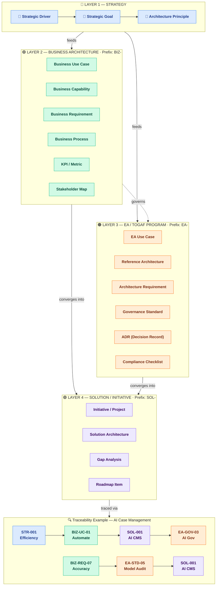

# EA Concepts Reference

## How to Use This Reference

This file is the canonical source for EA concepts that are frequently confused during interviews and artifact creation: **Vision**, **Mission**, **Business Context**, **Business Driver**, **Principle**, **Goal**, **Objective**, **Strategy**, **Plan**, **Risk**, **Issue**, **Problem**, **Opportunity**, **Capability Model**, **Value Stream**, **Business Process**, **Use Case**, **Business Model Canvas**, **Operating Model**, and **Metrics**. When the `ea-interviewer` agent detects concept confusion it cites this file. All commands and skills that capture direction, decisions, or risks should use these definitions — do not redefine them inline.

> 📎 Source: `references/ea-concepts-source.pdf` — *Enterprise Architecture Strategic Context: Terms, Concepts, and Relationship Models*. The definitions, relationships, and model diagrams in this file are grounded in that document.

---

## Motivation Framework

The engagement's strategic context is captured as a complete, linked chain from executive intent to practical execution:

```
Vision ──inspires──► Mission ──contextualizes──► Business Context (CTX)
                                                          │
                                                   informs / evidences
                                                          ▼
                                              Business Drivers (DRV)
                                                          │
                                                       drives
                                                          ▼
Issues (ISS) ──threatens──► Goals (G) ◄──achieves── Strategies (STR)
    │                           │                            │
   causes                 operationalizes          informed by / realised through
    ▼                           ▼                            ▼
Problems (PRB) ──blocks──► Objectives (OBJ)    Business Model Canvas (BMC)
                                │                            │
                             informs              ┌─────────┴─────────┐
                                ▼                  ▼                   ▼
                        Capability Model    Operating Model      Requirements Register
                       (What the org must be able to do)        (traces to ALL layers above)
                                │                                  │
                           exercises                        realised by
                                ▼                                  ▼
                         Value Streams                  Architecture Building Blocks (ABB)
                    (End-to-end value delivery)          (Logical, vendor-neutral components)
                                │                                  │
                            composed of                    implemented by
                                ▼                                  ▼
                         Business Processes                 Solution Building Blocks (SBB)
                                │                            (Concrete products and technologies)
                         enables / consumed by                       │
                                ▼                                    ▼
                          Use Cases                          User Stories (STY)
                    (Actor goals supported)                  (Actor-centred delivery items)
                                │                                    │
                           generates                          broken into
                                ▼                                    ▼
                     Requirements Register                       Tasks
                    (traces to ALL layers above)          (Atomic implementation steps)
```

Key relationships:
- **Vision** inspires Mission; **Mission** contextualizes **Business Context** — the external and internal conditions shaping the organisation
- **Business Context** informs and evidences **Business Drivers**; context findings (e.g., from PESTEL, SWOT, competitor analysis) become the source of Drivers, Issues, Opportunities, Policies, and Constraints
- **Business Drivers** drive Goals; **Issues** threaten Goals; **Strategies** achieve Goals
- **Goals** are operationalized through Objectives; **Problems** block Objectives
- **Objectives and Strategies** inform the **Capability Model** — what the org must be able to do
- **Strategies** also inform the **Business Model Canvas** — how the organisation creates, delivers, and captures value
- **Business Model Canvas** shapes both the **Capability Model** (what must be done) and the **Operating Model** (how it will be done)
- **Capability Model** exercises **Value Streams** — end-to-end chains that deliver stakeholder value
- **Value Streams** are composed of **Business Processes** — structured activity flows with defined actors and steps
- **Use Cases** consume **Business Processes** to achieve actor goals and generate **Requirements**
- **Capability Model** shapes the **Operating Model** — how capabilities, processes, and value streams are organized and delivered
- **Operating Model** performance is measured through Metrics
- **Metrics** close the feedback loop: they validate success or surface new Issues, Problems, and Capability Maturity gaps
- **Capability Gaps** (missing or immature capabilities) prevent Goals from being achieved — they are identified through the Capability Model and feed into the Gap Analysis
- **Requirements Register** is the formal bridge from the strategic layer to execution; every requirement traces back to a Driver, Goal, Objective, Issue, Problem, Capability, Value Stream, Process, Use Case, Operating Model element, or Metric
- **Architecture Building Blocks (ABBs)** realise Requirements as logical, vendor-neutral components; ABBs are implemented by **Solution Building Blocks (SBBs)** — concrete products and technologies
- **User Stories** translate SBBs into actor-centred delivery items that teams implement as **Tasks**

---

## Two Layers of Intent: Business Change vs EA Enablement

A common source of confusion in TOGAF engagements is the overlap between **what the business wants to achieve** (business architecture) and **how the EA function enables and governs that change** (EA/TOGAF program architecture). Both layers use the same vocabulary — Goal, Use Case, Requirement, Strategy — but they describe entirely different subjects. This section provides the anchor distinction, naming conventions, and a quick test to prevent miscategorization.

### The Core Distinction

| Layer | Subject | Question it answers |
|---|---|---|
| **Business Architecture** | Business capabilities and operations | *What does the business want to do?* |
| **EA / TOGAF Program** | Architecture capability and governance | *How do we structure, govern, and standardize change so it is done well?* |

> **Blunt framing:** Business architecture = **change** (what we want to transform). EA / TOGAF = **control** (how we ensure it is done right).

### Structural Model

Think in four layers. EA sits **across** the stack, not inside the business layer.

```
Layer 1 — Strategy
  Goals, Drivers

Layer 2 — Business Architecture
  Capabilities, Value Streams, Business Processes,
  Business Use Cases, Business Requirements

Layer 3 — Solution / Initiative
  Projects, Epics, Implementations

Layer 4 — EA / TOGAF (cross-cutting)
  Architecture Principles, Standards, Reference Architectures,
  EA Capability Use Cases, Architecture Requirements,
  Governance Processes, Architecture Decisions
```

- **Business artifacts** describe the organisation's desired future state and operational design.
- **EA artifacts** describe the rules, standards, and governance mechanisms that ensure solution initiatives conform to architecture direction.
- The two layers are **linked, not competing:** a Business Goal drives a solution initiative, which is then **governed by** an EA Use Case or Architecture Requirement.

### Visual Model

The diagram below shows the three domains (Business Architecture, Solution / Initiative, EA / TOGAF) and how they relate. Solid arrows show flow within a domain; dotted arrows show cross-cutting governance and enablement relationships.

![[Pasted image 20260508120316.png]]

Here's the Mermaid version.




### Naming Conventions

Use explicit prefixes to remove ambiguity. Both layers should still use the unified ID scheme (G-NNN, UC-NNN, REQ-NNN, etc.) — the prefix is for human readability in artifact titles and tables.

| Layer | Artifact | Naming pattern | Example |
|---|---|---|---|
| Business | Use Case | `Business Use Case: {actor goal}` | Business Use Case: Automate Case Management |
| Business | Requirement | `Business Requirement: {outcome}` | Business Requirement: Reduce handling time by 40% |
| Business | Goal | `Business Goal: {desired state}` | Business Goal: Automate case management with AI |
| EA / TOGAF | Use Case | `EA Capability Use Case: {capability}` | EA Capability Use Case: Govern AI Solutions |
| EA / TOGAF | Requirement | `Architecture Requirement: {rule}` | Architecture Requirement: All AI models must pass bias audit |
| EA / TOGAF | Goal | `EA Goal: {capability outcome}` | EA Goal: Establish AI architecture governance |

### Quick Test: "Would this still exist without the EA team?"

When an item feels ambiguous, apply this test:

- **If the item would still exist if the EA team were disbanded** → it is **Business Architecture**
  - Example: *Automating case management with AI* — the business still needs this.
- **If the item would disappear if the EA team were disbanded** → it is **EA / TOGAF**
  - Example: *Defining an AI governance process* — this is an EA capability, not a business operation.

### Example: AI in Case Management — Cleanly Separated

**Business Layer (running the business)**
- **Goal:** Automate case management with AI
- **Use Cases:**
  - Auto-triage cases
  - AI-assisted decisioning
  - Document classification
- **Requirements:**
  - Accuracy thresholds
  - Compliance constraints
  - Integration with CRM
- **Drivers:**
  - Reduce processing time
  - Improve service quality

**EA / TOGAF Layer (enabling controlled delivery)**
- **Use Case:** Define governance process for AI projects
- **Requirements:**
  - Model validation standards
  - Risk classification framework
  - Approval workflows
- **Outputs:**
  - Architecture principles
  - Reference architectures
  - Governance checkpoints

**Relationship map:**
```
Business Goal: Automate case management with AI
  ↓
Solution initiative: AI solution implementation
  ↓
Governed by → EA Capability Use Case: Govern AI Solutions
```

### When to Surface This Distinction

- During **Phase A interviews** when stakeholders describe "goals" that are actually about governance, standards, or EA team capabilities.
- During **Phase B Business Architecture** when business use cases are drafted — flag any whose subject is "governance," "standards," or "review" as likely EA-layer items.
- During **/ea-direction --quality** scans when a direction item's subject is ambiguous.
- During **/ea-grill** reviews when an artifact mixes business and EA intent without explicit labeling.

### Mapping Relationships Between the Two Layers

Do not keep the two layers separate in your head — connect them structurally:

| Business Layer | Relationship | EA / TOGAF Layer |
|---|---|---|
| Business Goal | drives | Solution initiative |
| Solution initiative | governed by | EA Capability Use Case |
| EA Governance | enforces | Architecture Requirements |
| Architecture Requirements | constrain | Solution design |
| Architecture Decisions | guide | Solution implementation |

---

## Quick Reference Table

| Concept | Core Question | One-Line Marker | TOGAF Artifact Home | ArchiMate Element |
|---|---|---|---|---|
| **Vision** | *What do we aspire to become?* | Long-term aspirational destination — the North Star; all Drivers and Strategies must align | Architecture Vision §1; Stakeholder Map | — |
| **Mission** | *Why do we exist today?* | Fundamental purpose and scope of activity — bounds which Drivers are relevant | Architecture Vision §1; Stakeholder Map | — |
| **Business Context (CTX-NNN)** | *What is the environment telling us?* | Analysis discipline capturing external/internal conditions (PESTEL, SWOT, competitor, regulatory) — feeds Drivers, Issues, Opportunities, Policies, Constraints | Business Context section; Architecture Vision context; Engagement Charter | — |
| **Business Driver** | *Why do we need to change now?* | External or internal force making the engagement necessary — must be evidenced and traceable to at least one Goal | Drivers Register; Architecture Vision §4 summary; Engagement Charter §6.2 | — |
| **Principle** | *What must always be true?* | Normative rule — applies to every future decision in its domain | Architecture Principles Catalogue (Prelim) | Principle (Motivation) |
| **Goal** | *Where do we want to be?* | Desired future state — qualitative, no deadline required | Goals Register; Architecture Vision §5 summary; domain artifacts | Goal (Motivation) |
| **Objective** | *How far, and by when?* | Measurable, time-bound result — must have a measure, target, and deadline | Objectives Register; Architecture Vision §10 summary; domain artifacts | Outcome (Motivation) |
| **Strategy** | *How will we get there?* | Chosen course of action — not an outcome, not a sequence | Architecture Vision; domain artifacts | Course of Action (Motivation) |
| **Plan** | *What will we do, in what order, by when?* | Sequenced execution — who, what, when | Architecture Roadmap (Phase E); Migration Plan (Phase F) | Implementation Event sequences (Impl. & Migration) |
| **Risk** | *What could go wrong?* | Uncertain future event with potential negative effect on objectives | Architecture Vision; Statement of Architecture Work; Migration Plan | Risk (Motivation, Strategy layer) |
| **Issue** | *What systemic concern is threatening a goal?* | Broad barrier or pattern of dysfunction — no single fix; threatens a Goal | Issues Register; Architecture Vision §7 summary (Phase A) | — |
| **Problem** | *What specific symptom is blocking an objective?* | Observable, measurable, and fixable — blocks an Objective | Problems Register; Architecture Vision §8 summary (Phase A) | — |
| **Capability Model** | *What must the organisation be able to do?* | Stable, hierarchical map of capabilities (people + process + info + tools) — independent of org structure or current systems | Business Architecture (Phase B); Capability Map | Resource (Active Structure) |
| **Capability Gap** | *Which capabilities are missing or immature?* | Delta between required and current capability — prevents goals; feeds Gap Analysis | Gap Analysis (Phase B/C/D) | — |
| **Business Model Canvas (BMC-NNN)** | *How do we create, deliver, and capture value?* | Structured description of the business model — sits between Strategy and Business Architecture/Operating Model; nine blocks map to SVC/VS, CAP, FIN, Stakeholder Map | Business Model Canvas artifact (Phase B) | — |
| **Operating Model** | *How does the organisation function to deliver value?* | Execution design: how the organisation operates its business to deliver value | Business Architecture (Phase B); Technology Architecture (Phase D) | — |
| **Value Stream** | *What end-to-end result does the stakeholder receive?* | End-to-end chain of activities delivering value from trigger to outcome — composed of processes, exercises capabilities | Business Architecture (Phase B); Value Stream Map | Value Stream (Strategy) |
| **Business Process** | *How is value delivered step by step?* | Structured set of activities with defined actors, inputs, outputs, and decision points — component of a value stream | Business Architecture (Phase B); Process Flow | Business Process (Business) |
| **Use Case** | *What does the actor need to accomplish?* | Discrete goal pursued by a specific actor — consumes processes, generates requirements | Business Architecture (Phase B); Use Case Catalog | — |
| **Constraint** | *What boundaries must we respect?* | Non-negotiable restriction on implementation choices — certain, sourced, and owned | Constraints Register; Architecture Vision; Principles | Constraint (Motivation) |
| **Metrics** | *How do we know we are succeeding?* | Specific, quantifiable measures — leading (predictive) or lagging (outcome); validate strategies or surface new Issues and Problems | Architecture Vision §11 Key Metrics; domain artifacts | — |
| **ABB** | *What logical component do we need?* | Reusable, vendor-neutral architecture component at solution-independent level — names the capability to be implemented, not the product | Technology Architecture §3a; Application Architecture; Phase D/E | — |
| **SBB** | *What product or system implements it?* | Concrete realisation of an ABB — specific product, vendor, or build choice; registered in the SBB Register | Technology Architecture SBB Register; Phase D | — |
| **User Story** | *What does the stakeholder want to be able to do?* | Stakeholder-perspective feature statement (As a… I want… so that…); links a business actor to a deliverable outcome; traced to REQ-NNN and ABB-NNN | Requirements Register; Phase C | — |
| **Service** | *What behaviour is offered to consumers?* | Externally visible unit of behaviour with a defined contract — what is offered, not how it is built | Business/Application/Technology Architecture service catalogues | Business / Application / Technology Service |
| **Interface** | *Where and how do two things connect?* | Defined access point and contract between components or services (API, event, file exchange) | Application Architecture (integration); Technology Architecture | Interface elements (all layers) |
| **Application / Technology Component** | *What structural element does the work?* | Modular structural unit (deployed application, node, device) — the thing that realises services via interfaces | Application/Technology Architecture diagrams and ABB/SBB tables | Application Component; Node / Device |
| **Capability Increment** | *How much of the capability does this step deliver?* | Discrete, valuable step in a capability's maturity, delivered by work packages and visible at a Plateau | Architecture Roadmap (Phase E); Capability Model | — |
| **Plateau / Transition Architecture** | *What stable state exists between baseline and target?* | A relatively stable, operable architecture state at a point in time | Transition Architectures (Phase E); Migration Plan (Phase F) | Plateau (Impl. & Migration) |
| **Deliverable** | *What work product is contractually handed over?* | Formally specified, reviewed, signed-off output of the engagement — contains artifacts | Statement of Architecture Work; Engagement Charter | Deliverable (Impl. & Migration) |
| **Architecture Partitioning** | *How is the architecture landscape divided?* | Deliberate division of architectures by level, domain, and time so teams can work without collision | Engagement setup (`architectureLevel`, ADM tailoring); Architecture Repository | — |
| **Enterprise Continuum** | *How generic or specific is this asset?* | Classification of assets from generic (Foundation) to Organisation-Specific — governs reuse from the Architecture Repository | Architecture Repository (reference library, STD/VDR/THR) | — |

---


---


## Concept Definitions


Detailed definitions are split by concept family to keep lookups fast and to prevent loading unused definitions.


| Family | Concepts | Reference |

|---|---|---|

| Motivation | Vision, Mission, Direction, Goal, Objective, Strategy, Plan, Risk, Issue, Problem, Opportunity, Metrics | [motivation-concepts.md](concept-families/motivation-concepts.md) |

| Business Context & Model | Business Context (CTX), Business Driver, Business Model Canvas (BMC) | [business-context-concepts.md](concept-families/business-context-concepts.md) |

| Governance & Rules | Principle, Policy, Business Rule, Constraint, Stakeholder Concern / Objection | [governance-concepts.md](concept-families/governance-concepts.md) |

| Business Layer | Capability Model, Operating Model, Value Stream, Business Process, Use Case, Business Scenario | [business-layer-concepts.md](concept-families/business-layer-concepts.md) |

| Architecture Products | Requirement, ABB, SBB, Reference Architecture, User Story, Service, Interface, Application/Technology Component, Capability Increment, Plateau/Transition Architecture, Deliverable, Architecture Partitioning, Enterprise Continuum | [architecture-products-concepts.md](concept-families/architecture-products-concepts.md) |

| Implementation | Work Package, Cost Entry (FIN), Architecture Decision Record, Capability Gap | [implementation-concepts.md](concept-families/implementation-concepts.md) |


## Disambiguation Checklist

Apply these tests in order. The first test that matches identifies the concept:

0. **Is the subject about how we design, govern, or standardize solutions — rather than a business capability or operation?** → it belongs in the **EA / TOGAF layer** (e.g., "governance process," "reference architecture," "review board"), not Business Architecture. See the **Two Layers of Intent** section above for naming conventions and the quick test. If the subject is a business capability or operation, continue below.
1. **Is it an external or internal condition (market, regulatory, competitive, technological, economic, social) that feeds direction or governance?** → it is **Business Context (CTX-NNN)** if it is the analysed finding, or a **Business Driver (DRV-NNN)** if it is the force that makes the engagement necessary
2. **Does it describe how the organisation creates, delivers, and captures value across nine blocks (segments, propositions, channels, revenue, costs, etc.)?** → it is a **Business Model Canvas (BMC-NNN)**
3. **Does it contain a deadline or a measurable target?** → likely an **Objective**, not a Goal
4. **Does it describe how to achieve something (an approach or choice), rather than what to achieve?** → likely a **Strategy**, not a Goal or Plan
5. **Does it include a sequence, phases, waves, or work packages with dates?** → likely a **Plan** (Roadmap or Migration Plan), not a Strategy
6. **Does it apply universally to all future decisions in its domain, not just this engagement?** → likely a **Principle**, not a Strategy or Goal
7. **Is it uncertain — could it either happen or not happen?** → likely a **Risk**, not a Constraint
8. **Is it a current, ongoing concern — already affecting the organisation?** → it is an **Issue** (if broad and systemic) or a **Problem** (if specific and fixable), not a Risk
9. **Is it specific, observable, and directly fixable — does it block a particular objective?** → it is a **Problem**, not an Issue
10. **Is it broad, systemic, and without a single fix — does it threaten a goal?** → it is an **Issue**, not a Problem
11. **Is it non-negotiable — it will definitely apply regardless of decisions?** → it is a **Constraint**, not a Risk
12. **Does it describe a desired future state without specifying how to get there?** → likely a **Goal**, not a Strategy
13. **Is it a binding rule that governs architecture decisions — not a description of what the organisation wants or how it will get there?** → it is a **Principle**
14. **Does it require a Rationale, Implications, and Owner to be complete?** → it is a **Principle** (TOGAF standard structure)

**Step 13 — Is this an architecture component or implementation?**

If you have identified something that is *not* a goal, objective, strategy, issue, problem, risk, capability, value stream, process, or use case — ask:

1. Does it describe *what logical function is needed* without specifying a product? → **Architecture Building Block (ABB-NNN)**
2. Does it name a specific product, tool, vendor, or technology? → **Solution Building Block (SBB-NNN)**
3. Is it phrased "As a {actor}, I want {goal} so that {benefit}"? → **User Story (STY-NNN)**
4. Is it a step-by-step action item (configure X, run Y, write Z)? → **Task** (captured under a Story, no ID)

---

## Common Confusions — Quick Reference

| What someone said | What they probably meant | Why |
|---|---|---|
| "Our principle is to use cloud-first" | **Strategy** (or Principle if permanent org rule) | States a technology approach, not a universal decision rule — unless it is a permanent board-approved policy |
| "Our goal is to migrate to Azure" | **Strategy** | Describes an approach, not a destination state |
| "We want 99.9% uptime" | **Objective** | Has an implicit measurable target; needs a deadline to be complete |
| "We plan to adopt microservices" | **Strategy** | No sequence, phases, or dates — just a chosen approach |
| "Budget overrun is a problem" | **Issue** (if ongoing) or **Risk** (if future) | Use "issue" if it has occurred; "risk" if it might occur |
| "We must finish by December" | **Constraint** | Certain, non-negotiable — not a risk |
| "The system must handle 10,000 concurrent users" | **Requirement** | Specific, testable, scoped to this system — not a principle |
| "We should document all APIs" | **Standard** or **Principle** | A standard if prescriptive and auditable; a principle if it's a governance rule ("All integration surfaces must be documented and versioned") |
| "Define governance process for AI projects" | **EA Capability Use Case** (EA layer) | Subject is "governance process" — how we standardize solutions. Not a Business Use Case, which would be "Auto-triage cases with AI" |
| "Automate case management with AI" | **Business Goal** or **Business Use Case** (business layer) | Subject is a business operation. If framed as governance ("Establish AI case management standards") → EA layer |
| "We need a backup service" | **ABB** (logical) → "Automated Backup Service" | No vendor named; describes function, not product |
| "We will use AWS Backup" | **SBB** (physical) → "AWS Backup" | Specific vendor/product named; could be swapped for another |
| "As an operator, I want automated backups every 15 minutes" | **User Story** (STY-NNN) | Actor + goal + benefit pattern; not a constraint or measurable condition |

---

## TOGAF and ArchiMate Alignment Summary

| Concept | TOGAF Artefact Home | ADM Phase First Used | ArchiMate Aspect | ArchiMate Element |
|---|---|---|---|---|
| Vision | Architecture Vision §1; Stakeholder Map | A | Motivation | — |
| Mission | Architecture Vision §1; Stakeholder Map | A | Motivation | — |
| Business Context | Business Context section; Architecture Vision context; Engagement Charter | Preliminary / A | Motivation | Assessment |
| Business Driver | Drivers Register; Architecture Vision §4 summary; Engagement Charter §6.2 | A | Motivation | Driver |
| Business Model Canvas | Business Model Canvas artifact | B | Business | — |
| Principle | Architecture Principles Catalogue | Preliminary | Motivation | Principle |
| Goal | Goals Register; Architecture Vision §5 summary; Domain Artifacts | A | Motivation | Goal |
| Objective | Objectives Register; Architecture Vision §10 summary; Domain Artifacts | A | Motivation | Outcome |
| Strategy | Strategy Register; Architecture Vision §11 summary; Domain Artifacts | A | Motivation | Course of Action |
| Plan | Architecture Roadmap; Migration Plan | E / F | Implementation & Migration | Work Package, Implementation Event |
| Risk | Architecture Vision; Statement of Architecture Work; Migration Plan | A | Motivation (Strategy layer) | Risk |
| Constraint | Architecture Vision; Principles; Requirements Register | Preliminary / A | Motivation | Constraint |
| Requirement | Requirements Register; Traceability Matrix | Requirements | Motivation | Requirement |
| Issue | Issues Register; Architecture Vision §7 summary; Gap Analysis | A | — | — |
| Problem | Problems Register; Architecture Vision §8 summary; Requirements Register (Motivation field) | A | — | — |
| Capability Model | Business Architecture; Capability Map | B | Business | Resource (Active Structure) |
| Capability Gap | Gap Analysis (B/C/D); Architecture Roadmap (E) | B | Business | — |
| Operating Model | Business Architecture; Technology Architecture | B / D | Business | — |
| Metrics | Architecture Vision §11; Phase G/H governance | A / G / H | Motivation | — |
| Architecture Decision Record | ADR Register; individual ADR-NNN files; cross-referenced in artifact `## Appendix A5 — Related Architecture Decisions` sections | Any | — | — |
| Architecture Building Block (ABB) | Architecture Definition Document; Gap Analysis; Business/App/Tech Architecture ABB sections | B–E | Application / Technology | Application Component; Technology Node |
| Solution Building Block (SBB) | Technology Architecture (SBB Register); Gap Analysis; Migration Plan | D–F | Technology | System Software; Device; Technology Service |
| User Story | Architecture Roadmap; Migration Plan; Requirements Register (Stories subsection) | E–F | Implementation & Migration | Work Package |

---

## Motivation Concepts Across the ADM Lifecycle

### EA's Role — Interpret and Operationalize, Not Create

TOGAF does not assume EA creates mission, vision, or strategy. These come from corporate leadership. EA's role is to:

- **Receive** them as inputs
- **Interpret** what they mean for architecture scope and direction
- **Operationalize** them into drivers, goals, objectives, issues, and problems that architecture can act on
- **Trace** them through every subsequent phase so all architecture decisions remain anchored to strategic intent

This is the fundamental distinction between strategic planning (which owns mission/vision/strategy) and enterprise architecture (which translates them into architecture-ready intent).

---

### Conceptual Mental Model

| Layer | Answers | Concepts |
|---|---|---|
| **WHY** | Why does the enterprise exist and where is it going? | Mission, Vision |
| **CONTEXT** | What is the environment telling us? | Business Context (CTX) |
| **WHAT** | What does it want to achieve? | Goals, Objectives |
| **HOW** | How does it plan to achieve it? | Strategies |
| **VALUE MODEL** | How does it create, deliver, and capture value? | Business Model Canvas (BMC) |
| **WHAT BLOCKS** | What is in the way? | Issues, Problems, Risks |
| **STRUCTURAL RESPONSE** | How does architecture enable the change? | Architecture (B–D) → Plan (E–F) → Governance (G) → Adapt (H) |

---

### Phase-by-Phase Lifecycle

| ADM Phase | What happens to motivation concepts | Key deliverables |
|---|---|---|
| **Preliminary** | Receive and understand existing mission, vision, high-level goals, and enterprise strategies from corporate strategy. Align the architecture capability to them. Embed them in Architecture Principles. EA does not create them here — it absorbs them. | Architecture Principles, Governance Framework |
| **Phase A — Architecture Vision** | Primary translation phase. Structure corporate intent into architecture-ready form: scope and confirm goals and objectives; identify business drivers; capture issues and problems via business scenarios; translate strategies into architecture direction; identify constraints and opportunities. This is where strategy becomes architecture intent. | Architecture Vision, Statement of Architecture Work, Stakeholder Map |
| **Phases B–D — Architecture Definition** | Refine goals into requirements; translate strategies into architectural building blocks; ensure every design choice traces to a goal, objective, or strategy. Issues and problems from Phase A become the gap drivers for baseline-to-target analysis. | Baseline & Target Architectures, Gap Analysis |
| **Phase E — Opportunities & Solutions** | Strategy becomes implementation-oriented. Identify solution approaches; group into work packages; align each work package to a goal, objective, or strategy. Benefits assessment validates that planned solutions address the identified issues and problems. | Solution Concept, Initial Roadmap, Benefits Assessment |
| **Phase F — Migration Planning** | Objectives and strategies meet execution reality. Prioritise initiatives based on goals; resolve constraints and trade-offs; sequence work packages into a deliverable roadmap. | Implementation & Migration Plan, Architecture Roadmap |
| **Phase G — Implementation Governance** | Governance ensures implementation conforms to the architecture that was derived from the motivation framework. Compliance reviews validate that delivered solutions still address the original drivers, goals, and objectives. | Compliance Assessments, Architecture Contracts |
| **Phase H — Change Management** | New problems, issues, or changes to strategy and goals trigger new ADM cycles. Metrics close the feedback loop — they either confirm success or surface new issues and capability gaps that re-enter the motivation framework. | Architecture Updates, Change Requests |

---

### Artifact Distribution

Not every motivation concept gets its own document. They are distributed across artifacts:

| Artifact | Motivation concepts hosted |
|---|---|
| **Architecture Vision** | Mission, Vision, Business Context (CTX), Business Drivers (DRV), Goals (G), Objectives (OBJ), Strategies (STR), Issues (ISS), Problems (PRB), Opportunities (OPP), Metrics (MET), Risks |
| **Architecture Principles** | Derived from Mission, Vision, Business Context, and Strategies — normative rules that operationalize strategic intent |
| **Engagement Charter** | Mission, Vision, Business Context, high-level goals, constraints, scope boundaries — the mandate frame |
| **Statement of Architecture Work** | Scope, constraints, objectives, success criteria — the delivery commitment |
| **Stakeholder Map** | Stakeholder concerns mapped to goals and issues |
| **Business Model Canvas** | Nine blocks: Customer Segments, Value Propositions, Channels, Customer Relationships, Revenue Streams, Key Resources, Key Activities, Key Partnerships, Cost Structure |
| **Business Architecture** | Business Context (CTX) narrative, Capabilities (CAP), Value Streams (VS), Business Services (SVC), Business Processes (PROC), Business Rules (BR), Use Cases (UC), Requirements (REQ) |
| **Operating Model** | Execution design derived from Business Architecture and Business Model Canvas: org design, roles/decision rights, controls, processes, workforce, sourcing, enablement, performance management |
| **Requirements Register** | Formalized goals, issues, and needs — the formal bridge from motivation to execution; every REQ traces to a DRV, G, OBJ, ISS, PRB, CAP, VS, UC, Process, OM element, or Metric |
| **Gap Analysis** | Issues and problems expressed as baseline-to-target gaps; capability gaps may surface as Opportunities |
| **Architecture Roadmap** | Goals, objectives, strategies, and business-model choices realized as sequenced work packages; Opportunities (OPP) elaborated into WPs |

---
