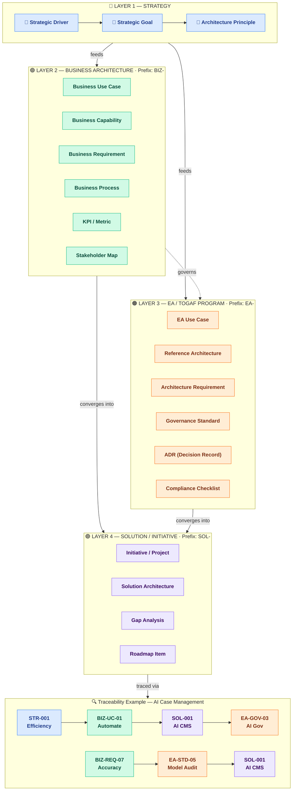

# Two Layers of Intent: Business Change vs EA Enablement

This reference is split out from `ea-concepts.md` so the distinction, naming conventions, and quick test are available without loading the full concepts index. Subfile cross-references (e.g. "see Two Layers of Intent" in `concept-families/motivation-concepts.md`, `concept-families/business-layer-concepts.md`, `cross-topic-detection.md`, and `phase-questions/phase-a---architecture-vision-interview.md`) resolve here.

---

## The Core Distinction

| Layer | Subject | Question it answers |
|---|---|---|
| **Business Architecture** | Business capabilities and operations | *What does the business want to do?* |
| **EA / TOGAF Program** | Architecture capability and governance | *How do we structure, govern, and standardize change so it is done well?* |

> **Blunt framing:** Business architecture = **change** (what we want to transform). EA / TOGAF = **control** (how we ensure it is done right).

## Structural Model

Think in four layers. EA sits **across** the stack, not inside the business layer.

```
Layer 1 — Strategy
  Goals, Drivers

Layer 2 — Business Architecture
  Capabilities, Value Streams, Business Processes,
  Business Use Cases, Business Requirements

Layer 3 — Solution / Initiative
  Projects, Epics, Implementations

Layer 4 — EA / TOGAF (cross-cutting)
  Architecture Principles, Standards, Reference Architectures,
  EA Capability Use Cases, Architecture Requirements,
  Governance Processes, Architecture Decisions
```

- **Business artifacts** describe the organisation's desired future state and operational design.
- **EA artifacts** describe the rules, standards, and governance mechanisms that ensure solution initiatives conform to architecture direction.
- The two layers are **linked, not competing:** a Business Goal drives a solution initiative, which is then **governed by** an EA Use Case or Architecture Requirement.

## Visual Model

The diagram below shows the three domains (Business Architecture, Solution / Initiative, EA / TOGAF) and how they relate. Solid arrows show flow within a domain; dotted arrows show cross-cutting governance and enablement relationships.

![[Pasted image 20260508120316.png]]

Here's the Mermaid version.



## Naming Conventions

Use explicit prefixes to remove ambiguity. Both layers should still use the unified ID scheme (G-NNN, UC-NNN, REQ-NNN, etc.) — the prefix is for human readability in artifact titles and tables.

| Layer | Artifact | Naming pattern | Example |
|---|---|---|---|
| Business | Use Case | `Business Use Case: {actor goal}` | Business Use Case: Automate Case Management |
| Business | Requirement | `Business Requirement: {outcome}` | Business Requirement: Reduce handling time by 40% |
| Business | Goal | `Business Goal: {desired state}` | Business Goal: Automate case management with AI |
| EA / TOGAF | Use Case | `EA Capability Use Case: {capability}` | EA Capability Use Case: Govern AI Solutions |
| EA / TOGAF | Requirement | `Architecture Requirement: {rule}` | Architecture Requirement: All AI models must pass bias audit |
| EA / TOGAF | Goal | `EA Goal: {capability outcome}` | EA Goal: Establish AI architecture governance |

## Quick Test: "Would this still exist without the EA team?"

When an item feels ambiguous, apply this test:

- **If the item would still exist if the EA team were disbanded** → it is **Business Architecture**
  - Example: *Automating case management with AI* — the business still needs this.
- **If the item would disappear if the EA team were disbanded** → it is **EA / TOGAF**
  - Example: *Defining an AI governance process* — this is an EA capability, not a business operation.

## Example: AI in Case Management — Cleanly Separated

**Business Layer (running the business)**
- **Goal:** Automate case management with AI
- **Use Cases:**
  - Auto-triage cases
  - AI-assisted decisioning
  - Document classification
- **Requirements:**
  - Accuracy thresholds
  - Compliance constraints
  - Integration with CRM
- **Drivers:**
  - Reduce processing time
  - Improve service quality

**EA / TOGAF Layer (enabling controlled delivery)**
- **Use Case:** Define governance process for AI projects
- **Requirements:**
  - Model validation standards
  - Risk classification framework
  - Approval workflows
- **Outputs:**
  - Architecture principles
  - Reference architectures
  - Governance checkpoints

**Relationship map:**
```
Business Goal: Automate case management with AI
  ↓
Solution initiative: AI solution implementation
  ↓
Governed by → EA Capability Use Case: Govern AI Solutions
```

## When to Surface This Distinction

- During **Phase A interviews** when stakeholders describe "goals" that are actually about governance, standards, or EA team capabilities.
- During **Phase B Business Architecture** when business use cases are drafted — flag any whose subject is "governance," "standards," or "review" as likely EA-layer items.
- During **/ea-direction --quality** scans when a direction item's subject is ambiguous.
- During **/ea-grill** reviews when an artifact mixes business and EA intent without explicit labeling.

## Mapping Relationships Between the Two Layers

Do not keep the two layers separate in your head — connect them structurally:

| Business Layer | Relationship | EA / TOGAF Layer |
|---|---|---|
| Business Goal | drives | Solution initiative |
| Solution initiative | governed by | EA Capability Use Case |
| EA Governance | enforces | Architecture Requirements |
| Architecture Requirements | constrain | Solution design |
| Architecture Decisions | guide | Solution implementation |
