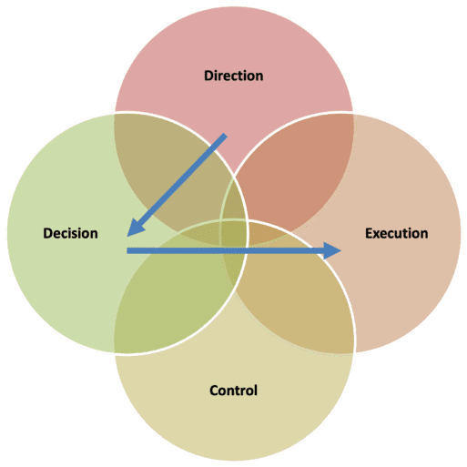
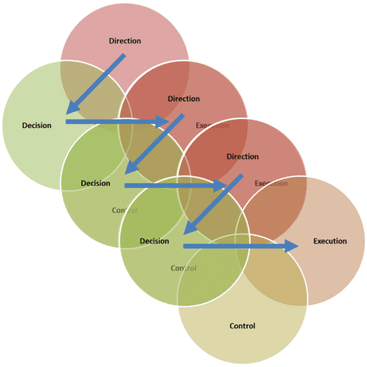

# Architecture Governance Framework

This reference explains the governance model used throughout EA engagements. It covers governance structure, the governance cascade, governance roles, the two core governance processes, and how everything maps to TOGAF ADM.

*Primary source: [Basics of Enterprise Architecture Governance — Conexiam](https://conexiam.com/basics-of-enterprise-architecture-governance/)*

---

## What Is Architecture Governance?

Governance is how an organisation delivers **direction** and exercises **control**.

> "Architecture governance is the method of directing enterprise architects, and how the enterprise architecture is used to provide direction to implementers."

There are two distinct activities:
1. The method you direct and control the **development** of your enterprise architecture.
2. The method you direct and control **implementation** using that architecture.

Direction always comes from above. A chain of direction runs from shareholders → board → executive → management → teams. At each level, direction consists of three things:

- **Performance expectation** — what outcome is required
- **Constraint** — what limits apply
- **Risk appetite** — how much uncertainty is acceptable

### Direction, Goals, Objectives, and Strategies

Direction is the superset. It is delivered through goals, objectives, and strategies — three related but distinct concepts that are frequently confused. Using the wrong one creates ambiguity in architecture work.

| Term | Question answered | Characteristics | Example |
|------|-------------------|-----------------|---------|
| **Direction** | *Why are we doing this?* | The complete performance expectation and constraint set. Superset of the three below. | "Transform our data capability to support real-time decision-making" |
| **Goal** | *Where do we want to be?* | Qualitative, long-term, aspirational. Sets a desired future state. Not directly measurable on its own. | "Become the most trusted financial services provider in the region" |
| **Objective** | *How far, and by when?* | Specific, measurable, time-bound. Makes a goal concrete and testable. Always has a measure, a target value, and a deadline. | "Reduce customer onboarding from 5 days to 1 day by Q4 2026" |
| **Strategy** | *How will we get there?* | A chosen course of action or approach. Not an outcome — a path. Should be traceable to one or more goals or objectives it serves. | "Adopt API-first integration to enable real-time data access across channels" |

**Common confusions to avoid:**

- A goal that contains a number is usually an objective. *"Achieve 99.9% availability"* → objective (it has a target value and is measurable).
- A strategy stated as an outcome is usually a goal. *"Move to the cloud"* — is this where you want to be, or how you'll get there? If it is the approach to achieving availability or cost goals, it is a strategy.
- Goals without corresponding objectives are aspirational but unactionable. Always pair goals with at least one objective.
- Objectives without a supporting strategy have no path to execution. Always identify how each objective will be pursued.

---

## The Four Elements of Governance

Every governance interaction — at any level — involves these four elements:

| Element | What it means |
|---------|---------------|
| **Direction** | Strategic intent: goals, principles, standards, and constraints that all architecture work must conform to. Comes from executive leadership, the Architecture Review Board, and the Enterprise Architecture team. |
| **Decision** | Translating direction into specific architecture commitments — which platforms, which patterns, which trade-offs. Decisions must stay within the bounds set by direction. |
| **Execution** | Carrying out the decisions — design, build, and delivery work done by solution architects, project teams, and engineers. All value is realised here. |
| **Control** | Verifying that execution conforms to decisions, and that decisions align with direction. Includes compliance assessments, architecture reviews, change requests, and **metrics** — the instruments that make control observable and evidence-based. Creates the feedback loop that holds everyone accountable. |

The arrows in the diagram show the primary flows:
- **Direction → Decision**: Strategic intent shapes the choices made.
- **Decision → Execution**: Committed choices guide the work.

Control wraps all three — it checks conformance at every layer and feeds findings back up.

---

## The Governance Cascade

Governance does not operate at a single organisational level. It cascades downward — the **execution** of one level becomes the **direction** for the level below.

| Level | Direction comes from | Decision makers | Execution done by |
|-------|---------------------|-----------------|-------------------|
| **Enterprise** | Board / C-suite strategy | Enterprise Architecture Board | EA team + domain architects |
| **Programme** | Enterprise architecture decisions | Programme architecture / Solution architecture | Project architects + technical leads |
| **Project** | Programme architecture decisions | Project architecture review | Solution designers + developers |

**Example cascade:**
1. Top direction: *grow revenue.* Decision: *new products.*
2. Next level receives "grow revenue with new products." Decision: *sell to existing customers.*
3. Next level receives "grow revenue with new products sold to existing customers." Executes the plan.

**Implication for EA engagements**: When establishing governance in Phase G, identify which level of the cascade the engagement operates at, and ensure upward traceability to the levels above. Deviation at any level must be escalated up the cascade, not resolved silently.

---

## Levels of Governance Inside the Enterprise

Architecture governance does not operate in isolation. It sits inside a hierarchy:

1. **Corporate governance** — board-level direction and accountability
2. **Architecture governance** — direction and control of EA development and implementation
3. **IT governance** — direction and control of IT operations and projects

Each governance domain can also operate at different geographic levels: global, regional, and local.

---

## The Two Core Governance Processes

### 1. Process to Approve Target Architecture

Most EA development happens inside the **decision** circle. Architects develop the target architecture in response to a problem and set of directions. The governance process is how the target gets approved — this is where the Architecture Review Board (ARB) holds architects accountable.

**Key question**: *Does the proposed target architecture address the direction, within the stated constraints and risk appetite?*

Once stakeholders approve the target, the organisation moves to the second process.

### 2. Implementation Governance Process

Controls ensure that implementers follow the directions embedded in the target architecture.

**Key question**: *Did those performing the change reasonably follow the direction in the target architecture?*

Specifically:
- Did they fill the gap?
- Did they follow the implementation strategy?
- Did they deliver the expected benefit?
- Did they follow the constraints (architecture specifications that limited their choices)?

The TOGAF ADM transitions between these two processes between **Phase E** (output: Architecture Roadmap) and **Phase F** (output: Implementation Plan + Architecture Contract).

---

## Governance Roles

Six roles are involved in architecture governance:

| Role | Responsibilities |
|------|-----------------|
| **Stakeholder** | Owner of the architecture. Provides priority, preference, and direction. Holds all decision rights regarding the target architecture, and any relief from or enforcement of the target. |
| **Stakeholder Agent** | Representative of the Stakeholder — acts on their behalf in governance forums. |
| **Subject Matter Expert (SME)** | Possesses specialised knowledge about the enterprise or its environment. Provides knowledge, advice, and validation of interpretation. |
| **Implementer** | Responsible for all change activity — from transformative capital projects to incremental operational changes. Holds all decision rights about proposed implementation choices (design, product selection, change sequence). |
| **Architect (Practitioner)** | Developer of the target architecture. Provides recommendations when non-compliance with the target is identified. |
| **Auditor** | Performs systematic reviews of both the target and implementation. Audits should occur at multiple stages to catch errors before correction costs exceed value realisation. May operate within a formal ARB or as a peer reviewer. |

---

## Enterprise Architecture Governance Framework Components

| Component | Description |
|-----------|-------------|
| **Roles and Responsibilities** | Clearly defined roles for stakeholders, architects, SMEs, and implementers |
| **Decision-Making Processes** | How architectural decisions are reviewed, approved, and communicated |
| **Compliance and Auditing** | Regular checks to ensure implementation projects conform to the target architecture |
| **Communication and Reporting** | Channels and structures to keep stakeholders informed |
| **Monitoring and Measurement** | KPIs to track EA effectiveness against organisational goals |
| **Education and Training** | Common understanding of frameworks, standards, and practices across all involved parties |

---

## Metrics — Making Control Observable

Metrics are the instruments that give the Control element its teeth. Without metrics, governance is opinion-based. With metrics, it is evidence-based.

Each metric tracks a specific element of direction:

| Metric type | Tracks | Question it answers | Linked to |
|-------------|--------|---------------------|-----------|
| **Outcome** | A goal | Is the desired state being approached? | Goal IDs (`BG-`, `DG-`, etc.) |
| **Performance** | An objective | Is the measurable target on track? | Objective IDs (`BO-`, `DO-`, etc.) |
| **Activity** | A strategy | Is the chosen approach being executed? | Strategy IDs (`BS-`, `DS-`, etc.) |

Every metric has:
- **Measure** — the specific unit or calculation (e.g., "average days from application to account activation")
- **Baseline** — current state before the engagement (establishes the starting point)
- **Target** — desired value (must align with the linked objective's target, if applicable)
- **Deadline** — when the target should be achieved
- **Frequency** — how often it is measured (Daily / Weekly / Monthly / Quarterly)
- **Source** — where the data comes from (e.g., CRM system, infrastructure monitoring tool)
- **Status** — `Not Established` | `On Track` | `At Risk` | `Behind` | `Achieved`

**Metrics vs. Objectives:**
- An **objective** defines the *commitment* — what will be achieved and by when.
- A **metric** defines the *instrument* — how progress will be measured, how often, and from what source.
- Every objective should have at least one corresponding performance metric. A metric without a linked direction item is an orphan and should be linked or removed.

---

## TOGAF Governance Tools

**Direction** (Performance expectation + constraint):
- Statement of Architecture Work
- Gap Analysis
- Work Package
- Architecture View
- Architecture Roadmap
- Implementation Strategy
- Architecture Contract
- Implementation and Migration Plan

**Control**:
- Compliance Assessment

**Other**:
- Implementation Governance Model

---

## Mapping to TOGAF ADM Phases

| Phase | Governance activity |
|-------|---------------------|
| **Prelim** | Establish the governance framework — ARB structure, decision rights, escalation paths |
| **A** | Agree scope and direction with the sponsor; document in the Statement of Architecture Work |
| **B–D** | Make architecture decisions within the approved direction; record in domain architecture documents |
| **E** | Output Architecture Roadmap — concludes target architecture governance |
| **F** | Produce Architecture Contract and Implementation Plan — initiates implementation governance |
| **G** | Compliance assessments verify that solution designs conform to the decisions made in B–D |
| **H** | Manage change requests; assess deviations; update direction if warranted |

---

## Governance Artefacts in EA Assistant

| Artefact | Governance role |
|----------|----------------|
| Architecture Principles Catalogue | Records Direction — normative statements all decisions must respect |
| Statement of Architecture Work | Documents agreed scope and decision rights |
| Architecture Vision | Communicates Direction to stakeholders |
| Architecture Compliance Assessment | Implements Control — verifies Execution against Decisions |
| Architecture Contract | Formalises the Decision → Execution handoff |
| Change Requests (Phase H) | Formal mechanism for Execution to request a change to a Decision |

---

*Source: Governance model adapted from [Conexiam — Basics of Enterprise Architecture Governance](https://conexiam.com/basics-of-enterprise-architecture-governance/).*
