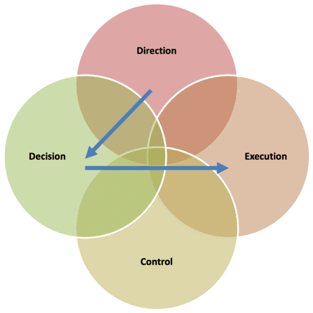
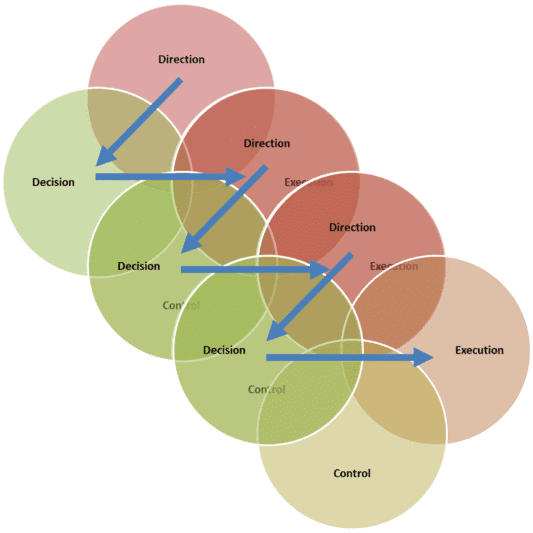

# Architecture Governance Framework

This reference explains the governance model used throughout EA engagements. It covers governance structure, the governance cascade, governance roles, the two core governance processes, and how everything maps to TOGAF ADM.

*Primary source: [Basics of Enterprise Architecture Governance — Conexiam](https://conexiam.com/basics-of-enterprise-architecture-governance/)*

---

## What Is Architecture Governance?

Governance is how an organisation delivers **direction** and exercises **control**.

> "Architecture governance is the method of directing enterprise architects, and how the enterprise architecture is used to provide direction to implementers."

There are two distinct activities:
1. The method you direct and control the **development** of your enterprise architecture.
2. The method you direct and control **implementation** using that architecture.

Direction always comes from above. A chain of direction runs from shareholders → board → executive → management → teams. At each level, direction consists of three things:

- **Performance expectation** — what outcome is required
- **Constraint** — what limits apply
- **Risk appetite** — how much uncertainty is acceptable

### Direction, Goals, Objectives, and Strategies

Direction is the superset. It is delivered through goals, objectives, and strategies — three related but distinct concepts that are frequently confused. Using the wrong one creates ambiguity in architecture work.

| Term | Question answered | Characteristics | Example |
|------|-------------------|-----------------|---------|
| **Direction** | *Why are we doing this?* | The complete performance expectation and constraint set. Superset of the three below. | "Transform our data capability to support real-time decision-making" |
| **Goal** | *Where do we want to be?* | Qualitative, long-term, aspirational. Sets a desired future state. Not directly measurable on its own. | "Become the most trusted financial services provider in the region" |
| **Objective** | *How far, and by when?* | Specific, measurable, time-bound. Makes a goal concrete and testable. Always has a measure, a target value, and a deadline. | "Reduce customer onboarding from 5 days to 1 day by Q4 2026" |
| **Strategy** | *How will we get there?* | A chosen course of action or approach. Not an outcome — a path. Should be traceable to one or more goals or objectives it serves. | "Adopt API-first integration to enable real-time data access across channels" |

**Common confusions to avoid:**

- A goal that contains a number is usually an objective. *"Achieve 99.9% availability"* → objective (it has a target value and is measurable).
- A strategy stated as an outcome is usually a goal. *"Move to the cloud"* — is this where you want to be, or how you'll get there? If it is the approach to achieving availability or cost goals, it is a strategy.
- Goals without corresponding objectives are aspirational but unactionable. Always pair goals with at least one objective.
- Objectives without a supporting strategy have no path to execution. Always identify how each objective will be pursued.

---

## The Four Elements of Governance

Every governance interaction — at any level — involves these four elements:

| Element | What it means |
|---------|---------------|
| **Direction** | Strategic intent: goals, principles, standards, and constraints that all architecture work must conform to. Comes from executive leadership, the Architecture Review Board, and the Enterprise Architecture team. |
| **Decision** | Translating direction into specific architecture commitments — which platforms, which patterns, which trade-offs. Decisions must stay within the bounds set by direction. |
| **Execution** | Carrying out the decisions — design, build, and delivery work done by solution architects, project teams, and engineers. All value is realised here. |
| **Control** | Verifying that execution conforms to decisions, and that decisions align with direction. Includes compliance assessments, architecture reviews, change requests, and **metrics** — the instruments that make control observable and evidence-based. Creates the feedback loop that holds everyone accountable. |

The arrows in the diagram show the primary flows:
- **Direction → Decision**: Strategic intent shapes the choices made.
- **Decision → Execution**: Committed choices guide the work.

Control wraps all three — it checks conformance at every layer and feeds findings back up.

---

## The Governance Cascade

Governance does not operate at a single organisational level. It cascades downward — the **execution** of one level becomes the **direction** for the level below.

| Level | Direction comes from | Decision makers | Execution done by |
|-------|---------------------|-----------------|-------------------|
| **Enterprise** | Board / C-suite strategy | Enterprise Architecture Board | EA team + domain architects |
| **Programme** | Enterprise architecture decisions | Programme architecture / Solution architecture | Project architects + technical leads |
| **Project** | Programme architecture decisions | Project architecture review | Solution designers + developers |

**Example cascade:**
1. Top direction: *grow revenue.* Decision: *new products.*
2. Next level receives "grow revenue with new products." Decision: *sell to existing customers.*
3. Next level receives "grow revenue with new products sold to existing customers." Executes the plan.

**Implication for EA engagements**: When establishing governance in Phase G, identify which level of the cascade the engagement operates at, and ensure upward traceability to the levels above. Deviation at any level must be escalated up the cascade, not resolved silently.

---

## Levels of Governance Inside the Enterprise

Architecture governance does not operate in isolation. It sits inside a hierarchy:

1. **Corporate governance** — board-level direction and accountability
2. **Architecture governance** — direction and control of EA development and implementation
3. **IT governance** — direction and control of IT operations and projects

Each governance domain can also operate at different geographic levels: global, regional, and local.

---

## The Two Core Governance Processes

### 1. Process to Approve Target Architecture

Most EA development happens inside the **decision** circle. Architects develop the target architecture in response to a problem and set of directions. The governance process is how the target gets approved — this is where the Architecture Review Board (ARB) holds architects accountable.

**Key question**: *Does the proposed target architecture address the direction, within the stated constraints and risk appetite?*

Once stakeholders approve the target, the organisation moves to the second process.

### 2. Implementation Governance Process

Controls ensure that implementers follow the directions embedded in the target architecture.

**Key question**: *Did those performing the change reasonably follow the direction in the target architecture?*

Specifically:
- Did they fill the gap?
- Did they follow the implementation strategy?
- Did they deliver the expected benefit?
- Did they follow the constraints (architecture specifications that limited their choices)?

The TOGAF ADM transitions between these two processes between **Phase E** (output: Architecture Roadmap) and **Phase F** (output: Implementation Plan + Architecture Contract).

---

## Governance Roles

The full role catalogue (ROLE-001 to ROLE-015) is defined in `references/role-catalogue.md`. That file is the authoritative source for all role definitions, responsibilities, RACI defaults, triggering events, cadence, and escalation paths. Do not redefine roles here.

The six foundational governance roles from the TOGAF governance model (Stakeholder, Stakeholder Agent, SME, Implementer, Enterprise Architect, Auditor) correspond to ROLE-001 through ROLE-006 in the catalogue. The catalogue extends these with domain architect sub-roles and delivery/ownership roles (ROLE-007 to ROLE-015).

---

## Enterprise Architecture Governance Framework Components

| Component | Description |
|-----------|-------------|
| **Roles and Responsibilities** | Clearly defined roles for stakeholders, architects, SMEs, and implementers |
| **Decision-Making Processes** | How architectural decisions are reviewed, approved, and communicated |
| **Compliance and Auditing** | Regular checks to ensure implementation projects conform to the target architecture |
| **Communication and Reporting** | Channels and structures to keep stakeholders informed |
| **Monitoring and Measurement** | KPIs to track EA effectiveness against organisational goals |
| **Education and Training** | Common understanding of frameworks, standards, and practices across all involved parties |

---

## Metrics — Making Control Observable

Metrics are the instruments that give the Control element its teeth. Without metrics, governance is opinion-based. With metrics, it is evidence-based.

Each metric tracks a specific element of direction:

| Metric type | Tracks | Question it answers | Linked to |
|-------------|--------|---------------------|-----------|
| **Outcome** | A goal | Is the desired state being approached? | Goal IDs (`G-NNN`) |
| **Performance** | An objective | Is the measurable target on track? | Objective IDs (`OBJ-NNN`) |
| **Activity** | A strategy | Is the chosen approach being executed? | Strategy IDs (`STR-NNN`) |

Every metric has:
- **Measure** — the specific unit or calculation (e.g., "average days from application to account activation")
- **Baseline** — current state before the engagement (establishes the starting point)
- **Target** — desired value (must align with the linked objective's target, if applicable)
- **Deadline** — when the target should be achieved
- **Frequency** — how often it is measured (Daily / Weekly / Monthly / Quarterly)
- **Source** — where the data comes from (e.g., CRM system, infrastructure monitoring tool)
- **Status** — `Not Established` | `On Track` | `At Risk` | `Behind` | `Achieved`

**Metrics vs. Objectives:**
- An **objective** defines the *commitment* — what will be achieved and by when.
- A **metric** defines the *instrument* — how progress will be measured, how often, and from what source.
- Every objective should have at least one corresponding performance metric. A metric without a linked direction item is an orphan and should be linked or removed.

---

## TOGAF Governance Tools

**Direction** (Performance expectation + constraint):
- Statement of Architecture Work
- Gap Analysis
- Work Package
- Architecture View
- Architecture Roadmap
- Implementation Strategy
- Architecture Contract
- Implementation and Migration Plan

**Control**:
- Compliance Assessment

**Other**:
- Implementation Governance Model

---

## The Two Governance Layers in TOGAF

TOGAF distinguishes two related but distinct governance layers. Understanding which layer you are operating in — and who owns it — prevents confusion across the ADM.

### Layer 1: Architecture Governance (governs the ADM and architecture outputs)

- **Primary question:** "Are we doing architecture properly?"
- **Object:** Architecture process, artifacts, standards, and decisions
- **Defined:** Primarily in the Preliminary Phase as part of establishing the Architecture Capability
- **Operated by:** Chief Architect, Architecture Review Board (ARB), EA function
- **Key mechanisms:** Architecture Board, principles, phase reviews, approval gates, waivers/dispensations, standards compliance, repository controls

### Layer 2: Program Governance (governs delivery of change)

- **Primary question:** "Are we delivering the change effectively and in conformance with the architecture?"
- **Object:** Portfolios, programs, projects, work packages, releases, benefits realization
- **Defined:** Outside the ADM — by the program sponsor, PMO, and steering committee
- **Operated by:** Program sponsor, PMO/portfolio office, program manager, steering committee (architects participate for conformance reviews)
- **Key mechanisms:** Program boards, investment committees, delivery stage gates, risk/issue management, benefits tracking, change control

### Comparison Table

| Aspect | Architecture Governance (Layer 1) | Program Governance (Layer 2) |
|---|---|---|
| Primary purpose | Control architecture development and decisions | Control execution of change and benefits delivery |
| Main object | Architecture process, artifacts, standards, decisions | Portfolios, programs, projects, releases |
| TOGAF emphasis | Preliminary through all phases | Especially E, F, and G |
| Strongest mechanism | ARB, reviews, standards, compliance | Steering committees, PMO, stage gates, funding |
| Key concern | "Is the architecture right and properly governed?" | "Is the change being delivered successfully?" |
| Architecture conformance | Central | One of several concerns |
| Delivery scope / schedule / budget | Secondary | Central |

### The Phase G Boundary

Phase G is **not** general program management governance. It is architecture's specific contribution to program governance — the conformance layer.

Phase G adds exactly one question to the broader program governance picture:

> "Is the implementation conforming to the approved architecture?"

Phase G does **not** replace: program boards, steering committees, investment committees, PMO oversight, benefits tracking, delivery schedule management, or funding governance.

The cleanest formulation: **architecture governance governs the architecture; program governance governs the delivery; Phase G is where they interface.**

---

## Mapping to TOGAF ADM Phases

| Phase | Governance layer | What governance does | Typical outputs |
|---|---|---|---|
| **Preliminary** | Architecture (Layer 1) | Define and establish the governance framework: ARB structure, decision rights, escalation paths, principles, standards, compliance approach, waivers process, relationship to enterprise/corporate governance | Governance Framework, Architecture Principles |
| **Phase A** | Architecture (Layer 1) | Approve scope and engagement mandate; confirm sponsorship; agree constraints and principles; authorise the architecture engagement; define how work will be governed; approve Statement of Architecture Work | Statement of Architecture Work (approved), Stakeholder Map |
| **Phases B–D** | Architecture (Layer 1) | Govern architecture development: ensure content is developed per agreed method; review by right stakeholders; consistent with principles and standards; approved before advancing to next domain. Governance of the architecture development process itself. | Approved domain architectures, Gap Analysis |
| **Phase E** | Architecture → Program bridge | Validate solution direction; structure work packages; ensure proposed solutions are architecturally coherent; begin bridging architecture governance with program governance | Architecture Roadmap, Solution Concept — concludes target architecture governance |
| **Phase F** | Architecture → Program bridge | Prioritise transitions; align roadmap with portfolio constraints; connect architecture with investment/program decisions; produce Architecture Contract as the formal handoff | Architecture Contract, Implementation & Migration Plan — initiates implementation governance |
| **Phase G** | Architecture (Layer 1) within Program (Layer 2) | Architecture's contribution to program governance: compliance reviews at delivery gates; approve or reject deviations; manage architecture contracts; monitor that delivered solutions conform to the approved architecture. Does not replace program boards or PMO. | Compliance Assessments, Dispensations, Architecture Contract updates |
| **Phase H** | Architecture (Layer 1) | Govern change to the architecture: assess whether requests are minor adjustments or require a new ADM cycle; control architecture change requests; maintain integrity of baseline and target states; new issues/problems or strategy changes trigger re-entry | Architecture Updates, Change Requests, new Request for Architecture Work |

---

## Governance Artefacts in EA Assistant

| Artefact | Governance role |
|----------|----------------|
| Architecture Principles Catalogue | Records Direction — normative statements all decisions must respect |
| Statement of Architecture Work | Documents agreed scope and decision rights |
| Architecture Vision | Communicates Direction to stakeholders |
| Architecture Compliance Assessment | Implements Control — verifies Execution against Decisions |
| Architecture Contract | Formalises the Decision → Execution handoff |
| Change Requests (Phase H) | Formal mechanism for Execution to request a change to a Decision |

---

## ARB Meeting Minutes

Architecture Review Board (ARB) meetings are the primary governance touchpoint for formal architecture decisions. Meeting minutes capture attendance, quorum, agenda, decisions, actions, and deferred items.

**Storage:** `artifacts/cross-cutting/arb-minutes-{NNN}-{YYYY-MM-DD}.md` — always cross-cutting, never phase-scoped.

**ID scheme:** `ARB-NNN` identifies a meeting (e.g. `ARB-001`). Individual decisions within a meeting are referenced as `ARB-001 Item 3`.

**Integration with other registers:**
- **ADR register** — ARB decisions that ratify an Architecture Decision Record update the ADR's `arbReference` field and `Governance Reference` (§5). Use `/ea-arb close` to propagate decisions.
- **Concerns register** — Concerns raised at an ARB meeting become CON-NNN entries in the affected artifact's Appendix A4.
- **Risk register** — Outstanding ARB actions past their due date can be escalated to the Risk Register as RIS-NNN entries.

**Decision format:** ARB Decisions tables use their own format (Item / Decision / Vote / ADR Reference / Governance Authority / Outcome / Owner) rather than the A3 governance table format. The A3 format is for within-artifact governance tracking; ARB minutes are a governance forum record.

**Quorum rules:** Defined per organisation. If quorum is not met, all decisions are recorded as `Provisional — pending quorum confirmation`. The `/ea-arb close` command enforces quorum resolution before setting status to `Approved`.

**Managed via:** `/ea-arb` — new, list, view, close.

*Source: Governance model adapted from [Conexiam — Basics of Enterprise Architecture Governance](https://conexiam.com/basics-of-enterprise-architecture-governance/).*
