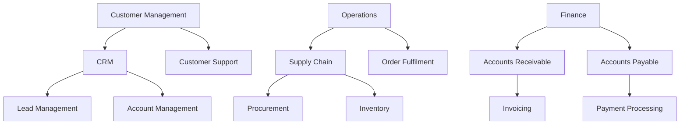
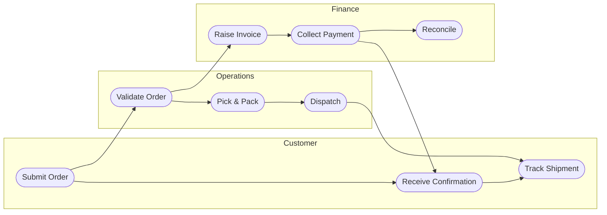
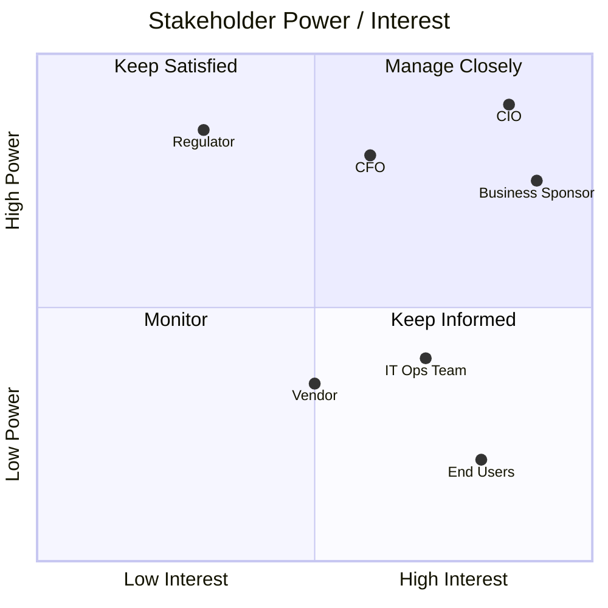
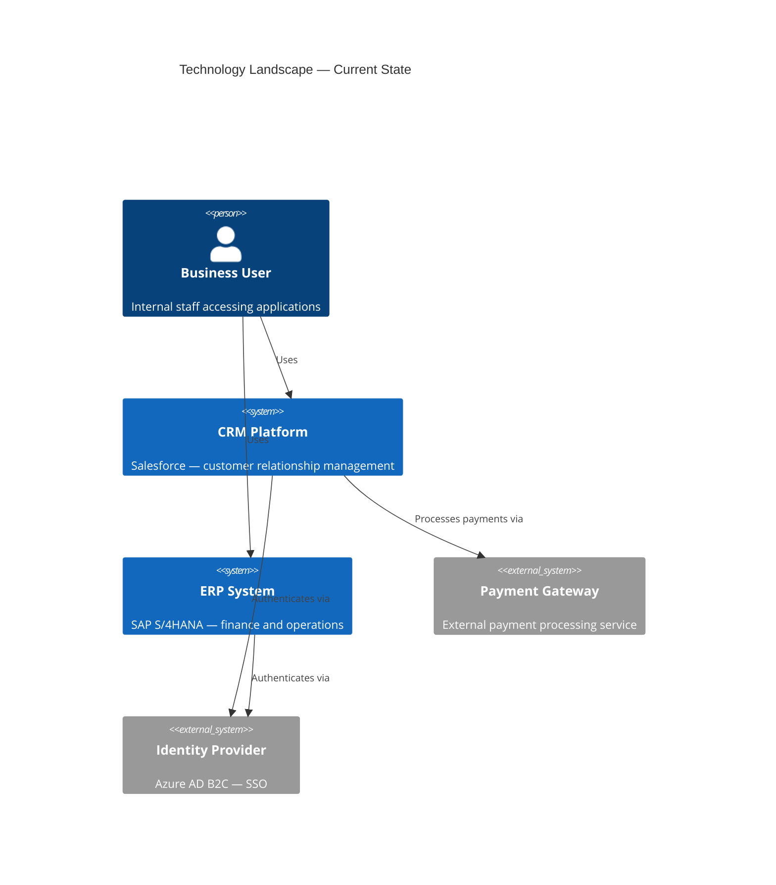
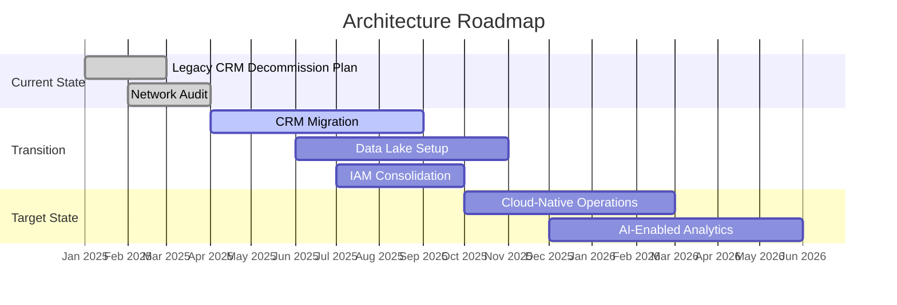
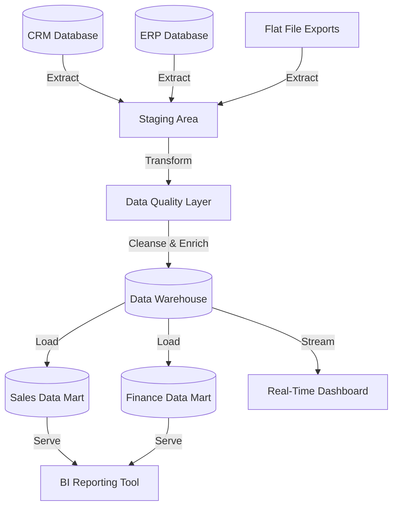

# EA Artifact Generation — Word, PowerPoint, and Mermaid

This skill governs how to produce formatted output files from individual EA artifacts within an engagement. Three formats are supported: Mermaid diagrams (embedded in Markdown or rendered as images), Word documents (.docx), and PowerPoint presentations (.pptx). For consolidated reports merging all artifacts across an engagement, use `/ea-publish` instead.

## Format Selection Guide

| Artifact | Mermaid | Word (.docx) | PowerPoint (.pptx) |
|---|---|---|---|
| Architecture Vision | — | ✓ primary | ✓ exec version |
| Statement of Architecture Work | — | ✓ primary | — |
| Architecture Principles | — | ✓ primary | ✓ summary slide |
| Stakeholder Map | ✓ quadrantChart | ✓ matrix table | ✓ slide |
| Business Architecture | — | ✓ primary | ✓ summary |
| Data Architecture | — | ✓ primary | ✓ summary |
| Application Architecture | — | ✓ primary | ✓ summary |
| Technology Architecture | — | ✓ primary | ✓ summary |
| Gap Analysis | — | ✓ table | ✓ table slide |
| Architecture Roadmap | ✓ gantt | ✓ embedded | ✓ roadmap slide |
| Migration Plan | ✓ gantt | ✓ primary | ✓ summary |
| Architecture Contract | — | ✓ primary | — |
| Compliance Assessment | — | ✓ primary | — |
| Change Request | — | ✓ primary | — |
| Requirements Register | — | ✓ table | — |
| Traceability Matrix | — | ✓ table | — |

## Mermaid Diagram Patterns

### 1. Capability Map



### 2. Process Flow



### 3. Stakeholder Map



### 4. Technology Landscape



### 5. Architecture Roadmap



### 6. Data Flow



## Word Document Generation (.docx)

### Prerequisites

**No manual setup required.** When `/ea-generate` runs for the first time it:

1. Creates `~/.ea-assistant-venv` if it does not exist
2. Installs `python-docx` and `python-pptx` into that venv
3. Uses the venv Python for all subsequent runs

This avoids WSL2 / externally-managed-environment errors without touching system Python.

### Standard Document Structure

Generated Word documents follow this standard structure:

1. Cover Page — engagement name, artifact title, version, date, classification
2. Table of Contents — auto-generated from heading styles
3. Executive Summary — 1–2 page overview of key findings and recommendations
4. Content Sections — artifact-specific structured content
5. Appendices — supporting data, glossary, reference architecture diagrams

### Running the Script

With engagement directory (recommended):

```bash
SCRIPT=$(find "$HOME/.claude" -name "generate-docx.py" -path "*/ea-assistant/scripts/*" | head -1)
VENV="$HOME/.ea-assistant-venv"
[ ! -f "$VENV/bin/python" ] && python3 -m venv "$VENV" && "$VENV/bin/pip" install --quiet python-docx python-pptx
"$VENV/bin/python" "$SCRIPT" \
  --engagement-dir ./EA-projects/my-engagement \
  --type vision \
  --content @/tmp/ea-gen-{artifact-id}.json \
  --output ./output/architecture-vision.docx
```

Standalone (content JSON supplied directly):

```bash
SCRIPT=$(find "$HOME/.claude" -name "generate-docx.py" -path "*/ea-assistant/scripts/*" | head -1)
"$HOME/.ea-assistant-venv/bin/python" "$SCRIPT" \
  --type gap-analysis \
  --content @/tmp/ea-gen-gap.json \
  --output ./output/gap-analysis.docx
```

**Artifact type values:** `vision`, `gap-analysis`, `app-portfolio`, `requirements-register`, `roadmap`, `stakeholder-map`

### Content JSON Format

```json
{
  "title": "Architecture Vision",
  "version": "1.0",
  "engagement": "Digital Transformation Programme",
  "classification": "CONFIDENTIAL",
  "executive_summary": "Single paragraph summarising the vision.",
  "sections": [
    {
      "heading": "Strategic Context",
      "level": 1,
      "body": "Paragraph text describing strategic context."
    },
    {
      "heading": "Architecture Drivers",
      "level": 2,
      "body": "Paragraph text describing key drivers."
    }
  ],
  "tables": [
    {
      "title": "Key Stakeholders",
      "headers": ["Stakeholder", "Role", "Interest"],
      "rows": [
        ["CIO", "Executive Sponsor", "Strategic alignment"],
        ["IT Architect", "Solution Owner", "Technical delivery"]
      ]
    }
  ]
}
```

## PowerPoint Generation (.pptx)

### Prerequisites

```bash
pip install python-pptx
```

### Standard Deck Structure

| Slide | Content |
|---|---|
| 1 | Title slide — engagement name, presentation title, date |
| 2 | Agenda — list of sections covered in the deck |
| 3–N | Content slides — one topic per slide, max 7 bullets |
| N+1 | Summary / Key Recommendations |
| N+2 | Next Steps and Owner table |
| Last | Appendix divider + supporting detail slides |

### Running the Script

With engagement directory:

```bash
SCRIPT=$(find "$HOME/.claude" -name "generate-pptx.py" -path "*/ea-assistant/scripts/*" | head -1)
"$HOME/.ea-assistant-venv/bin/python" "$SCRIPT" \
  --engagement-dir ./EA-projects/my-engagement \
  --type vision \
  --content @/tmp/ea-gen-{artifact-id}.json \
  --output ./output/architecture-vision.pptx
```

**Deck type values:** `vision`, `phase-summary`, `gap-analysis`, `roadmap`, `stakeholder`

### Content JSON Format

```json
{
  "title": "Architecture Vision",
  "subtitle": "Digital Transformation Programme",
  "date": "2026-03-20",
  "slides": [
    {
      "layout": "title",
      "title": "Architecture Vision",
      "subtitle": "Digital Transformation Programme — March 2026"
    },
    {
      "layout": "content",
      "title": "Strategic Objectives",
      "bullets": [
        "Modernise core banking platform by Q4 2026",
        "Consolidate data estates onto unified cloud data platform",
        "Reduce time-to-market for new products by 40%"
      ]
    },
    {
      "layout": "table",
      "title": "Capability Gap Summary",
      "headers": ["Capability", "Current", "Target", "Gap"],
      "rows": [
        ["Data Analytics", "Level 2", "Level 4", "High"],
        ["Cloud Adoption", "Level 1", "Level 3", "High"],
        ["API Management", "Level 3", "Level 4", "Medium"]
      ]
    }
  ]
}
```

## Styling Conventions

### Word Documents

- **Heading 1:** 14pt bold, dark blue `#1F3864`
- **Heading 2:** 12pt bold, medium blue `#2E74B5`
- **Body text:** Calibri 11pt, black `#000000`
- **Tables:** Header row dark blue background `#1F3864` with white text; alternating row shading `#D6E4F0`

### PowerPoint Slides

- **Title slide:** Dark blue background `#1F3864`, white text
- **Content slides:** White background `#FFFFFF`, dark blue headings `#1F3864`
- **Accent colour:** Orange `#C55A11` for highlights, callouts, and icons
- **Font:** Calibri throughout
- **Max 7 bullets per slide** — split into multiple slides if content exceeds this limit

## Troubleshooting

- **WSL2 / externally-managed-environment error:** Use a venv — `python3 -m venv ~/.ea-assistant-venv && ~/.ea-assistant-venv/bin/pip install python-docx python-pptx`. The generation commands detect and use it automatically.
- **python-docx not found:** Run `~/.ea-assistant-venv/bin/pip install python-docx` (venv) or `pip3 install python-docx` (system).
- **python-pptx not found:** Run `~/.ea-assistant-venv/bin/pip install python-pptx` (venv) or `pip3 install python-pptx` (system).
- **Script not found:** Verify the plugin root path is set correctly. Check that `${CLAUDE_PLUGIN_ROOT}` resolves to the plugin installation directory and that the `scripts/` subdirectory exists.
