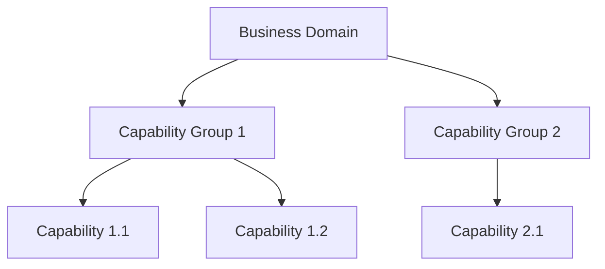
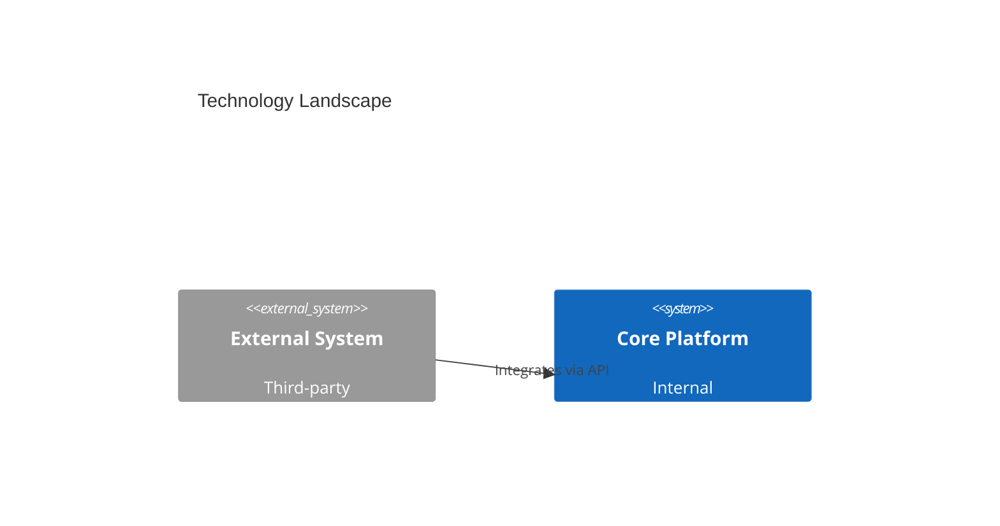

# TOGAF Standard Artifacts

TOGAF organises architecture artifacts into three types: **Catalogs** (lists of things), **Matrices** (relationships between things), and **Diagrams** (visual representations). This skill covers the nine priority artifacts for this plugin.

## Artifact Types Overview

| Type | Description | Format |
|------|-------------|--------|
| **Catalog** | Structured list of architecture entities | Table |
| **Matrix** | Relationship mapping between two domains | Grid table |
| **Diagram** | Visual representation of architecture | Mermaid |
| **Document** | Formal architecture deliverable | Word/.docx |
| **Presentation** | Stakeholder communication | PowerPoint/.pptx |

## Priority Artifacts

### 1. Architecture Vision Document
- **Phase**: A
- **Type**: Document
- **Purpose**: High-level description of the target architecture and how it addresses stakeholder concerns
- **Sections**: Executive Summary, Problem Statement, Stakeholder Summary, Baseline Architecture Overview, Target Architecture Overview, Gap Summary, Key Risks, Approval
- **Generate with**: `/togaf:generate vision` → produces `.docx`

### 2. Stakeholder Map
- **Phase**: A
- **Type**: Diagram + Matrix
- **Purpose**: Identify all stakeholders, their concerns, and engagement approach
- **Mermaid type**: `quadrantChart` (power vs. interest) or `graph TD` (stakeholder hierarchy)
- **Matrix columns**: Stakeholder | Role | Concerns | Current Involvement | Required Involvement | Engagement Approach
- **Generate with**: `/togaf:generate stakeholder-map`

### 3. Business Capability Map
- **Phase**: B
- **Type**: Diagram
- **Purpose**: Hierarchical decomposition of business capabilities
- **Mermaid type**: `graph TD` (capability hierarchy) or `block-beta` (heat-map layout)
- **Levels**: L1 (business area), L2 (capability group), L3 (specific capability)
- **Generate with**: `/togaf:generate capability-map`

### 4. Process Flow Diagram
- **Phase**: B
- **Type**: Diagram
- **Purpose**: Model business processes, activities, and flows with swim lanes
- **Mermaid type**: `flowchart LR` with subgraphs as swim lanes
- **Generate with**: `/togaf:generate process-flow`

### 5. Application Portfolio Catalog
- **Phase**: C
- **Type**: Catalog
- **Purpose**: Inventory of all applications with key attributes
- **Columns**: App ID | Application Name | Business Owner | Business Functions Supported | Technology Platform | Lifecycle Status | Notes
- **Generate with**: `/togaf:generate app-portfolio`

### 6. Technology Landscape Diagram
- **Phase**: D
- **Type**: Diagram
- **Purpose**: Show technology components and their relationships (C4 model)
- **Mermaid type**: C4Context or C4Container
- **Generate with**: `/togaf:generate tech-landscape`

### 7. Gap Analysis
- **Phase**: B, C, or D
- **Type**: Matrix
- **Purpose**: Compare baseline vs. target architecture, identify gaps and dispositions
- **Columns**: ID | Baseline Element | Target Element | Gap Type | Disposition | Action Required | Priority
- **Disposition values**: Retain, Replace, Retire, New, Extended
- **Generate with**: `/togaf:generate gap-analysis`

### 8. Architecture Roadmap
- **Phase**: F
- **Type**: Diagram
- **Purpose**: Timeline showing migration from baseline to target via transition architectures
- **Mermaid type**: `gantt`
- **Sections**: Current State, Transition Architecture 1, Transition Architecture 2, Target State
- **Generate with**: `/togaf:generate roadmap`

### 9. Requirements Register
- **Phase**: Requirements Management (all phases)
- **Type**: Catalog
- **Purpose**: Central store of all architecture requirements
- **Columns**: Req ID | Requirement | Source | Type | Priority | ADM Phase | Status | Notes
- **Types**: Business, Functional, Non-Functional, Constraint, Assumption
- **Generate with**: `/togaf:generate requirements-register`

## Artifact Generation Workflow

To generate any artifact:

1. Run `/togaf:generate [artifact-name]`
2. The `artifact-generator` agent collects required inputs (ask questions interactively if not available)
3. Confirm the content is accurate
4. Choose output format: Mermaid (default), Word (`.docx`), or PowerPoint (`.pptx`)
5. Run `/togaf:export [format]` to produce the file

## Mermaid Diagram Patterns

### Capability Map


### Gap Analysis (as table in Mermaid block)
Use a formatted markdown table — Mermaid does not support tables natively. Render as Word/PowerPoint for tabular output.

### Roadmap
```mermaid
gantt
    title Architecture Roadmap
    dateFormat  YYYY-Q[Q]
    section Current State
    Baseline Architecture      :done, 2024-Q1, 2024-Q2
    section Transition 1
    Workstream A               :2024-Q3, 2025-Q1
    section Target State
    Target Architecture        :milestone, 2025-Q4, 0d
```

### Technology Landscape (C4)


